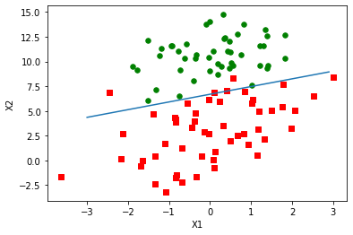

# 研究生工作周报(第四周)

## 学习目标

1. 机器学习实战(监督学习部分)
   1. 分类
      1. k-近邻算法
      2. 决策树
      3. 朴素贝叶斯
      4. Logistic回归
      5. 支持向量机
      6. AdaBoost元算法
2. RESP协议

## 学习内容

1. 机器学习实战监督学习部分

## 学习时间

* 5.29~6.04

## 学习产出

1. [Python代码](./code/)
2. github记录

## 算法演练

1. k-近邻算法
   1. 工作原理:存在一个训练样本集合,计算测试样本与训练样本距离最近的前k(k通常不大于20)个值,取其中出现次数最多的为测试样本的分类
   2. 算法实现

      ```python
      def classify0(inX, dataSet, labels, k):
         dataSetSize = dataSet.shape[0]
         # 距离计算
         # tile重复某个数组,并且特征值之间相减
         diffMat = tile(inX, (dataSetSize, 1)) - dataSet
         sqDiffMat = diffMat ** 2
         sqDistances = sqDiffMat.sum(axis=1)
         distances = sqDistances ** 0.5
         # 选择距离最小的k个点
         sortedDistdices = distances.argsort()
         classCount = {}
         for i in range(k):
            voteIlabel = labels[sortedDistdices[i]]
            classCount[voteIlabel] = classCount.get(voteIlabel, 0) + 1
         sortedClassCount = sorted(classCount.items(), key=operator.itemgetter(1), reverse=True)
         return sortedClassCount[0][0]
      ```

   3. 总结
      1. k-近邻算法是分类算法中最简单有效的算法
      2. 不过k-近邻算法需要保持所以数据集,不仅需要占据大量的储存空间,计算也较为耗时

2. 决策树
   1. 工作原理
      1. 计算香农熵:$H =-\Sigma _{i=1} ^n p(x_i)\log_x p(x_i)$
      2. 选择最好的信息增溢
      3. 构建决策树
   2. 算法实现

      ```python
      # 选择最好的划分数据集方式
      def chooseBestFeatureToSplit(dataSet):
         numFeatures = len(dataSet[0]) - 1
         baseEntropy = calcShannonEnt(dataSet)
         bestInfoGain = 0.0; bestFeature = -1
         for i in range(numFeatures):
            featList = [example[i] for example in dataSet]
            uniqueVals = set(featList)
            newEntropy = 0.0
            # 计算信息增益
            for value in uniqueVals:
                  subDataSet = splitDataSet(dataSet, i, value)
                  prob = len(subDataSet) / float(len(dataSet))
                  newEntropy += prob * calcShannonEnt(subDataSet)
            infoGain = baseEntropy - newEntropy
            if (infoGain > bestInfoGain):
                  bestInfoGain = infoGain
                  bestFeature = i
         return bestFeature
      ```

   3. 总结
      1. 决策树就像带有终结块的流程图
      2. 决策树选项过多可能存在过度匹配,需要进行减枝

3. 朴素贝叶斯:基于概率论的分类算法
   1. 工作原理
      1. 使用概率来判断类别
         1. 如果p1(x,y)>p2(x,y),那么类别为1
         2. 如果p2(x,y)>p1(x,y),那么类别为2
      2. 计算方法如下:$p(c_i | x,y) = \frac{p(x,y|c_i)p(x_i)}{p(x,y)}$
   2. 算法实现

      ```python
      def trainNB0(trainMatrix, trainCategory):
         numTrainDocs = len(trainMatrix)
         numWords = len(trainMatrix[0])
         pAbusive = sum(trainCategory) / float(numTrainDocs)
         # 初始化概率
         p0Num = ones(numWords); p1Num = ones(numWords)
         p0Denom = 2.0; p1Denom = 2.0
         for i in range(numTrainDocs):
            if trainCategory[i] == 1:
                  p1Num += trainMatrix[i]
                  p1Denom += sum(trainMatrix[i])
            else:
                  p0Num += trainMatrix[i]
                  p0Denom += sum(trainMatrix[i])
         p1Vect = log(p1Num / p1Denom)
         p0Vect = log(p0Num / p0Denom)
         return p0Vect, p1Vect, pAbusive
      ```

   3. 总结
      1. 通过已知值来估计未知概率
      2. 不用给出确定的值,而是给出一个最优的猜测

4. Logistic回归
   1. 工作原理
      1. 使用Sigmoid函数($\frac{1}{1+e^{-z}}$)替代单位阶跃函数
      2. 使用梯度上升算法寻找最佳参数
   2. 代码实现

      ```python
      def gradAscent(dataMatIn, classLabels):
         dataMatrix = mat(dataMatIn)
         labelMat = mat(classLabels).transpose()
         m, n = shape(dataMatrix)
         alpha = 0.001
         maxCycles = 500
         weights = ones((n, 1))
         for k in range(maxCycles):
            h = sigmoid(dataMatrix * weights)
            error = (labelMat - h)
            weights = weights + alpha * dataMatrix.transpose() * error
         return weights
      ```

      

   3. 总结
      1. 梯度上升算法处理大量数据集时复杂度太高,可以改用随即梯度上升算法
      2. Logistic回归的目的是寻找一个非线性函数Sigmoid的最佳拟合参数

5. 支持向量机(代码未实现,以后再看)
   1. 工作原理
      1. 寻找数据集的最大间隔(SMO算法)
      2. 如果数据非线性可分,可以利用核函数把数据映射到更高维空间
         1. 径向基核函数:$k(x,y)=exp(\frac{-||x-y||^2}{2\sigma^2})$
   2. 总结
      1. 支持向量机具有较好的学习能力,并且结果具有很好的推广性
      2. 处理多类问题时需要进行客栈,否则原生的SVM只能够二类分类问题

6. AdaBoost元算法
   1. 工作原理
      1. 训练数据中的每一个样本,并赋予其一个权重,这些权重构成了向量D.一开始,这些权重都初始化为相等值
      2. 首先在训练数据上训练出一个弱分类器并计算该分类器的错误率,然后在同一数据集上再次训练弱分类器
      3. 第二次训练时会调整样本的权重,第一次分对的权重降低,第一次分错的权重上升
   2. 单层决策树代码实现

      ```python
      def buildStump(dataArr, classLabels, D):
         dataMatrix = mat(dataArr); labelMat = mat(classLabels).T
         m, n = shape(dataMatrix)
         numSteps = 10.0; bestStump = {}; bestClassEst = mat(zeros((m, 1)))
         minError = inf
         for i in range(n):
            rangeMin = dataMatrix[:, i].min(); rangeMax = dataMatrix[:, i].max(); stepSize = (rangeMax - rangeMin) / numSteps
            for j in range(-1, int(numSteps) + 1):
                  for inequal in ['lt', 'gt']:
                     threshVal = (rangeMin + float(j) * stepSize)
                     predictedVals = stumpClassify(dataMatrix, i, threshVal, inequal)
                     errArr = mat(ones((m, 1)))
                     errArr[predictedVals == labelMat] = 0
                     weightedError = D.T * errArr
                     if weightedError < minError:
                        minError = weightedError
                        bestClassEst = predictedVals.copy()
                        bestStump['dim'] = i
                        bestStump['thresh'] = threshVal
                        bestStump['ineq'] = inequal
         return bestStump, minError, bestClassEst
      ```

   3. 总结
      1. AdaBoost函数可以作用与任意分类器,只要分类器可以处理加权数据

7. RESP协议

> redis客户端和服务端通过redis序列化协议进行沟通

优势

1. Simple to implement.
2. Fast to parse.
3. Human readable.

A client connects to a Redis server by creating a TCP connection to the port 6379.

2 协议描述

1. For Simple Strings, the first byte of the reply is "+"
2. For Errors, the first byte of the reply is "-"
3. For Integers, the first byte of the reply is ":"
4. For Bulk Strings, the first byte of the reply is "$"
5. For Arrays, the first byte of the reply is "*"

In RESP, different parts of the protocol are always terminated with "\r\n" (CRLF).

## 总结

1.在这一周内粗略的看了<机器学习实战>的监督学习分类部分,回归部分也简单的看了一下.对于SVM的一些实现还比较迷茫,以后会进行具体的了解.
2.下一周应该会把<机器学习实战>的监督学习回归部分和无监督学习粗略的看完,另外还要看一下用户画像相关的视频.
