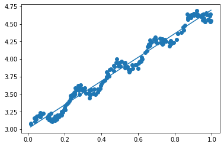

# 研究生工作周报(第四周)

## 学习目标

1. 机器学习实战（监督学习部分）
   1. 回归
      1. 线性回归
      2. 局部加权线性回归
      3. 树回归
2. 机器学习实战（无监督学习部分）
   1. K-均值
   2. Apriori算法
   3. FP-growth算法

## 学习内容

1. 机器学习监督学习回归部分，非监督学习部分

## 学习时间

* 6.05～6.11

## 学习产出

1. [Python代码](./code/)
2. github记录

### 线性回归

1. 使用普通最小二乘法求最佳拟合直线
2. 代码实现

   ```python
   import matplotlib.pylab as plt
   fig = plt.figure()
   ax = fig.add_subplot(111)
   ax.scatter(xMat[:,1].flatten().A[0], yMat.T[:,0].flatten().A[0])
   xCopy = xMat.copy()
   xCopy.sort(0)
   yHat = xCopy * ws
   ax.plot(xCopy[:,1], yHat)
   plt.show()
   ```

3. 效果显示
   
4. 缺陷
   1. 容易出现欠拟合现象

### 局部加权线性回归

1. 高斯核赋予附近的点更高的权重：$w(i,i)=exp(\frac{|x^{(i)}-x|}{-2k^2})$
2. 代码实现

   ```python
   def lwlr(testPoint, xArr, yArr, k=1.0):
      xMat = mat(xArr); yMat = mat(yArr).T
      m = shape(xMat)[0]
      weights = mat(eye((m)))
      for j in range(m):
         diffMat = testPoint - xMat[j, :]
         weights[j, j] = exp(diffMat * diffMat.T / (-2.0 *j ** 2))
      xTx = xMat.T * (weights * xMat)
      if linalg.det(xTx) == 0.0:
         print("This matrix is singular, cannot do inverse")
         return
      ws = xTx.I * (xMat.T * (weights * yMat))
      return testPoint * ws
   ```

3. 局部加权线性回归增加了计算量

### 岭回归

1. 岭回归就是在矩阵$x^Tx$上加一个$\lambda I$从而使得矩阵非奇异，进而能对$x^Tx+\lambda I求逆$
2. 回归系数的计算公式为：$w=(x^Tx+\lambda I)^{-1}x^Ty$

### 树回归

1. CART（分类回归树）既可以用于分类，也可以用于回归
   1. 连续和离散型特征的树的构建
2. 树剪枝
   1. 一棵树的节点过多，可能出现了“过拟合”
      1. 预剪枝
      2. 后剪枝

> 无监督学习方法需要回答的问题：“从数据X中能发现什么？”；需要回答的X方面的问题是：“X中哪三个特征最频繁共现？“

### k-均值聚类算法

1. K-均值算法
   1. 首先，随机确定k个初始点作为质心
   2. 将每个点分配到一个簇，具体来讲，为每个点找距其最近的质心，并将其分配给该质心所对应的簇
   3. 每一簇的质心更新为该簇所在点的平均值
   4. 缺陷：存在局部最小值而不是全局最小值
2. SSE（误差平方和）
3. 二分K-均值算法
   1. 首先，将所有点看成一个簇
   2. 对每个簇，进行如下操作
      1. 计算总误差
      2. 在给定的簇上进行K-Means聚类
      3. 计算将该簇一分为二之后的总误差
   3. 选择使得误差SSE最小的簇进行划分操作
   4. 重复2-3操作，直到达到用户指定的簇数目为止

### Apriori算法

1. 关联分析
   1. 频繁项集：经常出现在一起的物品的集合
2. 生成候选项集
   1. 伪代码

      ```txt
      对数据集中的每条交易记录tran
      对每个候选项集：
         检查一下can是否tran的子集
         如果是，则增加tran的计算值
      对每个候选项集：
         如果其支持度不低于最小值，则保留该项集
      返回所有频繁项集列表
      ```

3. 算法实现

   ```python
   # Apriori算法
   def aprioriGen(LK, K): #creates CK
      retList = []
      lenLK = len(LK)
      for i in range(lenLK):
         for j in range(i+1, lenLK):
               L1 = list(LK[i])[:K-2]; L2 = list(LK[j])[:K-2]
               L1.sort(); L2.sort()
               if L1 == L2:
                  retList.append(LK[i] | LK[j])
      return retList

   def apriori(dataSet, minSupport=0.5):
      C1 = createC1(dataSet)
      D = map(set, dataSet)
      L1, supportData = scanD(D, C1, minSupport)
      L = [L1]
      k = 2
      while (len(L[k-2]) > 0):
         Ck = aprioriGen(L[k-2], k)
         Lk, supk = scanD(D, Ck, minSupport)
         supportData.update(supk)
         L.append(Lk)
         k += 1
      return L, supportData
   ```

### FP-growth算法

1. 构建FP树（一种紧凑数据结构）
   1. FP growth只扫描数据集两次
2. 从FP树中挖掘频繁项集
3. 流程归纳
   1. 扫描数据，得到所有频繁一项集的的计数。然后删除支持度低于阈值的项，将1项频繁集放入项头表，并按照支持度降序排列。
   2. 扫描数据，将读到的原始数据剔除非频繁1项集，并按照支持度降序排列。
   3. 读入排序后的数据集，插入FP树，插入时按照排序后的顺序，插入FP树中，排序靠前的节点是祖先节点，而靠后的是子孙节点。
   4. 从项头表的底部项依次向上找到项头表项对应的条件模式基。
   5. 如果不限制频繁项集的项数，则返回步骤4所有的频繁项集，否则只返回满足项数要求的频繁项集。

### 降维技术（PCA）

1. 实现步骤
   1. 去中心化
   2. 寻找最小方差的方向

## 总结

1. 这周主要忙于毕业的各种事宜，继续看了一些Hadoop的视频和《机器学习实战》的监督学习回归和无监督学习部分
2. 下周应该会看一些深度学习的视频和多写一些代码
