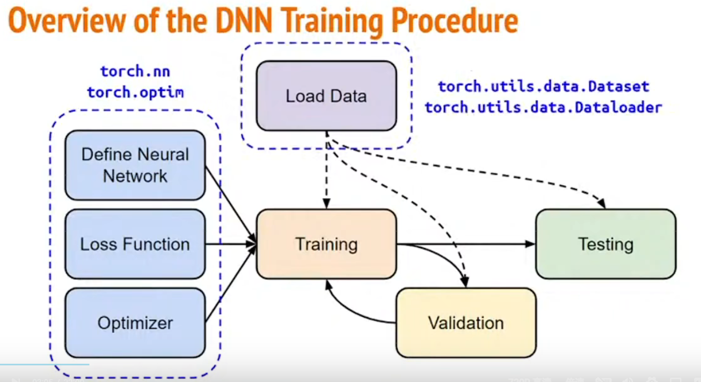

# 研究生周报（第六周）

## 学习目标

1. 李宏毅2021/2022春机器学习课程
2. 吴恩达深度学习课程

## 学习内容

1. 李宏毅2021/2022春机器学习课程
2. 吴恩达深度学习课程

## 学习时间

> 6.12～6.18

## 学习产出

1. [Python代码](./code/)
2. github记录

### 机器学习步骤

1. 线性模型（模型永远为一条直线）
   1. 未观看资料预测youtube观看人数
      1. function with unknown 定义一个包含未知数的函数：$y = wx + b$
      2. define loss from training data 定义一个Loss函数
      3. optimization 寻找一个最优解
   2. 观看资料发现youtube存在规律
      1. 修改函数：$y = \sum_{j=1}^7(w_jx_j) + b$
   3. 多个线性模型的组合可以逼近与曲线
      1. Sigmoid Funtion：$y = c\frac{1}{1 + e^{-(b+wx_1)}} = c \times sigmoid(b+wx_1)$
      2. 使用Sigmoid
   4. 过拟合（Overfitting）：训练资料上有变好，未知的训练的资料没有变好
      1. 选择在未知资料上表现的模型

### Pytorch

1. 训练流程
   

2. 常见公式
   1. Constructor
      1. torch.tensor([])
      2. torch.from_numpy(np.array([]))
      3. torch.zeros([])
      4. torch.ones()
   2. Operators
      1. x.squeeze() 去除一个维度
      2. x.unsqueeze() 增加一个维度
      3. x.transpose() 对换维度
      4. x.cat([], dim=1) 把多个tensor的维度接在一起
   3. Device
      1. x.to('cpu' | 'cuda')
   4. 训练步骤代码
      1. dataset = MyDataset(file)
      2. tr_set = DataLoader(dataset, 16, shuffle=True)
      3. model = MyModel().to(device)
      4. criterion = nn.MSELoss()
      5. optimizer = torch.optim.SGD(model.parameters(), 0.1)

### 深度学习

1. 什么是神经网络？
   1. 线性整流函数Relu：$f(x)=max(0,x)$
      1. 没有饱和区，不存在梯度消失问题
      2. 没有复制的指数运算，计算简单、效率很高
      3. 实际收敛速度较快，比Sigmoid/tanh快很多
      4. 比Sigmoid更符合生物学神经激活机制
      5. 缺点：训练的时候很脆弱，容易‘die’
   2. 神经元：输入->神经元->输出
   3. 不同权重的神经元构成的神经网络
2. 逻辑回归
   1. 一个逻辑回归函数：$\hat{y}=\sigma (w^Tx+b),\sigma (z)=\frac{1}{1+e^{-e}}$
   2. 代价函数（衡量训练效果）：$J(w,b)=\frac{1}{m}\sum_{i=1}^{m}\zeta(\hat{y}^{(i)},y^{i})=-\frac{1}{m}\sum_{i=1}^{m}y^{(i)}\log\hat{y}^{(i)}+(1-y^{(i)})\log(1-\hat{y}^{(i)})$
   3. 梯度下降（寻找最合适的参数）
3. 逻辑回归梯度下降
   1. 前向传播获取每个样本的loss
   2. 反向传播对W和b求偏导，用于更新参数
4. 向量化
   1. 向量化求值的效率比for循环的高

### 神经网络

1. 激活函数
   1. Sigmoid函数：$\frac{1}{1+e^{-z}}$，在0到1之间，不推荐使用，除非需要输出为0或者1（二元分类）
   2. tanh(z)相当于Sigmoid函数的移位版本（大部分优于Sigmoid函数，数据居住效果）
   3. RELU函数：$max(0, z)$（越来越多使用，推荐）
      1. 大部分时候斜率不为0
   4. leaky RELU函数：$max(0.1z, z)$（效果拔群，但是目前使用较少
2. 为什么要使用激活函数？
   1. 线性激活函数（恒等激活函数）无论有多少层，也只是计算一个线性激活函数，相当于没有隐藏层

## 总结

1. 这周看了看了下吴恩达老师和李宏毅老师的速度学习课程，目前感觉吴恩达老师的课程更适合我，下周应该主要看吴恩达老师的速度学习课程
2. 这周的周二到杭州处理一些琐事，周三到周五三天都在实习导致学习速度学习的时间较少，下周习惯实习后应该能够提升学习的时间
