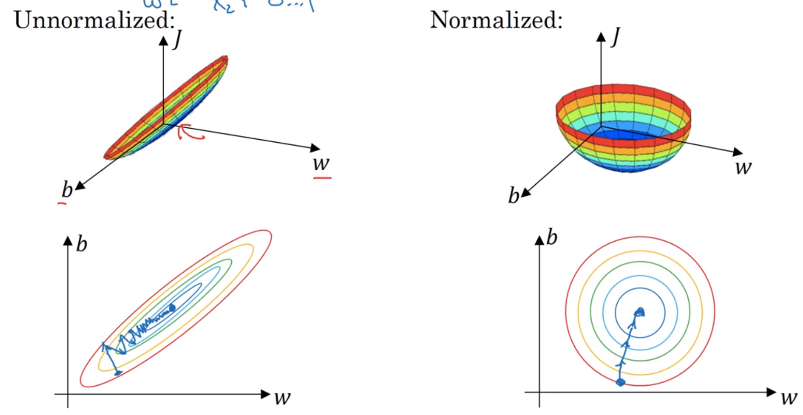
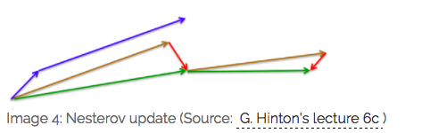

# 研究生周报（第七周）

## 学习目标

1. 吴恩达深度学习课程
   1. 正则化
   2. 梯度检验
   3. 归一化处理
   4. 多种梯度下降算法

## 学习时间

> 6.19～6.25

## 学习产出

1. [Python代码](./code/)
2. github记录

### 正则化

1. L2正则化

    > 用于避免过拟合

    1. $min_{w,b}J(w,b)$（L2正则化）
    2. $J(w,b)=\frac{1}{m}\sum_{i=1}^m(\hat{y^i},y^i)+\frac{\lambda}{2m}||w||_2^2+\frac{\lambda}{2m}b^2$
    3. 因为w包含许多参数，而b只是其中一个参数，故可以省略
    4. L1正则化使用的比较少
2. dropout（随机失活）
   1. dropout是值在深度学习网络的训练过程中，按照一定的概率将一部分神经网络单元暂时从网络中丢弃，相当于从原始的网络中找到一个更瘦的网络
3. 数据扩增
   1. 图片可以进行翻转、放大等方法提供更多的素材
4. 早终止法
   1. 当模型在验证集上的表现开始下降的时候停止训练
   2. 主要步骤
      1. 将原始的训练数据集划分为训练集和验证集
      2. 只在训练集上进行训练，并每隔一个周期计算模型在验证集上的误差
      3. 当模型在验证集上（权重的更新低于某个阙值；预测的错误率低于某个阙值；达到一定的迭代词数），则停止训练
      4. 使用上一次迭代的参数作为模型的最终参数

### 归一化输入

1. 零均值化
   1. $\mu=\frac{1}{m}\sum_1^mx_i$
   2. $m_i=m_i-\mu$
2. 归一化方差
   1. $\sigma^2=\frac{1}{m}\sum_1^mx_i^2$
   2. $m_i=\frac{m_i}{\sigma^2}$
3. 为什么要进行归一化操作（变量的范围过大）
   

### 梯度消失与梯度爆炸

1. 梯度消失：在神经网络中，当前面隐藏层的学习速率低于后面隐藏层的学习速率，即随着隐藏层数目的增加，分类准确率反而下降了。这种现象叫梯度消失
   1. 隐藏层的层数过多
   2. 采用了不合适的激活函数
2. 梯度爆炸：在神经网络中，当前面隐藏层的学习速率低于后面隐藏层的学习速率，即随着隐藏层数目的增加，分类准确率反而下降了。这种现象叫梯度爆炸。
   1. 隐藏层的层数过多
   2. 权重的初始化值过大
3. 初始化参数
   1. 全零初始化：在线性回归，logistics回归中可行，在神经网络中不行
   2. 随机初始化：随机分布选择不当将会导致网络优化陷入困境
   3. Xavier初始化：保持输入和输出的方差一致（服从相同的分布），就避免了所有输出值都趋向于0
      1. 根据输入和输出神经元的数量自动决定初始化的范围：定义参数所在的层的输入维度为m,输出维度为n,那么参数将从$(-\sqrt{\frac{6}{m+n}},\sqrt{\frac{6}{m+n}})$
   4. He initialization
      1. 在ReLU网络中，假定每一层都有一半的神经元被激活，另一半为0,所以要保持variance不变，只需要在Xavier的基础上再除以2
   5. Batch Normalization Layer
   6. pre-training
      1. pre-training阶段：将神经网络中的每一层取出，构造一个auto-encoder做训练，使得输入层和输出层保持一致。在这一过程中，参数得以更新，形成初始值。
      2. fine-tuning阶段：将pre-train过的每一层放回神经网络，利用pre-train阶段得到的参数初始值和训练数据对模型进行整体调整。在这一过程中，参数进一步被更新，形成最终模型。

### 梯度检验

1. 梯度检验是一种对求导结果进行数值检验的方法，该方法可以验证求导代码是否正确
2. 数学原理
   1. 最小化以$\theta$为自边量的目标函数$J(\theta)$，梯度更新公式为：$\theta:=\theta-\alpha\frac{d}{d\theta}J(\theta)$
   2. 以sigmoid函数为例，$f(z)=\frac{1}{1+exp(-z)}$，其导数形式为：$f^{'}(z)=g(z)=f(z)(1-f(z))$
   3. 导数的数学定义：$\frac{d}{d\theta}J=lim_{\varepsilon\rightarrow 0}\frac{J(\theta+\varepsilon)-J(\theta-\varepsilon)}{2\varepsilon}$
3. 深度学习的优化算法，差不多就是梯度下降，每次的参数更新有两种方式
   1. 批梯度下降：遍历全部数据集算一个损失函数，然后算函数对各个参数的梯度，更新梯度。这种方法没更新一次参数都要把数据集的所以样本看一遍，计算开销大
   2. 随机梯度下降：每看一个数据就算一次损失函数，然后求梯度更新参数，速度快但是收敛性能不太好
   3. 折中手段（mini-batch)：小批的梯度下降
4. mini-batch实现步骤
   1. 确定mini-batch size,一般有32、64、128等，按照自己的数据集而定，确定mini-batch_num=m/mini-batch_num+1
   2. 在分组之前将原数据集顺序打乱，随机打乱
   3. 分组，将打乱后的数据集分组
   4. 将分好的mini-batch组放入迭代循环中，每次循环都做mini-batch_num次梯度下降
5. batch_size选取原则
   1. m<2000时，batch_size=m，即采用batch梯度下降法
   2. m>2000时，batch_size=64,128,256,512,使用mini-batch梯度下降法

### 指数加权平均

1. 公式：$v_t=\beta\times v_{t-1} + (1-\beta)\times \theta(t)$
2. 偏差修正：$\frac{v_t}{1-\beta^t}$

### 动量梯度下降法

1. 动量梯度下降算法对比梯度下降算法直观体现：数值方向波动变小了，而在水平方向下降速度变快了
2. 实现代码

   ```python
   def sgd_momentum(parameters, vs, lr, gamma):
      for param, v in zip(parameters, vs):
         v[:] = gamma * v + lr * param.grad.data
         param.data = param.data - v
   ```

### RMSPrp算法

1. Momentum优化算法使得模型可以更加快的朝着最优化方向更新，且效果不错，但存在参数更新波动过大问题
2. 为保证模型加快收敛速度的同时保持参数波动平稳，对权重与偏置的梯度使用微分平方加权平均数：
   1. $S_{dW}=\beta S_{dW}+(1+\beta)dW^2$
   2. $S_{db}=\beta S_{dW}+(1+\beta)db^2$
   3. $W=W-\alpha\frac{dW}{\sqrt{S_{dW}+\epsilon}}, b=b-\alpha\frac{db}{\sqrt{S_{db}+\epsilon}}$

### 梯度下降算法比较

1. Batch Gradient Descent(BGD)
   1. BGD采用整个训练集的数据来计算cost function对参数的梯度：$\theta=\theta-\eta\cdot\nabla_{\theta}J(\theta)$
2. Stochastic Gradient Descent(SGD)
   1. SGD一次只进行一次更新，没有荣与，比较快，并且可以新增样本：$\theta=\theta-\eta\cdot\nabla_{\theta}J(\theta;x^{(i)};y^{(i)})$
   2. SGD的噪音比BGD多，并且迭代不是每次都向着整体最优化方向。所以虽然训练速度快，但是准确率下降，并不是全局最优。
3. Mini-Batch Gradient Descent(MBGD)
   1. MBGD每一次利用一小批样本，即n个样本进行计算，这样它可以降低参数更新时的方差，收敛更稳定，另一方面可以充分得利用深度学习库中高度优化的矩阵来进行更有效的梯度计算：$\theta=\theta-\eta\cdot\nabla_{\theta}J(\theta;x^{(i;i+n)};y^{(i;i+n)})$
   2. 缺点
      1. MBGD不能保证很好的收敛性，learn rate如果选择的太小，收敛速度会很慢，如果太大，loss function就会在极小值处不停地震荡甚至偏离。
      2. SGD对所有参数更新时应用同样的 learning rate，如果我们的数据是稀疏的，我们更希望对出现频率低的特征进行大一点的更新。LR会随着更新的次数逐渐变小。
4. Momentum(动量梯度下降法)
   1. 通过加入$yv_t=1$，可以加速SGD,并且抑制震荡：$v_t=\gamma v_{t-1}+\eta\nabla_{\theta}J(\theta);\theta=\theta-v_t$
   2. 超参数设定值：$\gamma$一般取0.9左右
5. Nesterov Accelerated Gradient
   1. 用$\theta-\gamma v_{t-1}$来近似当做参数下一步会变成的值，则在计算梯度时，不是在当前位置，而是未来的位置上：$v_t=\gamma v_{t-1}+\eta\nabla_{\theta}J(\theta-\gamma v_{t-1});\theta=\theta-v_t$
   2. NAG会在前一步积累梯度上有一个大的跳跃，然后衡量一下梯度做一下修正，这种预期的更新可以避免我们走的太快

6. Adaptive gradient algorithm(Adagrad)
   1. 这个算法可以对低频的参数做较大的更新，对高频的做较小的更新，因此对于稀疏的数据它的表现很好，很好的提高了SGD的鲁棒性（健壮性）
   2. 梯度更新规则：$\theta_{t+1}=\theta_{t,i}-\frac{\eta}{\sqrt{G_{t,ii}+\epsilon}}\cdot{g_{t,i}}$，其中g为t时刻$\theta_i$的梯度：$g_{t,i}=\nabla_{\theta}J(\theta_i)$
   3. Adagrad的优点是减少了学习率的手动调节
   4. Adagrad的缺点是分布会不断积累，这样学习率就会收缩并最终会变得非常小
7. Adadelta
   1. 算法是对Adagrad的改进，就是坟墓的G改成了梯度平方的衰减平均值：$\nabla\theta_t=-\frac{\theta}{\sqrt{E[g^2]_t+\epsilon}}g_t$
8. RMSprop都是为了解决Adagrad学习率急剧下降问题的：$E[g^2]_t=0.9E[g^2]_{t-1}+0.1g_t^2,\theta_{t+1}=\theta_t-\frac{\eta}{E[g^2]_t+\epsilon}g_t$
9. Adaptive Moment Estimation(Adam)
   1. 计算每个参数的自适应学习率的方法：RMSprop+Momentum
   2. 除了像 Adadelta 和 RMSprop 一样存储了过去梯度的平方 vt 的指数衰减平均值 ，也像 momentum 一样保持了过去梯度 mt 的指数衰减平均值：$m_t=\beta_1m_{t-1}+(1-\beta_1)g_t;v_t=\beta_2v_{t-1}+(1-\beta_2)g_t^2$
   3. 如果$m_t$和$v_t$被初始化为0向量，那它们就会向0偏置，所以作了偏差校正，通过计算偏差校正后的$m_t$和$v_t$来抵消这些偏差：$\hat{m_t}=\frac{m_t}{1-\theta_1^t};\hat{v_t}=\frac{v_t}{1-\theta_2^t}$
   4. 梯度更新规则：$\theta_{t+1}=\theta_t-\frac{\eta}{\sqrt{\hat{v_t}}+\epsilon\hat{m_t}}$
10. 算法选择
    1. 如果矩阵是稀疏的，就用自适应方法，即Adagrad,Adadelta,RMSprop,Adam(最好选择)

### 实习记录

1. 本周写了一个富阳的脚本用于满足需求
   1. [内容](./code/富阳脚本.sql)
2. 对于用户提供的经纬度围成的区域不应该直接计算，而是有两种方式
   1. 使用地图把经纬度区域上传，等待生成栅格编号
   2. 通过[射线算法](./code/射线算法.py)实现

### 独热编码

1. 离散特征的编码分为两种情况
   1. 离散特征的取值之间没有大小的意义，毕设color:[red, blue]，那么就使用one-hot编码
   2. 离散特征的取值有大小的意义，比如size:[X,XL,XXL]，那么就使用数值的映射{X:1,XL:2,XXL:3}

      ```python
      # 第二种情况的代码
      import pandas as pd
      df = pd.DataFrame([
                  ['green', 'M', 10.1, 'class1'], 
                  ['red', 'L', 13.5, 'class2'], 
                  ['blue', 'XL', 15.3, 'class1']])
      
      df.columns = ['color', 'size', 'prize', 'class label']
      
      size_mapping = {
               'XL': 3,
               'L': 2,
               'M': 1}
      df['size'] = df['size'].map(size_mapping)
      
      class_mapping = {label:idx for idx,label in enumerate(set(df['class label']))}
      df['class label'] = df['class label'].map(class_mapping)
      ```

   3. 分类器往往默认数据时连续的，并且是有序的
2. 独热编码即One-Hot编码，又称一位有效编码，其方法是使用N位状态寄存器来对N个状态进行编码，每个状态都由其它独立的寄存器位，并且在任意时候，其中只有一位有效
   1. 自然状态码：000,001,010,011,101,101
   2. 独热编码：000001,000010,000100,001000,010000,100000
3. 独热编码可以使数据变得稀疏
   1. 解决了分类器不好处理属性数据的问题
   2. 在一定程度上也起到了扩充特征的作用
4. 实现方式
   1. pandas.get_dummies(data, prefix=None, prefix_sep='_', dummy_na=False, columns=None, sparse=False, drop_first=False)
   2. 通过sklearn实现
5. 优缺点
   1. 优点：独热编码解决了分类器不好处理属性数据的问题，在一定程度上也起到了扩充特征的作用。它的值只有0和1，不同的类型存储在垂直的空间。
   2. 当类别的数量很多时，特征空间会变得非常大。在这种情况下，一般可以用PCA来减少维度。

## 总结

1. 这周看了看吴恩达老师的深度学习课程，对于参数的处理和梯度计算有了进一步的了解，同时也看了独热编码用于处理离散数据
2. 下周应该继续看吴恩达老师的深度学习课程，并且去看t-sne降维算法和一些聚类算法用于实习
