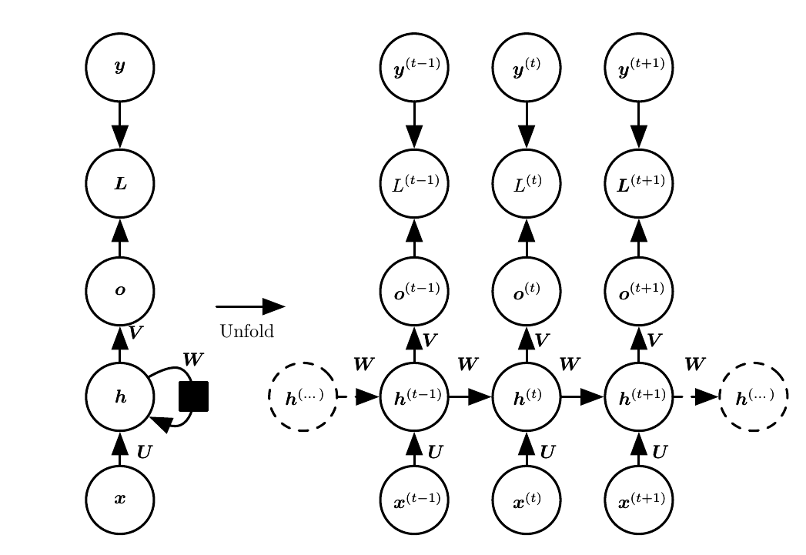
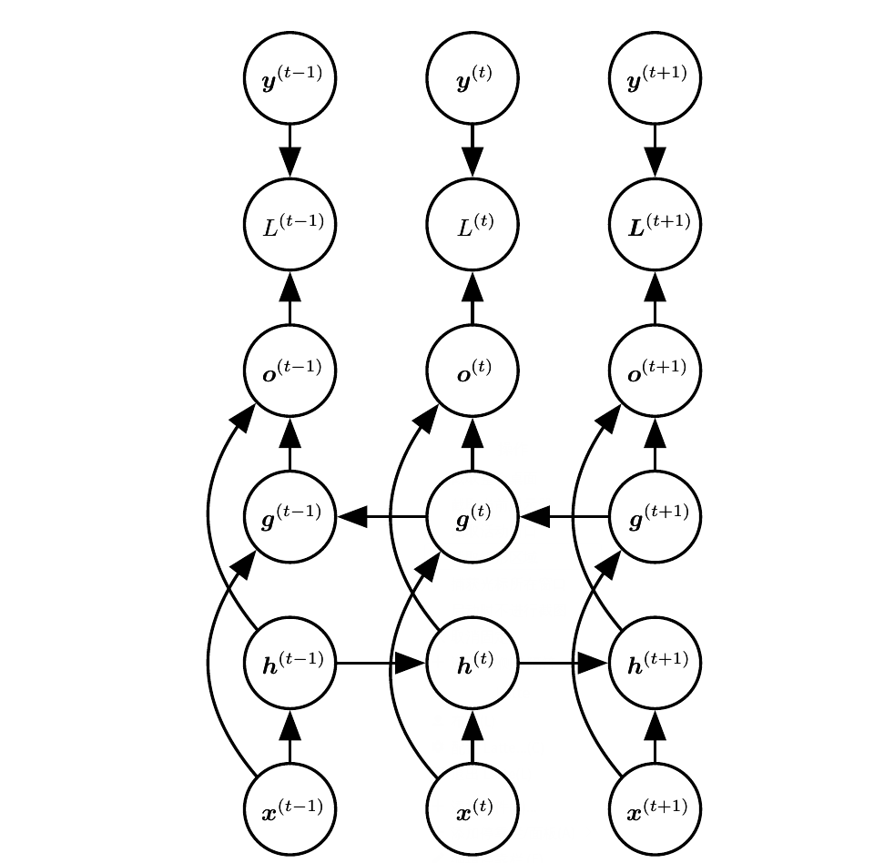

# 研究生周报（第九周）

## 学习产出

### 自编码器

1. 均方误差（MSE）
   1. SSE（和方差、误差平方和），计算公式为：
          $SSE=\sum_{i=1}^mw_i(y_i-\hat{y_i})^2$
   2. MSE（均方差、方差），计算公式为：
          $MSE=\frac{SSE}{n}=\frac{1}{n}\sum_{i=1}^mw_i(y_i-\hat{y_i})^2$
   3. RMSE（均方根、标准差）
          $RMSE=\sqrt{MSE}=\sqrt{\frac{SSE}{n}}=\sqrt{\frac{1}{n}\sum_{i=1}^mw_i(y_i-\hat{y_i})^2}$
2. MAE（Masked Autoencoders Are Scalable Vision Learners）
   1. MAE的做法是：以一定比例随机mask掉图片中的一些图像块，然后重建这些部分的像素值，主要特点有两个：
      1. 非对称的编、解码设计
      2. 使用较高的掩码率
   2. 为什么mask在NLP很流行，而在CV却比较冷门
      1. 架构差异：CV和NLP的网络架构不一致，前者在过去一直被CNN通知，他基于方正的局部窗口来操作；不过ViT（Vision Transformer）已经在CV界大肆虐杀了
      2. 信息密度不同：语言是高度语义和信息密集的，而图像在空间上是高度冗余的
      3. 解码的目标不一致
         1. NLP解码输出的是被mask掉的词语，本身包含了丰富的语义信息，而CV要重建的是被mask掉的图像块，是第语义的
      
   3. 策略
      1. 沿袭ViT的做法，将图像分成一块块不重叠的patch，然后使用服从均匀分布的采样策略对这些patches随机采样一部分，同时mask掉余下的另一部分。被mask掉的patches占所有patches的大部分（实验效果发现最好的比例是75%），他们不会输入到Encoder
         1. patch是服从均匀分布来采样的，这样能够避免潜在的“中心归纳偏好”
         2. 采样高掩码比例能够防止模型轻易地根据邻近的课件patches推断
         3. 这种策略还造就了稀疏的编码器输入，能够以更低的代价训练较大规模的Encoder
   4. Pipeline
      1. 将图像划分成 patches：(B,C,H,W)->(B,N,PxPxC)；
      2. 对各个 patch 进行 embedding(实质是通过全连接层)，生成 tokens，并加入位置信息(position embeddings)：(B,N,PxPxC)->(B,N,dim)；
      3. 根据预设的掩码比例(paper 中提倡的是 75%)，使用服从均匀分布的随机采样策略采样一部分 tokens 送给 Encoder，另一部分“扔掉”(mask 掉)；
      4. 将 Encoder 编码后的 tokens 与 加入位置信息后的 masked tokens 按照原先在 patch 形态时对应的次序拼在一起，然后喂给 Decoder 玩(如果 Encoder 编码后的 token 的维度与 Decoder 要求的输入维度不一致，则需要先经过 linear projection 将维度映射到符合 Decoder 的要求)；
      5. Decoder 解码后取出 masked tokens 对应的部分送入到全连接层，对 masked patches 的像素值进行预测，最后将预测结果与 masked patches 进行比较，计算 MSE loss
3. 自编码器
   1. 编码器：将输入压缩为潜在空间表示，可以用编码函数h=f(x)表示
   2. 解码器：这部分旨在重构来自隐藏空间表示的输入，可以用解码器r=g(h)表示
   3. 因此自编码器的整体可以用函数g(f(x))=r来表示，其中我们想要得到的r与原始输入相近
4. 自编码器的用途：数据可视化的数据降噪和降维
5. 自编码器的类型
   1. 普通的自编码器：三层网络（输入、隐藏、输出），其中输入和输出是一样的
   2. 多层自编码器
   3. 卷积自编码器：使用卷积代替完全连接层
   4. 正则化自编码器
      1. 系数自编码器：用于学习诸如分类等任务的特征
      2. 降噪自编码器：改变损失函数的重构误差项

### 序列建模：循环和递归网络

**循环神经网络**或RNN是一类用于处理序列数据的神经网络。就像卷积神经网络专门用于处理网格化数据**X**的神经网络，循环神经网络是专门用于处理序列$x^{(1)},\cdots,x^{(t)}$的神经网络。

1. 展开计算图
   1. 动态系统的经典形式：$s^{(t)}=f(s^{(t-1)};\theta)$
   2. 展开的示例为：$s^{(3)}=f(s^{(2)};\theta)=f(f(s^{(1)};\theta);\theta)$
   3. 循环图简洁，展开图能够明确描述其中的计算流程。
2. 循环神经网络

   1. 设计模式
      1. 每个时间步都有输出，并且隐藏单元之间有循环连接的循环网络
      2. 每个时间步都产生一个输出，只有当前时刻的输出到下个时刻的隐藏单元之间有循环连接的循环网络
      3. 隐藏单元之间存在循环连接，但读取整个序列后产生单个输出的循环网络
   2. 导师驱动过程和输出循环网络
      1. 尽在一个时间步的输出和下一个时间步的隐藏单元之间存在循环连接的网络不能模拟通用图灵机，因为这个网络缺少隐藏到隐藏的循环。
      2. 由输出反馈到模型而产生循环连接的模型可用导师驱动过程进行训练，导师驱动模型的最初动机是为了在缺乏隐藏到隐藏连接的模型中避免通过时间反向传播
   3. RNN前向传播
      $a^{<t>}=b+Wh^{<t-1>}+Ux^{<t>}$
      $h^{<t>}=\tanh{(a^{<t>})}$
      $o^{<t>}=c+Vh^{<t>}$
      $\hat{y^{<t>}}=softmax(o^{<t>})$
   4. RNN反向传播（穿越时间的反向传播BPTT）
      $\frac{\partial{L}}{\partial{o^{<t>}}}=\sum_{t=1}^{\tau}\frac{\partial{L^{<t>}}}{\partial{o^{<t>}}}=\sum_{t=1}^{\tau}\hat{y^{<t>}}-t^{<t>}$
      $\frac{\partial{L}}{\partial{c}}=\sum_{t=1}^{\tau}\frac{\partial{L^{<t>}}}{\partial{o^{<t>}}}\times\frac{\partial{o^{<t>}}}{\partial{c}}=\sum_{t=1}^{\tau}\hat{y^{<t>}}-t^{<t>}$
      $\frac{\partial{L}}{\partial{V}}=\sum_{t=1}^{\tau}\frac{\partial{L^{<t>}}}{\partial{o^{<t>}}}\times\frac{\partial{o^{<t>}}}{\partial{V}}=\sum_{t=1}^{\tau}(\hat{y^{<t>}}-t^{<t>})(h^{<t>})^T$
      $\frac{\partial{L}}{\partial{h^{t}}}=\frac{\partial{L^{<t>}}}{\partial{o^{<t>}}}\times \frac{\partial{o^{<t>}}}{\partial{h^{<t>}}}+\frac{\partial{L^{<t+1>}}}{\partial{h^{<t+1>}}}\times \frac{\partial{h^{<t+1>}}}{\partial{h^{<t>}}}=V^T(\hat{y^{<t>}}-y^{<t>})+W^T\frac{\partial{L}}{\partial{h^{<t+1>}}}diag(1-(h^{<t+1>})^2)$
      $\frac{\partial{L}}{\partial{h^{<\tau>}}}=V^T(\hat{y}^{<\tau>}-y^{<\tau>})$
      $\frac{\partial{L}}{\partial{b}}=\sum_{t=1}^{\tau}\frac{\partial{L^{<t>}}}{\partial{h^{<t>}}}\times \frac{\partial{h^{<t>}}}{\partial{b}}=\sum_{t=1}^{\tau}diag(1-(h^{<t>})^2)\times \frac{\partial{L}}{\partial{h^{<t>}}}$
      $\frac{\partial{L}}{\partial{W}}=\sum_{t=1}^{\tau}\frac{\partial{L^{<t>}}}{\partial{h^{<t>}}}\times \frac{\partial{h^{<t>}}}{\partial{W}}=\sum_{t=1}^{\tau}diag(1-(h^{<t>})^2)\times \frac{\partial{L}}{\partial{h^{<t>}}}\times (h^{<t-1>})^T$
      $\frac{\partial{L}}{\partial{U}}=\sum_{t=1}^{\tau}\frac{\partial{L^{<t>}}}{\partial{h^{<t>}}}\times \frac{\partial{h^{<t>}}}{\partial{U}}=\sum_{t=1}^{\tau}diag(1-(h^{<t>})^2)\times \frac{\partial{L}}{\partial{h^{<t>}}}\times (h^{<t>})^T$
   5. 作为有向图模型的循环网络
      1. 原则上循环网络几乎可以使用认可损失
      2. 最大化对数似然：$\log{p(y^{(t)}|x^{(1)},\cdots,x^{(t)})}$
   6. 基于上下文的RNN序列建模
3. 双向RNN
   1. 对于要输出的$y^{(t)}$可能依赖与整个输入序列，例如语音识别中，由于协同发音，当前声音的正确介绍可能取决于为了的几个音素
   
4. 深度循环网络
   1. 实验证据与我们需要足够的深度以执行所需映射的想法一致
5. 递归神经网络
   1. 递归神经网络代表循环网络的了一个扩展，它被构造为深的树状结构而不是RNN的链状结构。对于具有相同长度$\tau$的序列，深度可以急剧地从$\tau$减小为$O(\log{\tau})$，这可能有助于解决长期依赖。
6. 渗透单元和其它多时间尺度的策略
   1. 时间维度的跳跃连接：增加遥远过去的变量到目前变量的直接连接
   2. 渗透单元和一系列不同时间尺度
