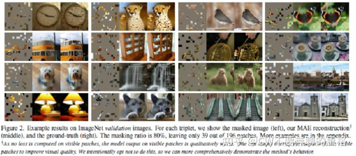

# 研究生周报（第九周）

## 学习产出

### 自编码器

1. 均方误差（MSE）
   1. SSE（和方差、误差平方和），计算公式为：
          $SSE=\sum_{i=1}^mw_i(y_i-\hat{y_i})^2$
   2. MSE（均方差、方差），计算公式为：
          $MSE=\frac{SSE}{n}=\frac{1}{n}\sum_{i=1}^mw_i(y_i-\hat{y_i})^2$
   3. RMSE（均方根、标准差）
          $RMSE=\sqrt{MSE}=\sqrt{\frac{SSE}{n}}=\sqrt{\frac{1}{n}\sum_{i=1}^mw_i(y_i-\hat{y_i})^2}$
2. MAE（Masked Autoencoders Are Scalable Vision Learners）
   1. MAE的做法是：以一定比例随机mask掉图片中的一些图像块，然后重建这些部分的像素值，主要特点有两个：
      1. 非对称的编、解码设计
      2. 使用较高的掩码率
   2. 为什么mask在NLP很流行，而在CV却比较冷门
      1. 架构差异：CV和NLP的网络架构不一致，前者在过去一直被CNN通知，他基于方正的局部窗口来操作；不过ViT（Vision Transformer）已经在CV界大肆虐杀了
      2. 信息密度不同：语言是高度语义和信息密集的，而图像在空间上是高度冗余的
      3. 解码的目标不一致
         1. NLP解码输出的是被mask掉的词语，本身包含了丰富的语义信息，而CV要重建的是被mask掉的图像块，是第语义的
      
   3. 策略
      1. 沿袭ViT的做法，将图像分成一块块不重叠的patch，然后使用服从均匀分布的采样策略对这些patches随机采样一部分，同时mask掉余下的另一部分。被mask掉的patches占所有patches的大部分（实验效果发现最好的比例是75%），他们不会输入到Encoder
         1. patch是服从均匀分布来采样的，这样能够避免潜在的“中心归纳偏好”
         2. 采样高掩码比例能够防止模型轻易地根据邻近的课件patches推断
         3. 这种策略还造就了稀疏的编码器输入，能够以更低的代价训练较大规模的Encoder
   4. Pipeline
      1. 将图像划分成 patches：(B,C,H,W)->(B,N,PxPxC)；
      2. 对各个 patch 进行 embedding(实质是通过全连接层)，生成 tokens，并加入位置信息(position embeddings)：(B,N,PxPxC)->(B,N,dim)；
      3. 根据预设的掩码比例(paper 中提倡的是 75%)，使用服从均匀分布的随机采样策略采样一部分 tokens 送给 Encoder，另一部分“扔掉”(mask 掉)；
      4. 将 Encoder 编码后的 tokens 与 加入位置信息后的 masked tokens 按照原先在 patch 形态时对应的次序拼在一起，然后喂给 Decoder 玩(如果 Encoder 编码后的 token 的维度与 Decoder 要求的输入维度不一致，则需要先经过 linear projection 将维度映射到符合 Decoder 的要求)；
      5. Decoder 解码后取出 masked tokens 对应的部分送入到全连接层，对 masked patches 的像素值进行预测，最后将预测结果与 masked patches 进行比较，计算 MSE loss
