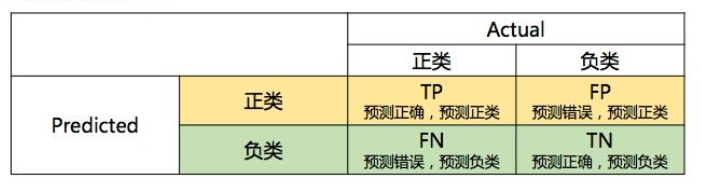
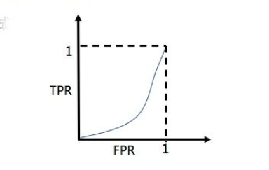
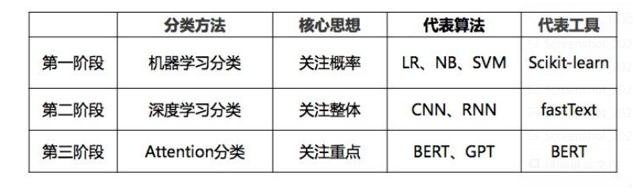
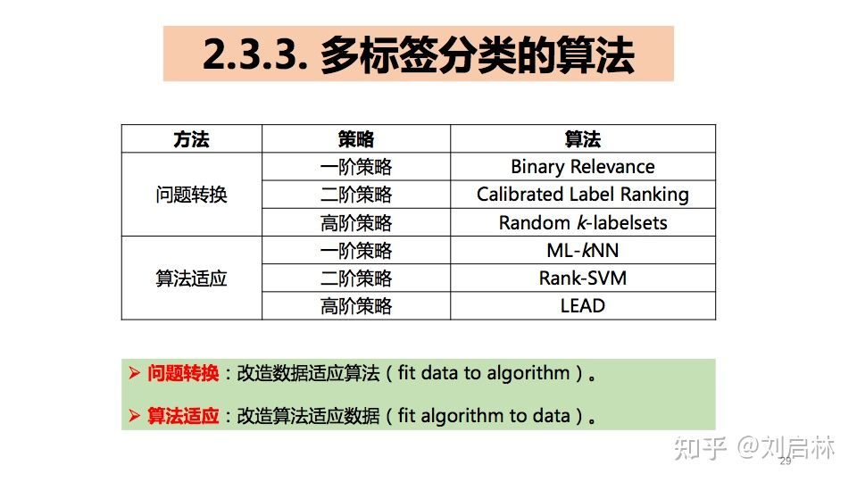

# 研究生周报（第十周）

## 学习目标

1. YOLO1简单理解
2. 线性因子模型
3. F1、ROC、AUC
4. 决策树和GBDT
5. XGBoost简单理解

## 学习时间

> 7.10 ~ 7.16

## 学习产出

1. [Python代码](./code/)
2. github记录

### Pytorch的一些注意事项

1. model.train()启用Batch Normalization和Dropout,如果模型中有BN层和Dropout,需要在训练时添加mode.train()。model.train()是保证BN层能够用到每一批数据的均值和方差。
2. model.eval()不启用Batch Normalization和Dropout，在测试时使用。在eval模式下，dropout会让所有的激活单元通过，而BN层会停止计算和更新meav和var,直接使用在训练阶段已经学出的mean和var值。
3. with torch.no_grad()主要用于停止autograd模块的工作，以起到加速和节省内存的作用。它的作用是将该with语句包裹起来的部分停止梯度的更新，从而节省了GPU算力和显存。
4. 不执行optimizer.zero_grad()，则每次梯度的值都要加上之前的梯度

### YOLO1

1. 概述
   1. YOLO的全称是you only look once，指只需要浏览一次就可以识别出途中物体的类别和位置
   2. 因为只要看一次，YOLO被称为Region-free方法，相比于Region-based方法，YOLO不需要提前找到可能存在目标的Region
   3. 一点典型的Region-base方法流程为：先通过计算机图形学的方法，对图片进行分析，找出可能存在物体的区域，将这些区域剪裁下来，放入一个图片分类器，由分类器分类
2. 整体流程
   1. 图形划分：将一副图片划分成SxS个网格，如果某个对象的中心点落在这个网格，则这个网格就负责预测这个对象
   2. Bounding Boxes预测
      1. bounding boxes + confidence。YOLO为每一个网格给出了两个预测框，每个预测框基于网格中心点，大小自定义，每个bounding boxer有四个坐标和一个置信度，所以最终的预测结果是SxSx(B*5+C)个向量
      2. class probablity map，负责将网格类别的分数放到一个7x7x30的张量中
         1. 使用S=7，B=2,PASCAL VOL有20个标签类=>7x7x(5*2+20)=7x7x30
      3. confidence是YOLO系列论文独有的一个参数，confidence有两种情况，分别是0和1,当网格中确实存在目标时，Pr(Object)就为1,如果网格中没有目标落在里面，那么Pr(Object)为0
   3. 最终预测时，对每个目标的最终概率是将conditional class probabilities乘上confidence,对于每个grid cell而言，我们会预测C个类别分数，那么这里的类别分数就是对应的conditional class probabilities,也就是Pr(Class|Object)
3. 网格结构分析
   
4. 损失函数详解
   
5. 缺陷
   1. 对群体性的小目标检测效果很差
   2. 目标出现新的尺寸或者配置的时候，预测效果也差
   3. 主要误差是由于定位不准
6. 详解
   1. DPM(Deformable Parts Model)基础HOG而来，传统的HOG只采用一个模板表示某种物体，而DPM把物体的模板划分为根模型和部分模型；在坚持中使用根模型进行定位，部分模型进行进一步的确认。
   2. HOG（Histogram of Oriented Gradient）特征的计算主要分为计算梯度、统计梯度只方图和归一化并截断三个步骤。
   3. DPM完成目标检测需要两次：一是寻找物件的位置，二是识别该物件。
   4. LeakyReLU：y=max(0,1)+leak*min(0,x)

### 线性因子模型

1. 线性因子模型
   1. 线性因子模型通过随机线性解码器函数来定义，该函数通过对h的线性变换以及添加噪声来生成x
   2. 首先从u偶和因子分布p(h)中抽取解释性因子h：h~p(h)，然后在给定因子的情况下，对实值的可观察变量进行采样：
   $$x=Wh+b+noise$$
   其中噪声往往是对角化的且服从高斯分布

2. 概率PCA和因子分析
   1. 因子分析：潜变量的先验是一个方差为单位矩阵的高斯分布：h~N(h;0,I)
   二噪声是从对角协方差矩阵的高斯分布中抽出来的，协方差矩阵为：$\psi=diag(\sigma^2)$，其中$\sigma^2=[\sigma_1^2,\cdots,\sigma_n^2]^T$
   可以看出生成的x服从多维正态分布，并满足：$x\sim N(x;b,WW^T+\psi)$
   2. 概率PCA：如果因子分析模型中的条件方差$\sigma_i^2$等于同一个值时，线性因子模型变为概率PCA,x服从的多维正太分布变为：$x=Wh+b+\sigma z$

3. 独立成分分析
   1. 它是一种建模线性因子的方法，旨在将观察到的信号分离成许多潜在信号，这些潜在信号通过縮放和叠加可以恢复成观察数据。
   2. 许多不同的具体方法被称为ICA,它们均要求p(h)是非高斯的，这样的选择在0附近具有比正态分布更高的峰值，因此ICA常用于学习稀疏特征。

4. 慢特征分析
   1. 慢特征分析（SFA）是使用来自时间的信息学习不变特征的线性因子模型，其想法源于慢性原则。
   2. SFA需要满足三个约束条件：
      1. 学习到的特征要具有零均值，这样优化问题才会有唯一解
      2. 学习到的特征要具有单位方差，以防止所以的特征趋近于0
      3. 学习道的特征必须彼此线性去相关

5. 稀疏编码
   1. 稀疏编码模型通常假设线性因子有一个各向同性精度为$\beta$的高斯噪声：
   $$p(x|h)=\nu (x;Wh+b,\frac{1}{\beta}I)$$
   2. 分布p(h)通常选取为一个峰值很尖锐且接近0的分布，常见的选择包括可分解的Laplace、Hauchy或者可分解的Student-t分布。

### [F1、ROC、AUC的原理、公式推导](https://zhuanlan.zhihu.com/p/115668303)

1. AUC基础
   1. 正类、负类：正类结果是我们要预测、识别的对象
   2. 混淆矩阵，是一种$N\times N$表格，用于总结分类模型的预测效果。其中N表示类别个数，横轴表示实际的标签，纵轴表示模型预测的标签。
   
   3. 精确率、召回率、F1
      1. 精确率：模型正确预测正类的频率
      $$Precise=\frac{TP}{TP+FP}$$
      1. 召回率：在所以实际的正类标签中，模型正确地识别出了多少个
      $$Recall=\frac{TP}{TP+FN}$$
      ==> 通常，精确率和召回率是矛盾的
      1. F1评估（综合度量精确率和召回率）
      $$F1=\frac{2}{\frac{1}{R}+\frac{1}{P}}=\frac{2TP}{2TP+FP+FN}$$
      ==> 通常，精确率、召回率、F1会一起使用，综合反应算法性能
      1. 局限
         1. 二分类时，只能评估正类的分类性能
         2. 多分类时，只能评估某一类的分类性能
      2. 准确率（正确率）：$Accuracy=\frac{预测正确的样本树}{样本总数}=\frac{TP+TN}{TP+FP+FN+TN}$
      3. 错误率：$Error=\frac{预测错误的样本数}{样本总数}=\frac{FP+FN}{TP+FP+FN+TN}$
2. AUC原理
   1. TPR、FPR
      1. 真正类率：$TPR=\frac{TP}{TP+FN}=召回率$
      2. 假正类率：$FPR=\frac{FP}{FN+TN}$
   2. ROC(Receiver Operating Characteristic) Curve，受试者工作特征曲线
      1. 不同分类阙值下的正类率（TPR）和假正类率（FPR）构成的曲线。其中TPR是纵轴，FPR是横轴
      
      1. 优点：
      **1.有助于选择最佳分类阙值**：ROC曲线越靠近左上角，模型的准确性就越高
      **2.方便对比不同模型的性能**：各个分类模型ROC绘制在一个坐标系鉴别优劣
      1. 缺点：**两个ROC曲线交叉导致难以判断优劣**
   3. AUC（Area Under the ROC Curve），ROC曲线下的面积：ROC曲线下面积越大，则分类模型效果越优
3. 总结
   1. AUC优势
      1. 体现相对的排序（适用与排序问题）
      2. 适用样本不平衡情况（不关注局部特征，对样本不敏感）
   2. AUC缺点
      1. 无法反应Top-N的效果
      2. 无法反应模型的局部特征

### [二分类、多分类、多标签的基础、原理、算法和工具](https://zhuanlan.zhihu.com/p/270458779)

1. 分类基础
   1. 机器学习分类
      1. 通过训练集${(x_1,y_1),(x_2,y_2),\cdots,(x_n,y_n)}$进行学习，建立一个从输入空间X到输出空间Y的映射f：X->Y
      2. 二分类、多分类、多标签分类
   2. 机器学习分类简史
   
2. 二分类

   |传统二分类算法|思想|
   |----|----|
   |LR逻辑回归模型|概率划分|
   |SVM支持向量机|空间划分|
   |k近邻算法|距离划分|
   |决策树|信息量划分|
   |朴素贝叶斯|条件概率公式|
   |FM因子分解机|概率划分|

3. 多分类原理
   1. 朴素贝叶斯多分类原理：返回概率最大的分类结果
   2. Softmax多分类结果：多用于深度学习、Attention学习

   |传统二分类算法|思想|
   |----|----|
   |k近邻算法|距离划分|
   |朴素贝叶斯|条件概率公式|
   |决策树、RF随机森林、GBDT梯度提升树、XGBppst|信息量划分|

4. 多标签分类
   1. 原理
      1. 一阶策略：假设标签是相互独立的
      2. 二阶策略：假设标签是两两相关的
      3. 高阶策略：假设多标签是相关的
   2. 分类算法
   

### [决策树（ID3、C4.5、CART）的原理、推到与应用](https://zhuanlan.zhihu.com/p/339380585)

1. 决策树（Decision Tree, DT）是树模型系列的根基模型，后续的随机森林（RF）、提升树（Boosting Tree）、梯度提升树（GBDT）、XGBoost都是在其基础上演化而来。决策树极其演化模型在数据挖掘、数据科学、数据分析、数据运营、金融风控、智能营销等领域得到广泛应用，是机器学习基础模型。
2. 基础
   1. 最优码
      1. Kraft不等式为前缀码约束条件。在前缀码中，显然不能使用所有的最短的码字，这样的话前缀码的条件就无法满足。就用二叉树来编码（二进制编码）的时候，如果一个节点被作为码字，则它的子树结点都无法作为码字。
      2. Kraft不等式定理：对于D元字母表上的即时码，码字长度$l_1,l_2,\cdots,l_m$比满足不等式
      $$\sum_iD^{-l_i}\leq 1$$
      3. 在信息论中，最优码长取$l_i^*=-\log_2p_i$
   2. 信息熵：对样本集S中的随机成员进行最优的编码时所需要的比特位数。则S的熵为：
   $$E(S)=-\sum_{i=0}^np_i\log_2p_i$$
   3. 信息增益：代表了在一个条件下，信息复杂度减少的程度，为父节点信息熵-子节点加权熵，信息增益越大，划分结构越好
   4. 基尼系数：表示随机抽样的两个样本不一致的概率（基尼系数越小，分类效果越好；基尼系数解决了信息增益和信息增益比的缺点，实际应用较广）
3. 决策树原理
   1. 决策树的本质：分支语句
   2. 决策树的种类

   <table>
      <tr>
         <th>时间</th>
         <th>模型</th>
         <th>任务</th>
         <th>树</th>
         <th>特征选择</th>
      </tr>
      <tr>
         <th rowspan="2">1984</th>
         <th rowspan="2">CART</th>
         <th>分类</th>
         <th rowspan="2">二叉树</th>
         <th>基尼系数（Gini）</th>
      </tr>
      <tr>
      <th>回归</th>
         <th>平方误差（MSE）</th>
      </tr>
      <tr>
         <th>1986</th>
         <th>ID3</th>
         <th>分类</th>
         <th>多叉树</th>
         <th>信息增益（Information Gain）</th>
      </tr>
      <tr>
         <th>1993</th>
         <th>C4.5</th>
         <th>分类</th>
         <th>多叉树</th>
         <th>信息增益比（Information Gain Ratio）</th>
      </tr>
   </table>

   3. ID3决策树原理
      1. ID3决策树的特征选择标准是信息增益，但偏向与取值较多的特征
      特征A对训练集D的信息增益G(D,A)，定义为集合D的信息熵H(D)与特征A给定条件下D的条件熵H(D|A)之差，即
      $$G(D,A)=H(D)-H(D|A)$$
   4. C4.5决策树原理
      1. C4.5决策树的特征选择标准是信息增益比，但偏向于取值较少的特征
      特征A对于训练数据集D的信息增益比$G_R(D,A)$定义为其信息增益G(D,A)与训练数据集D关于特征A的值的熵$H_A(D)$之比，即
      $$G_R(D,A)=\frac{G(D,A)}{H_A(D)}$$
   5. CART回归树算法流程
      输入：训练数据集$D=\{(x_1,y_1),(x_2,y_2),\cdots,(x_n,y_n)\}$，其中Y是连续变量
      输出：提升树f(x)
      在训练数据集所在的输入空间，递归地将每个区域划分为两个子区域并决定每个子区域上的输出值，构建二叉决策树
      1. 选择最优切分变量j与切分点s,求解
      $$\min_{j,s}{[\min_{c_1}\sum_{x_i\in R_1(j,s)}(y_i-c_1)^2+\min_{c_2}\sum_{x_i\in R_2(j,s)}(y_i-c_2)^2]}$$
      遍历变量j,对固定的切分变量j扫描切分点s,选择使达到最小值的对(j,s)
      2. 用选定对(j,s)划分区域并决定相应的输出值：
      $$R_1(j,s)=\{x|x^j\leq s\},R_2(j,s)=\{x|x^j\gt s\}$$
      $$c_m为选定区域的平均值：\hat{c_m}=\frac{1}{N_m}\sum_{x_i\in R_m(j,s)}y_i,x\in R_m,m=1,2$$
      3. 继续对两个子区域调用步骤1和2,直至满足停止条件
      4. 将输入空间划分为M个子区域$R_1,R_2,\cdots,R_m$，生成决策树
      $$f(x)=\sum_{m=1}^M\hat(c_m)I(x\in R_m)$$ 

### [GBDT的原理、推导和应用](https://zhuanlan.zhihu.com/p/280222403)

1. 概述
   1. 梯度提升决策树是一种基于boosting集成学习思想的加法模型，训练时采用前向分布算法进行贪婪的学习，每次迭代都学习一棵CART树来拟合之前t-1棵树的预测结果与训练样本真实值的残差。
   2. GBDT模型可解释性强，应用效果好，在数据挖掘、计算广告、推荐系统等领域得到来广泛应用。
2. 基础
   1. 集成学习（Ensemble Learning）
      1. Bagging：个体学习器间不存在强依赖关系、可同时生成的并行化方法
      代表方法：RF随机森林
      2. Boosting：个体学习器之间存在强依赖关系、必须串行化生成的序列化方法
      代表方法：AdaBoost、GBDT、XGBoost
3. GBDT原理
   1. 提升树算法（回归问题）
   输入：训练数据集$T=\{(x_1,y_1),(x_2,y_2),\cdots,(x_n,y_n)\},x_i\in X \in R^n,y_i\in Y\in R$
   输出：提升树$f_M(x)$
      1. 初始化$f_0(x)=0$
      2. 对m=1,2,...,M
         a. 计算残差：$r_{mi}=y_i-f_{m-1}(x_i),i=1,2,\cdots,N$
         b. 拟合残差$r_{mi}$学习一个回归树，得到$T_m(x)$
         c. 更新$f_m(x)=f_{m-1}(x)+T_m(x)$
      3. 得到回归问题提升树
      $$f_M(x)=\sum_{m=1}^MT_m(x)$$
   2. 梯度提升树算法（GBDT）
      1. 初始化弱学习器
      $$f_0(x)=\arg \min_c\sum_{i=1}^NL(y_i,c)$$
      假设去损失函数为平方损失，平方损失函数是一个凸函数，推得初始化时，c取值为所有训练样本标签值的均值。此时得到初始学习器
      $$f_0(x)=c$$
      2. 迭代训练m=1,2,...,M棵树
         a. 对每个样本i=1,2,...,N,计算负梯度，即残差：
         $$r_{mi}=-[\frac{\partial{L(y_i,f(x_i))}}{\partial f(x_i)}]_{f(x)=f_{m-1}(x)}$$
         b. 将a得到的残差作为样本新的真实值，并将数据$(x_i,r_{im})$,i=1,2,...,N作为下棵树的训练数据，得到一颗新的回归树
         c. 对j=1,2,...,J各叶子节点，计算最佳拟合值：
         $$c_{mj}=\arg \min_c\sum_{x_i\in R_{mj}}L(y_i,f_{m-1}(x_i)+c)$$
         d. 更新强学习器：
         $$f_m(x)=f_{m-1}(x)=\sum_{j=1}^Jc_{mj}I(x\in R_{mj})$$
      3. 最终得到最终学习器GBDT：
         $$\hat{f(x)}=f_M(x)=f_0(x)+\sum_{m=1}^M\sum_{j=1}^Jc_{mj}I(x\in R_{mj})$$

### [XGBoost的原理、推导、实现和应用](https://zhuanlan.zhihu.com/p/162001079)

1. XGBoost原理
   基本思想和GBDT相同，但XGBoost进行许多优化
   1. 利用二阶泰勒公式展开：优化损失函数，提高计算精确度
   2. 利用正则项：简化模型，避免过拟合
   3. 采用Blocks存储结构：可以并行计算等
2. XGBoost目标函数推导：损失函数+正则化项
   1. 已知训练数据集$T=\{(x_1,y_1),(x_2,y_2),\cdots,(x_n,y_n)\}$，损失函数$l(y_i,\hat{y_i})$，正则化项$\Omega(f_k)$
   则整体目标函数可记为：$\zeta(\phi)=\sum_il(y_i,\hat{y_i})+\sum_k\Omega(f_k)$
   预测值$\hat{y_i}$为：$\hat{y_i}=\sum_{k=1}^Kf_k(x_i)$
   第一步：二阶泰勒展开，去除常数项
   第二步：正则化项展开，去除常数项
   第三步：合并一次项系数、二次项系数
3. XGBoost和GBDT的比较

   <table>
      <tr>
         <th>相同点</th>
         <th>都是基于Boosting思想的集成学习方法</th>
      </tr>
      <tr>
         <th rowspan="3">不同点</th>
         <th>XBDT采用一阶导优化</th>
      </tr>
      <tr>
         <th>XGBoost的目标函数加入正则，而GBDT没有</th>
      </tr>
      <tr>
         <th>XGBoost自动处理缺省值，而GBDT不允许缺省值</th>
      </tr>
   </table>

## 总结

1. 本周深度学习花书的内容只看了线性因子模型以及理解YOLO v1版本；其它时间用于练习sklearn这一机器学习包和回顾决策树和GBDT相关知识用于理解XGBoost,不过对于XGBoost的具体实现等一些细节不够深入了解，应该会再找一些资料查看。
2. 下一周继续学习深度学习花书内容和练习sklearn相关代码。
