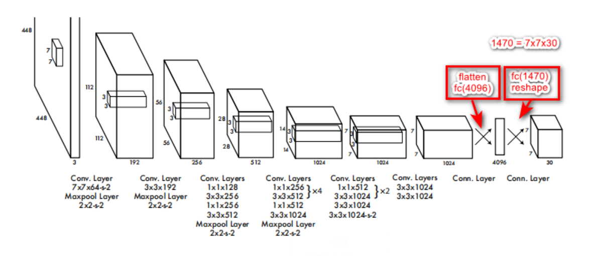
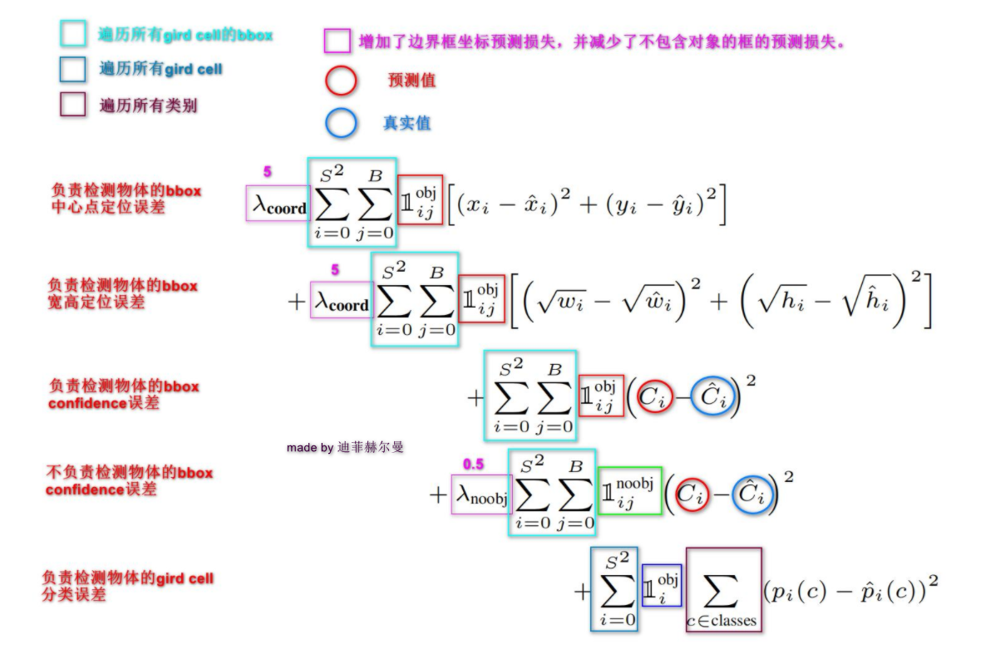

# 研究生周报（第十周）

## 学习产出

### Pytorch的一些注意事项

1. model.train()启用Batch Normalization和Dropout,如果模型中有BN层和Dropout,需要在训练时添加mode.train()。model.train()是保证BN层能够用到每一批数据的均值和方差。
2. model.eval()不启用Batch Normalization和Dropout，在测试时使用。在eval模式下，dropout会让所有的激活单元通过，而BN层会停止计算和更新meav和var,直接使用在训练阶段已经学出的mean和var值。
3. with torch.no_grad()主要用于停止autograd模块的工作，以起到加速和节省内存的作用。它的作用是将该with语句包裹起来的部分停止梯度的更新，从而节省了GPU算力和显存。
4. 不执行optimizer.zero_grad()，则每次梯度的值都要加上之前的梯度

### YOLO1

1. 概述
   1. YOLO的全称是you only look once，指只需要浏览一次就可以识别出途中物体的类别和位置
   2. 因为只要看一次，YOLO被称为Region-free方法，相比于Region-based方法，YOLO不需要提前找到可能存在目标的Region
   3. 一点典型的Region-base方法流程为：先通过计算机图形学的方法，对图片进行分析，找出可能存在物体的区域，将这些区域剪裁下来，放入一个图片分类器，由分类器分类
2. 整体流程
   1. 图形划分：将一副图片划分成SxS个网格，如果某个对象的中心点落在这个网格，则这个网格就负责预测这个对象
   2. Bounding Boxes预测
      1. bounding boxes + confidence。YOLO为每一个网格给出了两个预测框，每个预测框基于网格中心点，大小自定义，每个bounding boxer有四个坐标和一个置信度，所以最终的预测结果是SxSx(B*5+C)个向量
      2. class probablity map，负责将网格类别的分数放到一个7x7x30的张量中
         1. 使用S=7，B=2,PASCAL VOL有20个标签类=>7x7x(5*2+20)=7x7x30
      3. confidence是YOLO系列论文独有的一个参数，confidence有两种情况，分别是0和1,当网格中确实存在目标时，Pr(Object)就为1,如果网格中没有目标落在里面，那么Pr(Object)为0
   3. 最终预测时，对每个目标的最终概率是将conditional class probabilities乘上confidence,对于每个grid cell而言，我们会预测C个类别分数，那么这里的类别分数就是对应的conditional class probabilities,也就是Pr(Class|Object)
3. 网格结构分析
   
4. 损失函数详解
   
5. 缺陷
   1. 对群体性的小目标检测效果很差
   2. 目标出现新的尺寸或者配置的时候，预测效果也差
   3. 主要误差是由于定位不准
6. 详解
   1. DPM(Deformable Parts Model)基础HOG而来，传统的HOG只采用一个模板表示某种物体，而DPM把物体的模板划分为根模型和部分模型；在坚持中使用根模型进行定位，部分模型进行进一步的确认。
   2. HOG（Histogram of Oriented Gradient）特征的计算主要分为计算梯度、统计梯度只方图和归一化并截断三个步骤。
   3. DPM完成目标检测需要两次：一是寻找物件的位置，二是识别该物件。
   4. LeakyReLU：y=max(0,1)+leak*min(0,x)

### 线性因子模型

1. 线性因子模型
   1. 线性因子模型通过随机线性解码器函数来定义，该函数通过对h的线性变换以及添加噪声来生成x
   2. 首先从u偶和因子分布p(h)中抽取解释性因子h：h~p(h)，然后在给定因子的情况下，对实值的可观察变量进行采样：
   $$x=Wh+b+noise$$
   其中噪声往往是对角化的且服从高斯分布

2. 概率PCA和因子分析
   1. 因子分析：潜变量的先验是一个方差为单位矩阵的高斯分布：h~N(h;0,I)
   二噪声是从对角协方差矩阵的高斯分布中抽出来的，协方差矩阵为：$\psi=diag(\sigma^2)$，其中$\sigma^2=[\sigma_1^2,\cdots,\sigma_n^2]^T$
   可以看出生成的x服从多维正态分布，并满足：$x\sim N(x;b,WW^T+\psi)$
   2. 概率PCA：如果因子分析模型中的条件方差$\sigma_i^2$等于同一个值时，线性因子模型变为概率PCA,x服从的多维正太分布变为：$x=Wh+b+\sigma z$

3. 独立成分分析
   1. 它是一种建模线性因子的方法，旨在将观察到的信号分离成许多潜在信号，这些潜在信号通过縮放和叠加可以恢复成观察数据。
   2. 许多不同的具体方法被称为ICA,它们均要求p(h)是非高斯的，这样的选择在0附近具有比正态分布更高的峰值，因此ICA常用于学习稀疏特征。

4. 慢特征分析
   1. 慢特征分析（SFA）是使用来自时间的信息学习不变特征的线性因子模型，其想法源于慢性原则。
   2. SFA需要满足三个约束条件：
      1. 学习到的特征要具有零均值，这样优化问题才会有唯一解
      2. 学习到的特征要具有单位方差，以防止所以的特征趋近于0
      3. 学习道的特征必须彼此线性去相关

5. 稀疏编码
   1. 稀疏编码模型通常假设线性因子有一个各向同性精度为$\beta$的高斯噪声：
   $$p(x|h)=\nu (x;Wh+b,\frac{1}{\beta}I)$$
   2. 分布p(h)通常选取为一个峰值很尖锐且接近0的分布，常见的选择包括可分解的Laplace、Hauchy或者可分解的Student-t分布。

### (XGBoost的原理、推导、实现和应用)[https://zhuanlan.zhihu.com/p/162001079]

1. XGBoost基础
   1. GBDT（梯度提升决策树：Gradient Boosting Decision Tree）
      1. GBDT模型：GBDT时一种基于boosting集成思想的加法模型

2. XGBoost原理

3. XGBoost应用
