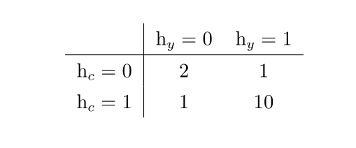

# 研究生周报（第十二周）

## 学习目标

1. 深度学习中的结构化概率模型
2. 吴恩达深度学习视频NLP部分
3. 信息检索导论

## 学习时间

> 7.24~7.30

## 学习产出

1. [Python代码](./code/)
2. github记录

### 深度学习中的结构化概率模型

结构化概率模型使用图来描述概率分布中随机变量之间的直接相互作用，从而描述一个概率分布。

1. 非结构化建模的挑战
    深度学习的目标是使得机器学习能够解决许多人工智能中亟待解决的挑战，这意味着它们能够理解具有丰富结构的高维数据。
    1. 概率模型可以完成的任务
        1. 估计密度函数：给定一个输入$x$，机器学习系统返回一个对数据生成分布的真实密度函数$p(x)$的估计。
        2. 去噪：给定一个受损的或者观察有误的输入数据$\hat{x}$，机器学习系统返回一个对原始的真实$x$的估计。
        3. 缺失值的填补：给定$x$的某些元素作为观察值，模型被要求返回一个$x$一些或者全部未观察值的估计或者概率分布。
        4. 采样：模型从分布$p(x)$中抽取新的样本。
2. 使用图描述结构
    结构化概率模型使用图来表示随机变量之间的相互作用。每一个节点代表一个随机变量，每一条边代表一个直接相互作用。
    1. 有向模型
        有向模型是一种结构化概率模型，也被称为信念网络或者贝叶斯网络。适合具有因果关系以及因果关系有明确方向的情况。
        之所以命名为有向模型是因为所有的边都是有方向的，即从一个节点指向另一个节点。这个方向可以通过画一个箭头来表示。箭头所指的方向表示了这个随机变量的概率分布是由起他变量的概率分布所定义的。
        只要有向图中的每一个变量都只有少量的父节点，那么这个分布就可以用较少的参数来表示。图结构上的一些限制条件，比如说要求这个图为一棵树，也可以保证一些操作更加有效
    2. 无向模型（马尔科夫随机场）
        举例：对三个二值模型进行建模：你是否生病，你的同事是否生病以及你的室友是否生病。假设
        * 你的室友和同事并不认识，所以它们不太可能直接相互传染一些疾病
        * 有可能其中之一将感冒传染给你，然后你在传染给了另一个人
        显然，模型不存在一个明确的单向箭头。
        
        正式地说，一个无向模型是一个定义在无向模型$G$上的结构化概率模型。会与图中的每一个团$C$，一个因子$\phi{C}$衡量了团中变量每一种可能的联合状态所对应的密切程度。这些因子都被限制为非负的。它们一起定义了未归一化概率函数：
        $$\hat{p}(x)=\prod_{c\in G}\phi{(C)}$$
        密切度越高的状态有越大的概率。
    3. 配分函数
        尽管未归一化概率函数处处不为零，我们任然无法保证它的概率之和或者积分为1。为了得到一个有效的概率的概率分布，需要使用对应的归一化的概率分布:
        $$p(x)=\frac{1}{Z}\hat{p}(x)$$
        其中，$Z$是使得所有的概率之和或者积分为1的常数，并且满足：
        $$Z=\int{\hat{p}(x)}dx$$
        当函数$\phi$固定时，我们可以把$Z$当作是一个常数。归一化常数$Z$被称作配分函数。
    4. 基于能量的模型
        无向模型中许多有趣的理论结果都依赖于$\forall{x}，\hat{p}(x)>0$这个假设。使这个条件满足的一种简单方式是使用基于能量的模型其中
        $$\hat{p}(x)=\exp{(-E(x))}$$
        $E(x)$被称作是能量函。对所有的$Z$，$\exp{(z)}$都是正的，这保证了没有一个能量函数会使得某一个状态$x$的概率为0。
    5. 分离和d-分离
        图模型中的边告诉我们哪些变量直接相互作用。在无向图模型中，识别图中的条件独立性是非常简单的。在这种条件下。图中隐含的条件独立性成为分离。
        * 如果图结构显示给定变量集$S$的情况下变量集$A$和变量集$B$无关，那么我们声称给定变量集$S$是。变量集$A$与另一组变量集$B$是分离的。
        * 如果连接两个变量$a$和$b$的连接路径仅涉及未观察变量，那么这些变量不是分离的。
        * 如果它们之间没有路径。就或者所有路径都包含可观测的变量，那么它们是分离的。
        类似的概念适用于有向模型，只是在有向模型中，这些概念被称为d-分离。
    6. 在有向模型和无向模型中转换
        有向模型提供了一种高效地从模型中抽取样本的直接方法，而无向模型形式通常对于推导近似推断过程是很有用的。
        * 有向->无向：有向模型能够使用一种无向模型无法完美表示的特定类型的子结构，这个字结构被称为不道德。
        为了将有向模型$D$转换为无向模型，我们需要创建一个新图$U$。
        对于每对变量$x$和$y$，如果存在连接$D$中的$x$和$y$的有向边，或者$x$和$y$都是图$D$中另一个变量$z$的父节点，则在$U$中添加连接$x$和$y$的无向边，得到的图$U$被称为是道德图。
        * 无向->有向：无向模型可以包括有向模型不能完美表示的子结构
        如果$U$包含长度大于3的环（是由无向边连接的变量序列，并且满足序列中的最后一个变量连接回序列中的第一个变量），则有向图$D$不能捕获无向模型$U$所包含的所有条件独立性，除非该环还包含弦（是定义环序列中任意两个非连续变量之间的连接）。
        如果$U$具有长度为4或更大的环，并且这些环没有弦，我们必须在将它们转换为有向模型之前添加弦。添加这些弦会丢弃在$U$中编码的一些独立信息。
    7. 因子图
        因子图是从无向模型中抽样的另一种方法，它可以解决标准无向模型语法中图表达的模糊性。
        在无向模型中，每$\phi$函数的范围必须是图中某个团的子集。们无法确定每一个团是否含有一个作用域包含整个团的因子——比如说一个包含三个结点的团可能对应的是一个有三个结点的因子，也可能对应的是三个因子并且每个因子包含了一对结点，这通常会导致模糊性。
        通过显示地表示每一个$\phi$函数的作用域，因子图解决了这种模糊性。
3. 从图模型中采样
   有向图模型的一个有点是，可以通过一个简单高效的过程从模型所表示的联合分布中产生样本，这个过程被称为原始采样。
   原始采样的基本思想是将图中的变量$x_i$使用拓扑排序，使得对于所有$i$和$j$，如果$x_i$是$x_j$的一个父亲节点，则$j$大于$i$。缺点是只适用于有向图模型，并且不是每次采样都是条件采样操作。
4. 结构化建模的优势
   使用结构化概率模型的主要优点是它们能够显著降低概率分布、学习和推断的成本。有向模型中采样还可以被加速，但是对于无向模型情况则较为复杂。
5. 学习依赖关系
   良好的生成模型需要准确地捕获所观察到的或“可见”变量$v$上的分布。通常$v$的不同元素彼此高度依赖。在深度学习中，最常用于建模这些依赖关系的方法是引入几个潜在或“隐藏”变量$h$。然后，该模型可以捕获任何对之间的依赖关系。
   如果一个良好的关于$v$的模型不包含任何潜变量，那么它在贝叶斯网络中的每一个节点需要具有大量父节点或在马尔可夫网络中具有非常大的团。当模型旨在描述直接连接的可见变量之间的依赖关系时，通常需要连接紧密相关的变量，忽略其他变量之间的作用。

### Python

1. 爬虫之前需要分析网页时动态页面还是静态页面，目前还不会爬取动态页面，只会爬取静态页面的相关内容
2. 使用requests包请求html页面，目前爬虫没有遇到反爬机制，如果需要反爬机制，主要处理的也是网络请求的内容
3. 使用bs4分析html页面，通过bs4可以通过find、find_all获取需要的内容
4. 通过re配合bs4使用，解析bs4拆分出的文本内容

### [信息检索导论](../信息检索导论/README.md)

1. XML检索
2. 概率检索模型
3. 基于语言建模的信息检索模型

## 总结

1. 本周深度学习只看了结构化概率模型一章，深度学习方面的代码coding也比较少；信息检索导论继续看了几章；地址分词的项目也有涉及
2. 下周把吴恩达的视频看完，再去找一点coding进行练习
