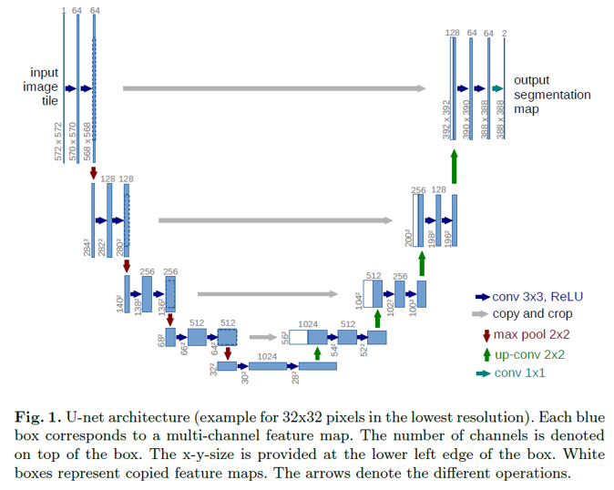

# 研究生（周报第十三周）

## 学习目标

### U-Net模型详解

U-Net最早是在医学图像领域提出用于医学图像的语义分割的模型，它的网络结构如下图所示。

输入的是572x572维的灰度图，经过5层卷积，每层都是用3x3的卷积核，且不加padding，因此每次卷积后会是用2x2的Maxpooling。

**第五层卷积结束后图像维度是28x28，通道数是1024。**

对其做2x2的上采样卷积，得到图像维度是56x56，通道数是512的特征图。再将第四层卷积的输出通过crop操作将64x64变为56x56后，于第五次上采样后的特征图进行concat操作，得到通道数为1024大小为56x56的特征图。再对其进行同样的卷积、上采样并与再上一层的输出crop后进行concat，总共进行4次上采样。

**最后一层采用1×1的卷积，输出通道为2，大小为388×388的医学图像语义分割图。**

### 蒙特卡罗方法

随机计算可以粗略地分为两类：Las Vegas算法和蒙特卡罗算法。Las Vegas算法总是精确地返回一个正确答案（或者算法失败），这类算法通常需要占用随机量地计算资源。蒙特卡洛方法返回地答案具有随机大小地错误。

1. 采样和蒙特卡罗方法
    
    当我们需要以较小地代价近似许多项地和或者某个积分时，采样是一种很灵活地选择，有时候可以用于加速一些很费时却易于处理地求和估计。

2. 蒙特卡罗采样的基础

    当无法精确计算和或积分时，通常可以使用蒙特卡罗采样来近似它。这种想法把和或者积分视作某分布下的期望，然后通过估计对应地平均值来近似这个期望。令
    $$s=\sum_{x}p(x)f(x)=E_{p}[f(x)]$$
    为我们所需要估计地和或者积分，写成期望地形式，$p$是一个关于随机变量$x$地概率分布或者概率密度函数。
    可以从$p$中抽取$n$个样本$x^{(1)},\cdots, x^{(n)}$来近似$s$并得到一个经验平均值
    $$\hat{s}_{n}=\frac{1}{n}\sum_{i=1}^{n}f(x^{(i)})$$
    以上结论依赖于我们可以从基准分布$p(x)$中轻易地采样，但是这个假设并不是一直成立的。当我们无法从$p$中采样时，一个备选方案时用重要采样，另一种更加通用的方式时构建一个收敛到目标分布的估计序列。

3. 重要采样

	在蒙特卡罗方法中，对积分（或者和）分解，确定积分中哪一部分作为概率分布$p(x)$以及哪一部分作为被积的函数$f(x)$是很关键的一步。$p(x)f(x)$不存在唯一的分解，因为它总是可以被写成
	$$p(x)f(x)=q(x)\frac{p(x)f(x)}{q(x)}$$
	可以发现任意蒙特卡罗估计可以被转化为一个重要采样的估计
	$$\hat{s}_{q}=\frac{1}{n}\sum_{i=1,x^{(i)}~q}^{n}\frac{p(x^{(i)}f(x^{(i)}))}{q(x^{(i)})}$$
	重要采样的方差可能对$q$的选择非常敏感，方差想要取到最小值，$q$需要满足$q^{*}(x)=\frac{p(x)|f(x)|}{Z}$，这里$Z$表示归一化常数。对于重要采样来说任何的$q$分布都是可行的，$q^{*}$指的是最优的$q$分布。
	另一种方法是采用**有偏重要采样**，这种方法有一个优势，即不需要归一化的$p$或$q$分布，在处理离散变量时，有偏重要采样估计可以表示为
	$$\hat{s}_{BIS}=\frac{\sum_{i=1}^{n}\frac{\tilde{p}(x^{(i)})}{\tilde{q}(x^{(i)})}f(x^{(i)})}{\sum_{i=1}^{n}\frac{\tilde{p}(x^{(i)})}{\tilde{q}(x^{(i)})}}$$

4. 马尔可夫链蒙特卡罗方法
