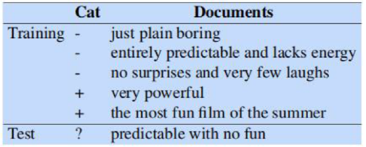

# 研究生周报（第十四周）

## 学习目标

1. 语音与语言处理——N元语言模型
2. 语音与语言处理——朴素贝叶斯与情感分类
3. 语音与语音处理——逻辑回归部分内容
4. 熟悉地址分类代码

## 学习时间

> 8.07 ~ 8.13

## 学习产出

### 2. N-gram Language Models

#### 2.1 N-Grams

从计算P(w|h)的任务开始，即：在给定历史h的条件下，计算单词w的概率。假设历史h是“its water is so transparent that”，我们想知道下一个单词是“the”的概率：
$$
P(the|its \ water \ is \ so \ transparent \ the)
\tag{2.1}
$$
估计这个概率的一种方法是通过相对频率计数：取一个非常大的语料库，计算我们看到“its water is so transparent that”的次数，并计算它后面跟着“the”的次数。这就可以回答“根据我们看到历史h的次数，由多少次它后面跟着w”，如下所示：
$$
P(the | its \  water \ is \ so \ transparent \ that)
= \frac{Count(its \ water \ is \ so \ transparent \ that \ the)}{Count(its \ water \ is \ so \ transparent \ that)}
\tag{2.2}
$$
有足够大的语料库，如web，我们可以计算这些技术，并根据公式3.2估计概率。但是因为语言具有创造力，即使是例句的简单扩展，在web上也可能出现0的计数。
处于这些原因，我们需要引入更聪明的方法来估计在给定历史h条件下的单词w的概率然后通过链式规则分解整个$P(w_1,w_2,\cdots,w_n)$这样的整个序列的概率：
$$
P(X_1...X_n)=P(X_1)P(X_2|X_1)P(X_3|X_{1:2})...P(X_n|X_{1:n-1})=\prod_{k=1}^{n}P(X_k|X_{1:k-1})
\tag{2.3}
$$
运用链式法则，我们得到：
$$
P(w_{1:n})=P(w_1)P(w_2|w_1)P(w_3|w_{1:2})...P(w_n|w_{1:n-1})=\prod_{k=1}^{n}P(w_k|w_{1:k-1})
\tag{2.4}
$$
链式规则展示了计算一个序列的联合概率和计算在给定前一个单词的情况下的条件概率之间的联系。但是给定一长串前面的单词，我们没有任何办法可以计算出一个单词的确切概率，正如上面所说的，我们不能仅仅通过计算每个单词在每个长字符串后面出现的次数来估计，因为语言是有创造性的，任何特定的上下文可能以前**从未出现过**！
**n元语法模型**的直觉是，与其在给定全部单词历史记录的情况下计算单词的概率，不如仅仅通过最后几个单词来估计历史记录。
例如，**二元语法（bigram）模型**仅通过使用一个先前单词$P(w_n|w_{n-1})$的条件概率来近似所有先前单词$P(w_n|w_{1:n-1})$的单词的概率。换句话说，不是计算概率：
$$
P(the | Walden \ Pond's \ water \ is \ so \ transparent \ that)
\tag{2.5}
$$
而是使用下面的概率来近似计算：
$$
P(the|that)
\tag{2.6}
$$
以此，当我们使用bigram模型来预测下一个单词的条件概率时，我们可以做出如下近似：
$$
P(w_n|w_{1:n-1})\approx P(w_n|w_{n-1})
\tag{2.7}
$$
一个词的概率只取决于前一个词的假设被成为**马尔可夫（Markov）假设**。马尔可夫模型是概率模型的一类，它们假定我们可以预测某些未来的概率而不会过多地考虑过去。我们可以将二元语法（想过去看一个单词）推广到三元语法（向过去看两个单词），然后推广到**n元语法（n-gram）**（向过去看n-1个单词）
因此，这个n元近似的序列这种下一个单词的条件概率的一般方程是：
$$
P(w_n|w_{1:n-1}) \approx P(w_n|w_{n-N+1:n-1})
\tag{2.8}
$$
在给定单个凡此概率的二元语法假设的情况下，我们可以通过将公式2.7带入公式2.4计算出全部单词序列的概率：
$$
P(w{1:n})=\prod_{k=1}^nP(w_k|w_{1:k-1})
\tag{2.9}
$$
如何估计这些二元或n元语法概率？估计概率的一种直观方法称为**最大似然估计（MLE）**。我们通过从语料库中获取计数，并对计数进行**归一化（normalize）**，使它们位于0-1之间，从而获取n-gram模型参数的MLE估计。
$$
P(w_n|w_{n-1})=\frac{C(w_{n-1}w_n)}{\sum_{w}C(w_{n-1}w)}
\tag{2.10}
$$
可以简化此等式，因为以给定单词$w_{n-1}$开头的所有二元语法计数的总和必须等于该单词$w_{n-1}$的一元语法计数：
$$
P(w_n|w_{n-1})=\frac{C(w_{n-1}w_n)}{C(W_{n-1})}
\tag{2.11}
$$

对于MLE n-gram参数的一般情况：
$$
P(w_n|w_{n-N+1:n-1})=\frac{C(w_{n-N+1:n-1}w_n)}{C(W_{n-N+1:n-1})}
\tag{2.12}
$$
一些实际问题：在实践中，更常见的是使用三元语法（trigram），或者数据更多时使用4-gram甚至5-gram模型。
通常使用对数概率的形式来表示和计算语言模型的概率，否则容易导致数字下溢。最后报告时在使用exp转回概率。
$$
p_1 \times p_2 \times p_3 \times p_4 = \exp(\log{p_1} + \log{p_2} + \log{p_3} + \log{p_4})
\tag{2.13}
$$

#### 2.2 评估语言模型

评估语言模型性能的最佳方法是将其嵌入到应用程序中，并衡量应用程序的改进程度。这种端到端的评估称为**外部评估**（extrinsitc evaluation）。外部评估是了解某个组件的特定改进是否真的会帮助完成手头任务的唯一方法。
不幸的是，端到端的运行大型NLP系统非常昂贵。一个**内在评估**（intrinsic evalaution）的度量是一个独立于任何应用程序的模型质量的测量。
对于语言模型的内在评估，我们需要一个测试集。n-gram模型的概率来自于它所受训练的语料库，即**训练集**。然后通过n-gram模型在**测试集**上的性能来衡量其质量。有时将不在训练集中测试集和起他数据集称为保留**语料库**。
有时，我们过于频繁地使用一个特定的测试集，以致于我们隐式地调整了它地特征。因此需要一个新的测试集，一个真正看不见地测试集，我们称为**开发测试集**。在实践中，我们通常只是将我们地数据分为80%的训练、10%的开发和10%的测试。

##### 2.2.1 困惑度

在实践中，不使用原始概率作为我们评估语言模型的度量标准，而是使用一种叫做困惑度（perplexity）的变量。测试集上的语言模型的困惑度（有时简称PP）是测试集的逆反概率，由单词的数量归一化。对于一个测试集$W=w_1w_2...w_N$，有：
$$
PP(W)=P(w_1w_2...w_N)^{-\frac{1}{N}}=N\sqrt{\frac{1}{P(w_1w_2...w_N)}}
\tag{2.14}
$$
使用链式规则来展开$W$的概率：
$$
PP(W)=N\sqrt{\prod_{i=1}^N \frac{1}{P(w_i|w_1w_2...w_{i-1})}}
\tag{2.15}
$$
使用二元语言模型计算$W$的困惑度为：
$$
PP(W)=N \sqrt{\prod_{i=1}^N \frac{1}{P(w_i|w_{i-1})}}
\tag{2.16}
$$
如果单词序列的条件概率越高，则困惑度越低。即最小化困惑度等价于最大测试集概率。由于通常使用的测试集是整个单词序列，整个序列将会跨越许多句子边界，因此需要在概率计算中包括开始和结束句子标记\<s\>和\</s\>，还需要单词符记的总数N中包括句子的结束标记\</s\>。
另一种思考困惑度的方式：作为一种语言的加权平均的分支因子。当英文数字（0、1、2、……9）的任务，每一个的概率P=1/10时，困惑度为10。如果英文数字的概率变动很大，困惑度可能比较小，表明困惑度与熵的信息理论概念密切相关。
困惑度的（内在的）改善，并不保证语言处理任务（如语言识别或机器翻译）性能的（外在的）改善。尽管如此，由于困惑往往与这些改进相关，它通常被用作对算法的快速检查。

#### 2.3 从语言模型中抽取样本

#### 2.4 泛化与零

n-gram模型，像许多统计模型一样，依赖于训练语料库。一个暗示是，概率通常会争对有关给定训练语料库的特定事实进行编码，另一个暗示是，随着我们增加N的值，n-grams在对训练语料库进行建模方面做得越来越好。
比如训练莎士比亚的作品，一元语法的句子中，单词与单词之间没有连贯的关系，二元语法具有局部的连贯关系，三元和四元开始向莎士比亚的作品。

如图所示，零（0）在训练集中不会出现，但是在测试集中会出现：
- 它们的存在意味着我们低估了各种可能出现的单词的概率。
- 如果测试集之中任何一个的概率为0，则测试集的整体概率为0，导致不能计算困惑度。

##### 2.4.1 未知单词

在一个封闭词汇（closed vocabulary）的系统中，测试集只能包含本词汇库中的单词，不会有未知的单词。在某些领域（例如语音识别或机器翻译）中，这是一个合理的假设，在这些领域中，我们预先安装了发音词典或短语表，因此语言模型只能使用该词典或短语表中的单词。
其他情况下，我们必须处理没有见过的单词，称为未知单词，或**表外词**（OOV）单词。OOV单词在测试集中出现的百分比称为OOV率。一个开放词汇（open vocabulary）的系统是这样的系统，在这个系统中，首先，争对测试集之中的未知词，我们添加一个名为\<UNK\>的伪词；然后，我们对那些未知词进行建模。
有两种常用的方法来训练未知词模型\<UNK\>的概率
1. 提前选择一个固定的词汇表，把这个问题变成一个封闭的词汇表：
	1. 选择一个预先确定的词汇表
	2. 在文本规范化步骤中，将训练集中不属于该集合的任何单词（OOV）转换为未知单词符记\<UNK\>
	3. 根据\<UNK\>的计数估计其概率，就像训练集中的任何其他普通单词一样。
2. 在事先没有预先的词汇表的情况下，隐式地创建这样地词汇表：
	1. 基于单词地频率，用\<UNK\>替换训练数据中地单词，例如用\<UNK\>替换所有在训练集中出现次数小于n次地单词，其中n式一个较小的数字；或等价地提前选择大小V，按频率选择前V个单词，其余的用UNK替换。
	2. 将\<UNK\>视为普通单词进行训练。

#### 2.5 平滑

如何处理词汇表中地单词（它们不是未知地单词），但它们出现在一个看不见地上下文地测试集之中（例如出现在一个训练中从未出现过地单词之后）？为了防止将这些不可见事件分配零概率，我们将不得不从一些更频繁发生地事件中消除一些**概率质量**（probability mass），并将其分配给我们从未见过地时间，这些修改称为**平滑**（smoothing）或**折扣**（discounting）。

##### 2.5.1 拉普拉斯平滑

最简单地平滑处理是：在我们将它们标准化之前，将所有地bigram计数加1，这种算法被称为**拉普拉斯平滑**（Laplace smoothing）。不过拉普拉斯平滑在现代n-gram模型中表现得不够好，但是引入了许多我们在其它平滑算法中看到的概念，给出了一个有用地基线。
单词$w_i$地一元语法概率地未平滑最大似然估计是其计数$c_i$地归一化（N是单词符记总数）：
$$
P(w_i)= \frac{c_i}{N}
$$
拉普拉斯仅对每个计数加一，由于词汇有V个单词，并且每个单词都增加了，我们还需要调整父母以考虑额外地V个观察值：
$$
P_{Laplace}(w_i) = \frac{c_i + 1}{N + V}
$$
通过定义一个调整后地计数$c^{*}$，可以方便地描述平滑算法如何影响分子，而不必同时更改分子和分母。这个调整后地计数更容易直接与MLE计数，并且可以通过N地归一化将其转换为类似于MLE计数的概率，为了定义此计数，因除了加1之外，我们更改了分子，故还需要乘以归一化因子N/(N+V)：
$$
c_i^{*}=(c_i+1) \frac{N}{N+V}
$$
看待平滑的一种相关方法是，为了获得将被分配给零计数的概率质量，打折一些非零计数。因此，不是引用折扣计数$c^{*}$，而是用相对则扣$d_c$来描述平滑算法，即折扣计数与原始计数的比率：
$$
d_c = \frac{c^{*}}{c}
$$

##### 2.5.2 加K平滑

加一平滑的另一选择，是从可见事件到不可见事件的概率质量稍微减少一点。我们不给每个技数加1,而是加一个分数计数k（.5?.05?.01?）。因此，此算法被称为**加k**（add-k）平滑。
$$
P_{Add-k}^{*}(w_n|w_{n-1})=\frac{C(w_{n-1}w_n)+k}{C(w_{n-1}+kV)}
$$
加k平滑要求我们选择k的方法，尽管加k在一些任务中很有用（包括文本分类），但它仍不能很好地用于语言建模，生成的计数具有很差的方差和经常不适当的折扣。

##### 2.5.3 回退和插值

可以考虑利用另外一条只是来源：如果我们没有特定的三元语法例子，我们可以通过二元语法概率来进行估计，二元语法可以用一元语法来估计。
在**回退**（backoff）中，我们在没有证据证明高阶n-gram存在的情况下才会“回退”到低阶n-gram。**插值**（interpolation），通过权衡和组合trigram、bigram和unigram计数的方式，我们总是混合来自所有n元语法估计器的概率估计。
在简单线性插值中，我们通过对所有模型进行线性插值来组合不同阶的n-gram。因此，通过混合unigram、bigram和trigram概率极其对应的加权$\lambda$系数，我们估计trigram概率
$P(w_n|w_{n-2}w_{n-1})$：
$$
\hat{P}(w_n|w_{n-2}w_{n-1})=\lambda_1 P(w_n|w_{n-2}w_{n-1}) + \lambda_2 P(w_n|w_{n-1}) + \lambda_3 P(w_n)
$$
其中$\lambda_s$总和为1：
$$
\sum_i{\lambda_i}=1
$$
在一个稍微复杂的线性插值版本中，每个$\lambda$权重是通过上下文条件计算的。这样，如果我们我们对一个特定的二元语法具有特别准确的计数，那么我们就认为基于该二元语法的三元语法的计数更加可信，因此我们可以使这些三元语法的$\lambda_s$更高，从而在插值中使该三元语法的权重更大。
$$
\hat{P}(w_n|w_{n-2}w_{n-1})=
\lambda_1(w_{n-2:n-1})P(w_n|w_{n-2}w_{n-1})
+\lambda_2(w_{n-2:n-1}P(w_n|w_n-1))
+\lambda_3(w_{n-2:n-1})P(w_n) 
$$
这些$\lambda$如何设置？简单插值和条件插值$\lambda_s$都是从**保留**（held-out）预料库中学习的。保留预料库是一种额外的训练预料库，我们可以通过选择最大化保留预料库似然度的$\lambda$值来设置这些$\lambda$值之类的超参数。
为了让回退模型给出一个正确的概率分布，我们必须对高阶n-gram进行打折，为低阶n-gram保留一些概率质量。如果不对高阶n-gram进行打折，而我们只使用了未打折的MLE概率，则只要我们将具有零概率的n-gram替换为低阶n-gram,最后计算的总概率将大于1。
除了这个显式的折扣因子，我们还需要一个函数$\alpha$来将这个概率质量分配到低阶n-gram。这种打折的回退也被成为**卡茨回退**（Katz backoff）。
$$
P_{BO}(w_n|w_{n-N+1:n-1})=
\begin{cases}
	P^{*}(w_n|w_{n-N+1:n-1}),if \ C(w_{n-N+1:n})>0 \\
	\alpha (w_{n-N+1:n-1})P_{BO}(w_n|w_{n-N+2:n-1}),otherwise
\end{cases}
$$
卡茨回退通常与一种称为“好图灵”（Good-Turing）的平滑方法结合在一起。

#### 2.6 Knerser-Ney 平滑

最常用和性能最好的n-gram平滑方法之一是插值的Knerser—Ney算法（Kneser和Ney 1995,Chen和Doodman 1998）。
Kneser-Key起源于一种被称为绝对打折的方法。
通过对美联社的2200万个单词中计算出一个bigram语法，另外2200万个单词检查来每个bigram的计数，发现除了0和1的保留计数之外，只需要从训练集中的计数中减去0.75,就可以很好地估算出保留集中的所有其他二元语法计数！**绝对打折**（absolute discounting）是通过从每次计数中减去一个固定的折扣d来形式化这种直觉。直觉是，由于我们以及对非常高的计数有了很好的估计，一个小的折扣d不会对它们有太大的影响，这种折扣实际上对计数从2到9的bigrams是一个很好的折扣，适用于bigrams绝对折扣的插值公式：
$$
P_{AbsoluteDiscounting}(w_i|w_{i-1})=\frac{C(w_{i-1}w_i)-d}{\sum_VC(w_{i-1}v)}+\lambda(w_{i-1})P(w_i)
$$
```txt
I can't see without my reading _____.
在这里，‘glasses（眼镜）’似乎比‘Kong（孔）’这个词更容易出现，所以我们希望我们的unigram模型更喜欢‘glasses’这个词。但实际上，更常见的是‘Kong’，因为‘Hong Kong（香港）’是一个非常高频的词，但主要高频在‘Hong Kong’，即‘Hong’一词之后。glass这个词的分布分为要广得多。
```
因此，我们想创建一个称为$P_{CONTINUATION}$的unigram模型，而不是创建P(w)。单词w作为新延续出现的次数可以表示为：
$$
P_{CONTINUATION}(w)\propto | \{v:C(vw)>0\}
$$
按所有单词前面的单词数进行归一化，如下所示：
$$
P_{CONTINUATION}(w)=\frac{|\{v:C(vw)>0\}|}{\sum_{w^{'}}|\{v:C(vw^{‘}）>0)\}|}
$$

##### 2.7 巨大的语言模型和傻瓜回退

通过使用来自网络或其他大量的集合的文本，可以建立非常大的语言模型。
在构建如此大的n-gram集合的语言模型时，效率考虑非常重要。不是将每个单词储存为字符串，而是在内存中表示为64为哈系数，单词本身储存在磁盘上。概率通常仅使用4-8为进行量化，n-grams被储存在倒叙前缀数中。
n-gram也可以通过修剪来缩小：
- 仅储存计数大于某个阙值
- 使用步隆过滤器之类的技术来构建近似语言模型
对于非常大的语言模型，一个非常简单的算法就就足够了，这个算法被成为**傻瓜回退**（stupidoff）。傻瓜回退放弃来试图使语言模型成为真实概率分布的想法。

##### 2.8 困惑度与熵的关系

随机变量X的熵是：
$$
H(X)=\sum_{x\in \chi}p(x)log_2p(x)
$$
当我们不知道产生某些数据的实际概率分布p时，交叉熵很有用。他允许我们使用一些m,它是p的模型（即p的近似值）。m在p上的交叉熵定义为：
$$
H(p,m)=lim_{n->\infty}-\frac{1}{n}\sum_{W\in L}p(w_1,w_2,...,w_n)logm(w_1,w_2,...,w_n)
$$
对于任何模型m：
$$
H(p)\leq H(p,m)
$$
这意味着我们可以使用一些简化的模型m来帮助估计真实熵，m越精确，交叉熵H(p,m)就越接近真实熵H(p)。
$$
H(W)=-\frac{1}{N}logP(w_1,w_2,...,w_n)
$$
一个关于单词W序列P的困惑度为：
$$
Perplexity(W)=2^{H(W)}=P(w_1,w_2,...,w_N)^{-\frac{1}{N}}
$$

### 3. Naive Bayes and Sentiment Classification（朴素贝叶斯与情感分类）

分类是人类和机器智能的核心。
本章聚焦于一个常见的文本分类任务**情感分析**（sentiment analysis）、情感提取、作者对某一对象表达的积极或消极倾向。
分类的目的是进行单个观察，提取一些有用的特征，从而将这个观察分类到一组离散类集合中的一个。分类文本的一种方法是使用手写规则。在语言处理的许多领域，基于规则的手写分类器构成了最先进（SOTA）的系统，或者至少是其中的一部分。
然而，规则可能是脆弱的，因为情况或数据会随着时间的推移而变化，而且对于某些任务，人类不一定擅长提出规则。语言处理中的大多数分类都是通过**监督机器学习**（supervised machine learning）完成的。

#### 3.1 朴素贝叶斯分类器

朴素贝叶斯是一个概率分类器，意味着对于一个文档$d$，$\hat{c}$在所有类$c\in C$中的后验概率最大：
$$
\hat{c} = argmax_{c \in C}P(c|d)
\tag{3.1}
$$
贝叶斯规则如下所示：
$$
P(c|y)=\frac{P(y|x)P(x)}{P(y)}
\tag{3.2}
$$
将公式3.2代入公式3.1得到：
$$
\hat{c}=argmaxP(c|d)=argmax \frac{P(d|c)P(c)}{P(d)}
\tag{3.3}
$$
可以通过去掉分母P(d)来简化公式3.3。因为为每一个类计算$\frac{P(d|c)P(c)}{P(d)}$，但是P(d)不会因为每个类而改变。
我们总是关心同一文档d的最有可能的类，这个类必须具有相同的概率P(d)。
因此，我们可以选择使这个简单公式最大化的类：
$$
\hat{c}=argmax_{c\in C}P(c|d)=argmax_{c\in C}P(d|c)P(c)
\tag{3.4}
$$
则$\hat{c}$具有两个以下概率的最高乘积：文档的**似然度**（likelihood）P(d|c)和类的**先验概率**（prior probability）P(c)。
不失一般性，我们可以将文档d表示为一组特征$f_1，f_2，...，f_n：$
$$
\hat{c}=argmax_{c\in C}P(f_1,f_2,...,f_n|c)P(c)
$$
因此，朴素贝叶斯分类器为该类选择的最终方程为：
$$
C_{NB}=argmax_{c\in C}P(c)\prod_{f\in F}P(f|c)
$$
要将朴素的贝叶斯分类器应用于文本，我们需要通过简单地便利文档中每个单词位置的索引来考虑单词位置：
$$
\begin{aligned}
positions \leftarrow all \ word \ positions \ in \ test \ document \\
C_{NB} = argmax_{c\in C}P(c)\prod_{i\in positions}{P(w_i|c)}
\end{aligned}
$$
朴素贝叶斯的计算，就像语言建模的计算，是在对数空间中完成的，以避免下溢和提高速度：
$$
C_{NB}=argmax_{c\in C}\log P(c) + \sum_{i\in positions}\log P(w_i|c)
$$

#### 3.2 朴素贝叶斯分类器的训练

如何学到概率$P(c)$和$P(f_i|c)$？我们首先考虑最大似然估计。我们将简单地使用数据中的频率。
对于$P(c)$之前的类，我们要得到训练集中文档在每个类$c$中的百分比。设$N_c$为训练数据中文档的数量，$N_{doc}$为文档的总数，然后：
$$
\hat{P}(c)=\frac{N_c}{N_{doc}}
$$
要了解概率$P(f_i|c)$，我们加上，一个特征只是文档词袋中一个单词的存在，因此我们需要$P(w_i|c)$，将其计算为次数的分数，这个次数是指，在主题$c$中的所有文档的所有单词中出现单词$w_i$的次数。
$$
\hat{P}(w_i|c)=\frac{count(w_i,c)}{\sum_{w\in V}count(w,c)}
$$
不过最大似然训练存在一个问题。想象一下，我们试图估计给定类别为阳性的单词“fantastic”的似然度，但假设没有既包含单词“dantastic”又被分类为阳性的训练文档。那么该特征的概率将为零：
$$
\hat{P}(fantastic|positive)=\frac{count(fantastic,postive)}{\sum_{w\in V}count(w,positive)}=0
$$
最近的解决方案是拉普拉斯（加一）平滑，它在朴素贝叶斯文本分类中经常被使用：
$$
\hat{P}(w_i|c)
=\frac{count(w_i,c)+1}{\sum_{w\in V}(count(w,c)+1}
=\frac{count(w_i,c)+1}{(\sum_{w\in V}count(w,c))-|V|)}
$$
对于出现在测试数据中但根本不再词汇表中的单词，因为它们在任何类的任何训练文档中都没有出现，我们该怎么办？**解决此类未知词（unkkonwn word）的方法是忽略它们—从测试文档中删除它们，根本不包含任何概率**。
某些系统选择完全忽略另一类单词：**停用词**，比如说the和a。可以通过对按训练集中的频率对词汇进行排序，然后将前10-100个词汇定义为停用词，或者使用许多可用的在线预定义停用词列表之一来完成。最后将这些停用词的每个实例都从训练和测试文档中删除。不过在大多数文本分类应用程序中，使用停用词列表并不能提高性能，因此更常见的是利用整个词汇表而不使用停用词列表。
```c
// 使用加一平滑处理的朴素贝叶斯算法
function Train Naive Bayes(D, C) return log P(c) and log P(w|c)

for each class c in C
	NDOC = number of documents in D
	NC = number of documents D in class c
	logprior[c] <- log(NC/NDOC)
	V <- vocabulary of D 
	bigdoc[c] <- append(d) for d in D with class c
	for each word w in V
		count(w, c)
		loglikelihood[w, c] <- log((count(w,c) + 1)/ (for w in V : (count(w, c) + 1)))
	return logprior, loglikelihood, V

function Test Naive Bayes(testdoc, logprior, loglikelihood, C, V) returns best c

for each class c in C
	sum[c] <- lohprior[c]
	for each position i in testdoc
		word <- testdoc[i]
		if word in V
			sum[c] <- sum[c] + loglikelihood[word, c]
return argmax(sum[c])

```

#### 3.3 实例

将情感分析域分为证明（+）和负面（-）两个类，并从实际电影评论中简化以下微型训练和测试文档。

这两个类的先验P(c)通过公式$\frac{N_c}{N_{doc}}$计算：
$$
P(-)=\frac{3}{5} \ \ \ \ 
p(+)=\frac{2}{5}
$$
单独with没有出现在训练集中，所以我们完全放弃它，求测试集剩下的三个单词“predictable”、“no”和“fun”的似然度。
$$
\begin{aligned}
P(predictable|-)=\frac{1+1}{14+20}\ \ \ \ 
P(predictable|+)=\frac{0+1}{9+20} \\
p(no|-)=\frac{1+1}{14+20} \ \ \ \ 
p(no|+)=\frac{0+1}{9+20} \\
p(fun|-)=\frac{0+1}{14+20} \ \ \ \ 
p(fun|+)=\frac{1+1}{9+20}
\end{aligned}
$$
对于测试句S="predicted woth no fun"，去掉“with”后，通过公式对多选类计算如下：
$$
\begin{aligned}
P(-)P(s|-)=\frac{3}{5}\times \frac{2\times 2\times 2 \times 1}{34^3}=6.1\times 10^{-5} \\
P(+)P(S|+)=\frac{2}{5}\times \frac{1\times 1\times 2}{29^3}=3.2\times 10^{-5}
\end{aligned}
$$

#### 3.4 情感分析的优化

尽管标准的朴素贝叶斯文本分类可以很好地用于情感分析，但通常会进行一些小的更改以提高性能。
- 通常对于情感分类和许多其他文本分类任务，一个单词是否出现似乎比其出现频率更加重要，因此，通常可以将每个文档的单词计算限制为1来提高性能。
- 处理否定（negation）。在否定符记（n't, not, no, never）之后的每个单词前加前缀NOT_，知道下一个标点符号。

#### 3.5 朴素贝叶斯用于其他文本分类任务

1. 电子邮件检测任务，即确定某封特定的邮件是否为垃圾邮件。一种常用的解决方案是，不要将所以的单词作为单独的特征使用，而是将可能的单词或短语集预先定义为特征，并与非纯语言的特征相结合。
2. 语言ID（确认给定一段文字使用那种语言），最有效的朴素贝叶斯特征是字符n-gram。

#### 3.6 朴素贝叶斯的语言模型

一个朴素贝叶斯模型可以被看作是一组特定于类的unigram语言模型，其中每个类的模型实例化了一个unigram语言模型。由于朴素贝叶斯模型的似然特征为每个单词P(word|c)分配来概率，因此该模型也为每个句子分配来概率：
$$
P(s|c)=\prod_{i\in positions}P(w_i|c)
$$
即可以将每个句子的单词概率进行乘积，观察P(s|pos)和P(s|neg)的大小。

#### 3.7 评估：精度、召回率、F量度

精度（precision）衡量的是系统检测到的项目（即标记为阳性的系统）实际上是阳性的项目所占的百分比：
$$
Precision=\frac{true \ positives}{true \ positives + false \ positives}
$$
召回率（recall）衡量输入中实际存在的，被系统正确识别的项目所占的百分比。召回率定义为：
$$Recall=\frac{true \ positives}{true \ positives+false \ negatives}$$
精度和召回率将有助于解决无用的“nothing is pie”分类器问题。有许多方法可以包含精度和召回率两个方面的单个度量标准。这些组合中最简单的是**F-度量**，定义为：
$$
F_{\beta}=\frac{(\beta^2+1)PR}{\beta^2P+R}
$$
$\beta$参数可能会根据应用程序的需求，以不同的方式加权召回率和精度的重要性。$\beta>1$的值有助于召回率，而$\beta<1$的值有助于精度。当$\beta=1时$，精度和召回率是相等的；这是最常用的指标，称为$F_{\beta}=1$或仅称为$F_1$：
$$
F_1=\frac{2PR}{P+R}
$$

##### 3.7.1 用两个以上的类进行评估

在任务超过2个时，需要稍微修改一下精度和召回率的定义。
- **宏平均**，我们计算每个类别的性能，然后对各个类别进行平均。
- **微平均**，我们将所以类的决策收集到一个混淆矩阵中，然后从该表中计算精度和召回率。


#### 3.8 测试集和交叉验证

通常，我们需要使用大量数据进行训练，小量数据进行测试。如果我们可以用全部数据进行训练和测试就好了？这个可以使用**交叉验证**完成。
在交叉验证中，我们选择一个数字k,并将我们的数据划分为k个不相交的子集，称为折叠。我们选择这k次中的一个作为测试集，在剩下的k-1次上训练分类器，然后计算测试集上的错误率。然后我们用另一个折叠作为测试集重复，再次训练另一个k-1个折叠。我们做这个抽样k次然后对这k次运行中的测试集错误率取平均值得到一个平均错误率。如果k=10,则称为10被交叉验证。
交叉验证唯一的问题是，因为所有的数据都用于测试，我们需要整个预料库是盲的。我们不能检查任何数据来暗示可能的特征。然而设计NLP系统时，查看预料库来了解发生来什么是很重要的！因此常见的做法是先创建一个固定的训练集和测试集，然后在训练集内部进行10次交叉验证，而在测试集中采用正常的方法来计算错误率。


#### 3.9 统计显著性检验

在构建系统时，我们经常需要比较两个系统的好坏，如何知道新的系统比老的系统好？这是统计假设检验的范围。
M(A,x)是系统A在测试集x上的评分，M(B,x)是系统B在测试集x上的评分，$\delta(x)$是系统A和B的差异：
$$
\delta (x) = M(A,x)-M(B,x)
$$

##### 3.9.1 配对引导测试

**引导测试**（boostrap test）可以适用于任何度量标准，从精度、召回率或$F_1$到机器翻译中使用的BLEU指标。引导一词指的是从原始的较大样本中重复抽取大量较小的样本，并进行替换。引导测试的直觉是我们可以通过从观察到的测试集中重复采样来创建许多虚拟测试集，该方法仅假设样本可以代表总体。


#### 3.10 避免分类中的危害

重要的是要避免分类器中可能造成的损害，这些损害即可能存在于朴素的贝叶斯分类器中，也存在于其它分类算法。
- 一类是**代表性伤害**，该类又贬低群体的系统造成的伤害，例如通过对他们的负面刻板印象的永恒化。
- 在其他任务中，分类器可能同时导致代表性损害和其他损害，如审查制度。
机器学习系统通常会复制甚至放大其训练数据中的偏差。但是这些问题也有可能是由于标签（人类标签的偏差）、使用的资源（例如词汇）、甚至是模型体系结构导致了。目前尚没有解决办法，需要为每个版本发布**模型卡**（model card），其中包含以下信息：
- 训练算法和参数
- 训练数据源、动机和预处理
- 评估数据源、动机和预处理
- 预期的用途和用户
- 跨不同人员背景或其他群体和环境状况的模型性能

## 总结

1. 语音与识别处理由于看的比较仔细，所以进度比较慢，暂时先停止看花书的内容。
2. 地址分类由于是在别人的基础上改进的，并且又做了几周，对于分类的规则也添加了较多内容，我目前只对于大致流程和部分细节有所了解，还需要一点时间消化。
