# 研究生周报（第十五周）

## 学习目标

1. 语音与语言处理——逻辑回归
2. 语音与语言处理——向量语义和嵌入
3. 语音与语言处理——神经网络和神经语言模型
4. 语音与语言处理——词性和命名实体识别的标签
5. 语音与语言处理——序列处理的深度学习框架
6. 地址划分的一些思考

## 学习时间

> 8.14 ~ 8.20

## 学习产出

## 4. Logistic Regression

**生成性**（generative）和**区分性**（discriminative）分类器：朴素贝叶斯和逻辑回归之间的最重要区别是，逻辑回归是一种区分性分类器，而朴素贝叶斯是生成性分类器。
假设正在区分狗图像和猫图像：
生成模型的目标是了解猫的外观和狗的外观$(x^{(i)},y^{(i)})$的训练语资料，通常有组成部分：
1. 输入的一种特征表示。
2. 一个分类函数，他通过$p(y|x)$计算被估类的$\hat{y}$
3. 一种用于学习的目标函数，通常包括最小化训练示例中的误差。
4. 一种优化目标函数的算法。

### 4.1 分类：sigmoid

二元逻辑回归的目标是训练一个分类器，使其能够对新的输入观察的类做出二元决策。这里使用sigmoid分类器做出决策。
逻辑回归通过从训练集中学习权向量和偏差项来解决此任务。每个权重$w_i$是实数，并且与输入特征$x_i$之一相关联。权重$w_i$表示输入特征对分类决策的重要性，可以为正为负。**偏差项**（bais term），也称为**截距**（intercept），是添加到加权输入中的另一个实数。
为了在测试实例上做出决策（在我们学习了训练的权重之后），分类器首先将每个$x_i$乘以权重$w_i$，对加权求和，然后加上偏差项$b$。所的的单个数字$z$表示该类别证据的加权总和。
$$
z=(\sum_{i=1}^nw_ix_i)+b
$$
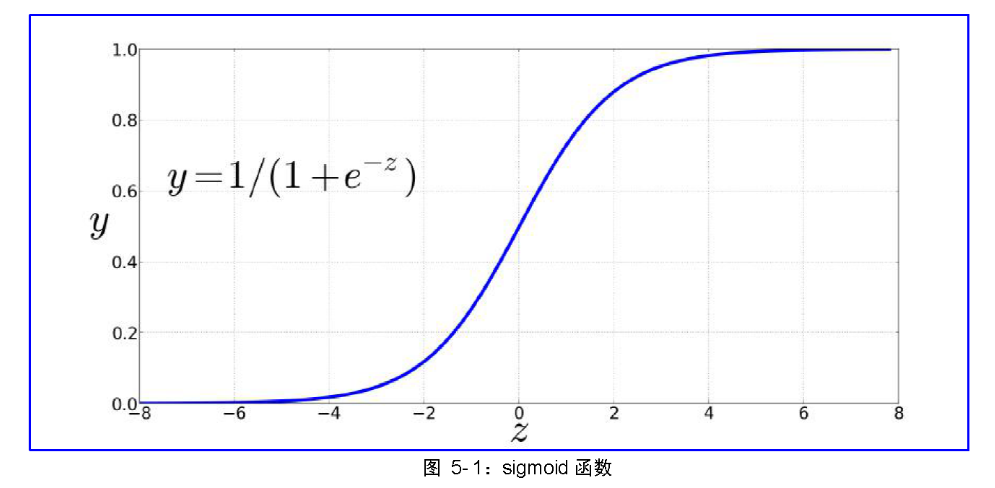
通常使用线性代数的**点积**（dot product）符号来表示这样的和。两个向量a和b的点击，写成$a\cdot b$，是每个向量对应元素的乘积的和：
$$
z = w \cdot x + b
$$
因为没有任何东西强制z为合法概率，即介于0和1之间，因此z的取值分为是$-\infty$到$\infty$。为了产生概率，我们通过sigmoid函数$\sigma(z)$传递z：
$$
y=\sigma(z)=\frac{1}{1+e^{-z}}=\frac{1}{1+exp(-z)}
$$
将Sigmoid应用于加权特征的总和，我们将得到一个介于0和1之间的数字，要使其成为概率，我们只需要确保p(y=1)和p(y=0)的总和为1。我们可以这样进行操作：
$$
\begin{aligned}
P(y=1)=\sigma(w\cdot x+b) =\frac{1}{1+exp(-(w\cdot x + b))} \\
P(y=0)=1-\sigma(w\cdot x+b) = 1-\frac{1}{1+exp(-(w\cdot x + b))} = \frac{exp(-(w\cdot x + b))}{1+exp(-(w\cdot x + b))}
\end{aligned}
$$
S型函数有这样的性质：
$$
1-\sigma(x)=\sigma(-x)
$$
现在我们有了一个算法，给定一个实例x计算概率P(y=1|x)。我们如何做出决策？对于测试实例x,如果概率P(y=1|x)大于0.5,则说“是”，否则说“否”。我们将0.5称为决策边界（decision boundary）：
$$
\hat{y}=
\begin{cases}
1 \ if \ P(y=1|x) \gt 0.5 \\
0 \ otherwise
\end{cases}
$$

#### 4.1.1 情感分析

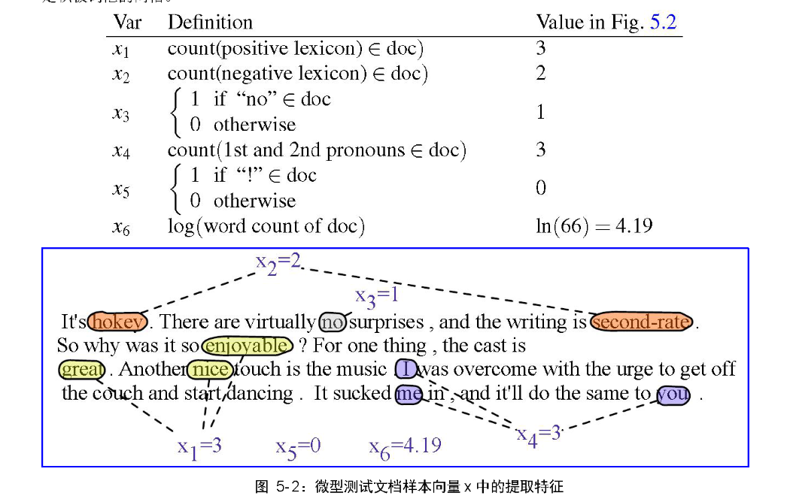
可以根据$w$和$b$的值计算概率并进行筛选。

### 4.2 在逻辑回归中学习

如何学习模型的参数（权重w和偏差b）？
1. 第一个度量标准是当前标签（$\hat{y}$）与真实黄金标签$y$的接近程度。我们通常考虑的不是度量相似度，而是与之相反的情况：系统输出与黄金输出之间的距离，我们将距离称为损失函数或成本函数。
2. 第二个是用于迭代更新权重的优化算法，以便最小化此损失函数。对此的标准算法是梯度下降。

### 4.3 交叉熵损失函数

对于观察x,我们需要一个损失函数来表示分类器输出$（\hat{y}=\sigma(w\cdot x + b)）$与正确的输出（y，即0或1）有多接近。我们将其称为：
$$
L(\hat{y}, y) = How \ much \ \hat{y} \ differs \ from \ the \ ture \ y
$$
我们通过损失函数来做到这一点，损失函数更倾向于训练示例的正确类标签。这称为条件最大似然估计：我们选择参数w,b,该参数在给定观察值x的情况下最大化训练数据中真实y标签的对数概率。最终的损失函数为负对数似然损失，通常称为**交叉熵损失**(cross-entropy loss)。
导出这个损失函数，并应用与单个损失值x。由于只有两个离散的结果（1或0），所有这是一个伯努利分布，对于我们的分类器为一个观察而产生的概率：
$$
p(y|x)=\hat{y}^y(1-\hat{y})^{1-y}
$$
可以通过对两边取对数方便数学运算：
$$
\log{p(y|x)}=\log{[\hat{y}^{y}(1-\hat{y})^{1-y}]}=y\log{\hat{y}}+(1-y)\log{(1-\hat{y})}
$$
转换为损失函数（需要将其最小化），我们只需要将上述公式中的符号翻转即可。结果是交叉熵损失LCE：
$$
L_{CE}(\hat{y}, y)=-\log{p(y|x)}=-[y\log{\hat{y}}+(1-y)\log{(1-\hat{y})}]
$$
最后可以带入$\hat{y}=\sigma(w\cdot x + b)$的定义：
$$
L_{CE}(\hat{y},y)=-[y\log{\sigma(w\cdot x + b)+(1-y)\log(1-\sigma{w\cdot x + b})}]
$$

### 4.4 梯度下降

使用梯度下降的目标是找到最优的权值：最小化我们为模型定义的损失函数。损失函数$L$是由权值参数化的，在机器学习中我们通常将其成为$\theta$（在逻辑回归中$\theta=w,b$的情况下）。所以我们的目标是找到一组使损失函数最小的权值，在所以例子上取平均值。
$$
\hat{\theta}=argmin_{\theta}\frac{1}{m}\sum_{i=1}^{m}L_{CE}(f(x^{(i)};\theta),y^{(i)})
$$
梯度下降算法是通过找出函数的斜率在那个方向上（在参数$\theta$的空间内）最陡峭地上升，并在相反方向上移动来找到函数的最小值。直觉是，如果您在峡谷中徒步类型，并试图最快速地下降到底部的河流，则可能会环顾四周360度，找到地面最陡峭的方向，然后沿该方向下坡。
对于逻辑回归，此函数通常是**凸的**（convex）。凸函数只有一个最小值，没有局部最小值可以陷入，因此可以保证从一点开始的梯度下降都可以找到最小值。
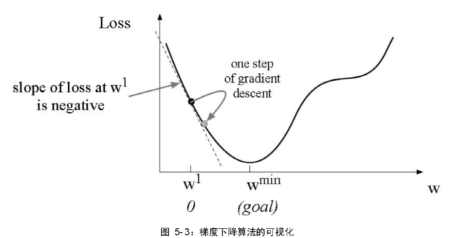
梯度下降的移动量的大小是由**学习率**（learning rate）$\eta$加权的斜率$\frac{d}{dw}f(x;w)$的值。更高（更快）的学习深度意味着我们应该在每一步上增加更多。我们在参数中所做的更改是学习率乘以梯度（或斜率）：
$$
w^{t+1}=w^t-\eta \frac{d}{dw}f(x;w)
$$
将一个标量w的函数扩展到许多变量，我们需要判断该如何移动A。

在实际的逻辑回归中，参数向量w比1或2长得多，意味输入特征向量x可能很长，并且每个$x_i$需要权重$w_i$。对于w中的每个维度/变量$w_i$（加上偏差b），梯度将具有u一个分量，该分量告诉我们相对于该变量的斜率。**本质上，我们再问：“改变了$w_i$的微笑变化会对总损失函数L产生多大影响**。
对每个维度$w_i$中，我们将斜率表示为损失函数的偏导数$\partial /  \partial w_i$。然后将梯度定义为这些偏导的向量。我们将y表示为$f(x;\theta)$，以使用对$\theta$的依赖性更加明显：
$$
\nabla L(f(x;\theta),y)=
\left[
\begin{matrix}
\frac{\partial}{\partial w_1}L(f(x;\theta),y) \\
\frac{\partial}{\partial w_2}L(f(x;\theta),y) \\
\vdots \\
\frac{\partial}{\partial w_n}L(f(x;\theta),y)
\end{matrix}
\right]
$$
因此，$\theta$是基于梯度而更新的，其最终方程为：
$$
\theta_{t+1}=\theta_{t}-\eta \nabla L(f(x;\theta),y)
$$

#### 4.4.1 逻辑回归的梯度

为了更新$\theta$，我们需要定义梯度$\nabla f(x;\theta), y)$。对于逻辑回归，交叉熵函数为：
$$
L_{CE}(\hat{y},y)=-[y\log{\sigma (w\cdot x + b)} + (1-y)\log{(1-\sigma(w\cdot x + b))}]
$$
该函数对一个测量向量x的导数为：
$$
\frac{\partial L_{CE}(\hat{y}, y)}{\partial w_j}=[\sigma(w\cdot x + b) - y]x_j
$$

#### 4.4.2 随机梯度下降算法

算计梯度下降是一个在线算法，通过在每个训练是例之后计算其梯度，并在正确的方向上推动$\theta$来最小化损失函数。
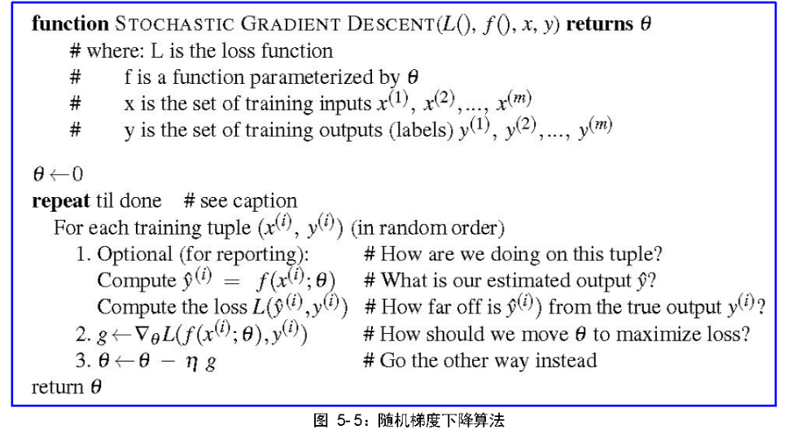

#### 5.4.3 一个例子

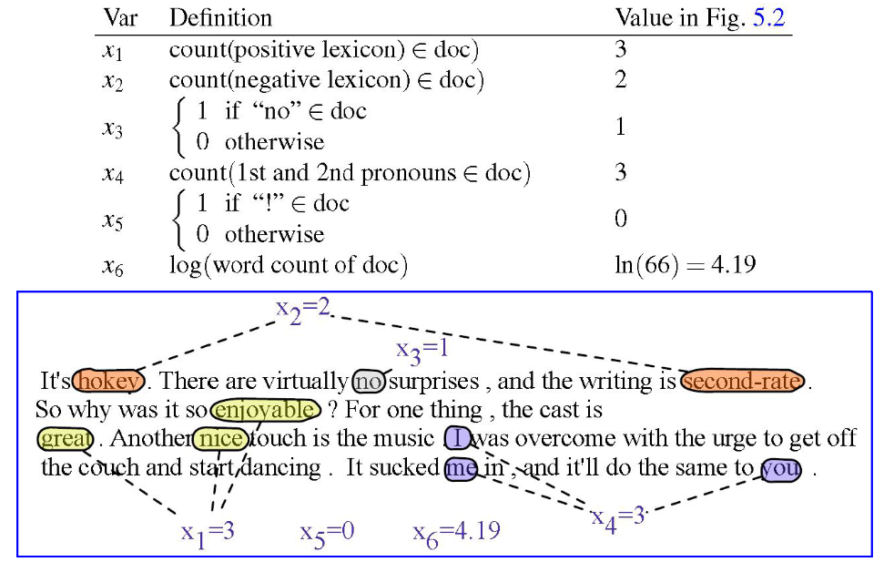
在上述例子中，我们看到一个观测值x,其正确值为y=1（这是积极的评论），并且只有两个特征：
$x_1=3$（积极词汇数）
$x_2=2$（消极词汇数）
假设$\theta ^0$的初始权重和偏差都设置为0,初始学习率$\eta$为0.1：
$w_1=w_2=b=0$
$\theta = 0.1$
单个更新步骤要求我们计算梯度乘以学习率：
$\theta^{t+1}=\theta^t - \eta\nabla_{\theta} L(f(x^{(i)};\theta),y^{(i)})$
梯度向量有3为维度，可以计算第一个维度：
$$
\nabla_{w,b}=
\left[
\begin{matrix}
\frac{\partial L_{CE}(\hat{y}, y)}{\partial w_1} \\ 
\frac{\partial L_{CE}(\hat{y}, y)}{\partial w_2} \\ 
\frac{\partial L_{CE}(\hat{y}, y)}{\partial w_b}
\end{matrix}
\right]=
\left[
\begin{matrix}
(\sigma (w\cdot x + b) - y)x_1 \\
(\sigma (w\cdot x + b) - y)x_2 \\
\sigma(w\cdot x + b) - y
\end{matrix}
\right]=
\left[
\begin{matrix}
(\sigma (0)-1)x_1 \\ 
(\sigma (0)-1)x_2 \\ 
\sigma (0)-1 \\
\end{matrix}
\right]=
\left[
\begin{matrix}
-0.5x_1 \\
-0.5x_2 \\
-0.5
\end{matrix}
\right]=
\left[
\begin{matrix}
-1.5 \\
-1.0 \\
-0.5
\end{matrix}
\right]
$$
现在可以获取一个新的参数$\theta^1$：
$$
\theta^1=
\left[
\begin{matrix}
w_1 \\
w_2 \\
b
\end{matrix}
\right]-\eta
\left[
\begin{matrix}
-1.5 \\
-1.0 \\
-0.5
\end{matrix}
\right]=
\left[
\begin{matrix}
.15 \\
.1 \\
.05
\end{matrix}
\right]
$$

#### 4.4.4 小批量训练

随机梯度下降法之所以被称为随机，是因为它一次选择单个随机示例，移动权重以提高示例的性能。这可能会导致很不文档的移动，一次通常在成批训练实例而非单个实例上计算梯度。
在**批量**训练中，我们计算整个数据集的梯度。通过查看如此多的示例，批处理训练可以很好地估计权重的移动方向，计算如此完美的代价是，要花费大量时间来处理训练集中的每个示例。
一个折衷方案是**小批量**训练：我们训练一组小于整个数据集的m个示例。小批量训练还有计算效率的优势，小批量可以容易地进行矢量化，根据计算资源选择小批量的大小。
$$
\log _p(training \ labels)=\log{\prod_{i=1}^m}p(y^{(i)}|x^{(i)})
=\sum_{i=1}^m\log{p(y^{(i)}|x^{(i)})}=-\sum_{i=1}^mL_{CE}(\hat{y}^{(i)},y^{(i)})
$$
m个示例的小批量生产的成本函数是每个示例的平均损失：
$$
Cost(\hat{y},y)=\frac{1}{m}\sum_{i=1}^{m}L_{CE}(\hat{y}^{(i)},y^{(i)})=-\frac{1}{m}\sum_{i=1}^my^{(i)}\log \sigma(w\cdot x^{(i)}+b)+(1-y\hat{(i)})\log(1-\sigma(w\cdot x^{(i)}+b))
$$

### 4.5 正则化

为了避免过拟合，一个新的**正则化**项$R(\theta)$被添加到公式的目标函数中，得出了一批m个实例的一下目标：
$$
\hat{\theta}=argmax_{\theta}\sum_{i=1}^m\log P(y^{(i)}|x^{(i)})-\alpha R(\theta)
$$
新的正则化项$R(\theta)$用于惩罚较大的权重，因此假设有两种权重方案：
- 一个完全匹配训练数据的权重设置，且使用许多高值的权重；
- 一个稍好匹配训练数据的权重设置，且使用一些较小的权重。
一种方法是L2正则化：
$$
R(\theta)=||\theta||_2^2=\sum_{j=1}^n\theta_j^2
$$
L2正则化目标函数变为：
$$
\hat{\theta}=argmax_{\theta}[\sum_{i=1}^m\log{P(y^{(i)}|x^{(i)})}]-\alpha \sum_{j=1}^n \theta_j^2
$$
另一种是L1正则化，使目标函数变为：
$$
\hat{\theta}=argmax_{\theta}[\sum_{i=1}^m\log{P(y^{(i)}|x^{(i)})}]-\alpha \sum_{j=1}^n \theta_j
$$
这种类型的正则化来自统计学，其中L1正则化被成为lasso回归，而L2正则化被称为岭回归，这两者都常用于语言处理中。L2正则化具有简单的导数而更易于优化，而L1正则化则更复杂。但是，L2偏爱具有许多较小权重向量的情况下，L1偏爱具有一些较大权重但又有更多权重设置为零的稀疏解。
L1和L2正则化均具有贝叶斯解释，作为对权重外观的先验约束。L1正则化可以被视为权重上的拉普拉斯先验。L2正则化对于与加上权重根据均值$\mu=0$的高斯分布进行分配。在高斯或正态分布中每一个值与平均值的距离越远，其概率越低。通过对权重使用高斯先验，权重$\theta_j$的高斯函数为：
$$
\frac{1}{\sqrt{2\pi \sigma_j^2}}\exp{(-\frac{(\theta_j - \mu_j)^2}{2\sigma_j^2})}
$$
如果将每个权重乘以权重的高斯先验，则将使以下约束最大化：
$$
\hat{\theta}=argmax_{\theta}\prod_{i=1}^MP(y^{(i)}|x^{(i)})\times \prod_{j=1}^n\frac{1}{\sqrt{2\pi \sigma_j^2}}\exp{(-\frac{(\theta_j - \mu_j)^2}{2\sigma_j^2})}
$$

### 4.6 多项逻辑回归

当情感分类超过两种（证明、负面或中性），我们使用多项式逻辑回归，也称为**softmax回归**。在多项式逻辑回归中，目标y是一个变量，范围超过两个类别。
多项式逻辑分类器使用广义的Sigmoid,称为softmax函数，来计算概率p(y=c|x)。softmax函数采用k个任意值的向量$z=[z_1,z_2,\cdots,z_k]$并将其映射到概率分布，每个值的范围为(0,1)，所有值的综合为1.
$$
softmax(z_i)=\frac{\exp(z_i)}{\sum_{j=1}^k\exp(z_j)} \ 1\leq i \leq k
$$
再次像Sigmoid一样，softmax的输入将权重向量w和输入向量x（加上偏置）之间的点积。但是，现在我们需要为K个类中的每个类使用单独的权重向量（和偏差）。
$$
p(y=c|x)=\frac{\exp{w_c\cdot x + b_c}}{\sum_{j=1}^k\exp(w_j\cdot x + b_j)}
$$

#### 4.6.1 多项逻辑回归的特征

多项式回归函数的特征类似于二元逻辑回归，不同之处在于我们需要为每一个K类单独的权向量（和偏差）。
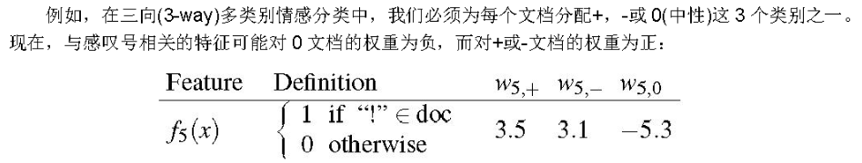

## 5. Vector Semantics and Embeddings（向量语义和嵌入）

### 5.1 词汇语义

**同义词**：两个词在任何一个句子中可以相互替换，而不改变句子的真值条件，也就是这个句子为真的情况，那么这两个词就是同义词。
**词相似**：虽然单词没有很多同义词，但是大多数单词都有很多相似的单词。猫不是狗的同义词，但猫和狗肯定是相似的词。
**词关联**：两个单词的含义可以通过相似以外的其他方式联系，比如“咖啡”和“杯子”。词汇之间的一种常见联系是他们是否属于同一**语义场**。语义场是指涵盖特定语义域并相互之间具有结构化关系的单词集合，例如在医院（外科医生、手术刀、护士、麻醉师、医院）。
**语义框架和角色**：语义框架是一组表示特定类型事件的视角与参与者的单词。例如，商业交易是一个实体与另一个实体进行货币交易以换取某种商品或服务的事件，在此之后，商品服务得以执行。

### 5.2 向量语义

**向量语义**的思想是将一个单词表示为多维语义空间中的一个点，该多维语义空间是从单词邻居的分布中派生出来的。表示单词的向量成为嵌入。

### 5.3 单词和向量。

含义的向量或分布模型通常基于**共现矩阵**，这是表示单词共现频率的一种方式。
- 术语-文档矩阵
- 术语-术语矩阵

#### 5.3.1 向量和文档

在**术语-文档**矩阵中，每一行代表词汇表中的单词，每一列代表一些文档集中的文档。
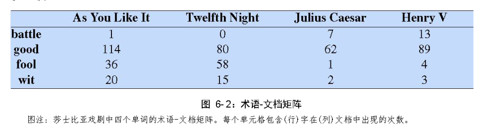
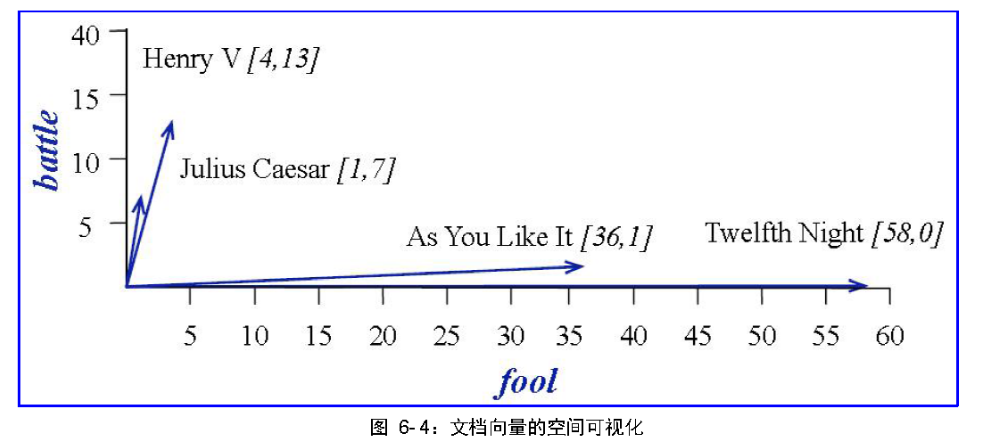
术语-文档矩阵最初被定义为一种用于查找文档信息检索任务的相似文档的方法。相似的两个文档倾向于具有相似的单词，如果两个文档具有相似的单词，则它们的列向量将趋于相似。
**信息检索**的任务是从某个集合中与查询q最匹配的D个文档中找到文档d。因此，对于IR,我们还将通过向量来表示查询，并且我们需要一种比较两个向量的方式，以查找它们之间的相似度。

#### 5.3.2 单词作为向量：文档维度维度

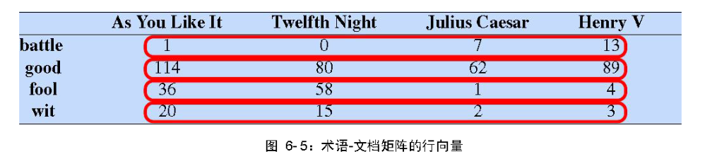

#### 5.3.3 单词作为向量：单词维度

使用术语-文档矩阵将单词表示为文档计数向量的另一种方法是使用术语-术语矩阵，也称为矩阵或术语-上下文矩阵，其中列是用单词而不是文档标记的。
比如可以取每个单词的每一次出现，并计算它周围的上下文单词，我们就得到一个单词-单词共现矩阵。
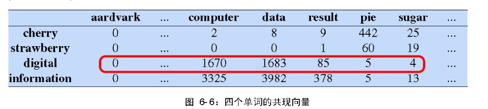

### 5.4 余弦测量相似度

为了测量两个目标才v和w之间的相似度，我们需要一个度量，该度量采用两个向量（具有相同维度，两个向量都以词汇量的长度|V|为维度，或者两个都以文件的长度|D|作为维度）并给出它们相似性的度量。到目前为止，最常见的相似性度量是向量之间的角度的余弦值。
$$
dot \ product(v,w)=v\cdot w=\sum_{i=1}^Nv_iw_i=v_1w_1+v_2w_2+\cdots+v_Nw_N 
$$
以上的原始点存在相似性度量问题：它偏爱长向量。**向量长度**定义为：
$$
|v|=\sqrt{\sum_{i=1}^Nv_i^2}
$$
通过修改点积，通过点积除以两个向量的长度来对向量长度进行归一化。根据向量a和b的点积的定义，这个归一化的点积等于两个向量夹角的余弦值：
$$
a\cdot b=|a||b|\cos{\theta}
$$
因此，两个两类v和w之间的余弦相似性度量可以计算为：
$$
cosine(v,w)=\frac{v\cdot w}{|v||w|}=\frac{\sum_{i=1}^Nv_iw_i}{\sqrt{\sum_{i=1}^Nv_i^2}\sqrt{\sum_{i=1}^Nw_i^2}}
$$
可以计算单词cherry或digital与information的关系：

| |pie|data|computer|
|---|---|---|---|
|cherry|442|8|2|
|digital|5|1683|1670|
|information|5|3982|3325|

$cos(cherry,information)=\frac{442*5+8*3982+2*3325}{\sqrt{442^2+8^2+2^2}\sqrt{5^2+3982^2+3325^2}}=.017$
$cos(digital,information)=\frac{5*5+1683*3982+1670*3325}{\sqrt{5^2+1683^2+1670^2}\sqrt{5^2+3982^2+3325^2}}=.996$
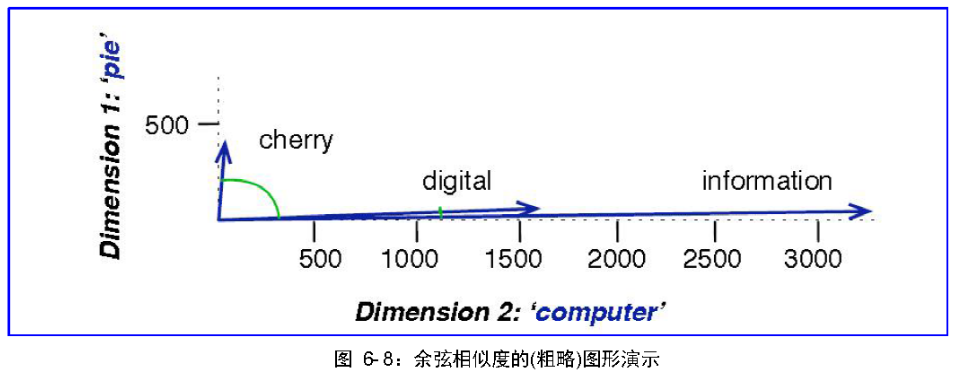

### TF-IDF：向量中的权重项

上面的共现矩阵通过频率表示每个单元，或者是带有文档的单词，或者是带有其他单词的单词。但是原始频率并不是单词之间关联的最佳度量。原始频率非常倾斜，也不是很有区别。如果我们想知道哪种类型的上下文，是被cherry和strawberry共享的而不是digital和information共享，则我们将无法很好地区别诸如the、it或they之类的单词，它虽然出现在各种单词，但是并不能提供特定单词的信息。因此过于频繁的词语并不重要，我们需要进行解决。
**词频**：即单词t在文档d中的频率。我们可以用原始技术作为词频：
$$
tf_{t,d}=count(t,d)
$$
更常见的是，我们通过使用频率的log10来压缩原始频率。直觉是，一个单词在文档中出现100次不会使该单词与文档含义相关的可能性提高100倍。有因为不能取0的计数，所以通常加1到计数中：
$$
tf_{t,d}=\log_{10}(count(t,d)+1)
$$
**反文档频率**：用于赋予仅在少数几个文档中出现的单词更高的权重。使用**idf**来强调诸如Romeo之类的判别词。idf使用分数$N/df_t$定义的，其中N是集合中文档的总数，而$df_t$是出现t术语的文档数。e
$$
反文档频率（idf）=idf_t=\log_{10}(\frac{N}{df_t})
$$
因此，文档d中单词t的td-idf加权值$w_{t,d}$将词频率$tf_{t,d}$与$idf_t$相结合：
$$
w_{t,d}=tf_{t,d}\times idf_t
$$

### 5.6 逐点互信息（PMI）

当向量维度对应于单词而不是文档时，tf-idf替代加权函数PPMI用于术语-术语矩阵。PPMI的直觉是，权衡两个词之间关联的最佳方法是要求这两个词在我们的预料库中同时出现的数量要比我们事先希望它们偶然出现的数量究竟高多少。**逐点互信息**可以衡量事件x和y发生的频率：
$$
I(X,Y)=\sum_{x}\sum_{y}P(x,y)\log_2\frac{P(x,y)}{P(x)P(y)}
$$
目标词w和上下文c之间的逐点互信息被定义为：
$$
PMI(w,c)=\log_2\frac{P(w,c)}{P(w)P(c)}
$$
PMI值的范围从负到正无穷大。但是，负PMI值是不可靠的，除非预料库非常庞大。
$$
PPMI(w,c)=max(\log_2 \frac{P(w,c)}{P(w)P(c)},0)
$$
更正式地说，假设我们有一个共现矩阵F,其中W行（单词）和C列（上下文），其中f_{ij}给出单词w_i在上下文$c_j$中出现的次数。可以将其转换为PPMI矩阵，其中$ppmi_{i,j}$通过上下文$c_j$给出单词$w_i$的PMI值，如下所示：
$$
p_{ij}=\frac{f_{i,j}}{\sum_{i=1}^W\sum_{j=1}^Cf_{ij}}p_{i*}=\frac{\sum_{j=1}{C}f_{ij}}{\sum_{i=1}^W\sum_{j=1}^Cf_{ij}}p_{i*}=\frac{\sum_{i=1}^Wf_{ij}}{\sum_{i=1}^W\sum_{j=1}^Cf_{ij}}
$$
$$
PPMI_{i,j}=max(\log_2\frac{p_{ij}}{P_{i*}p_{*j}},0)
$$
计算例子如下：
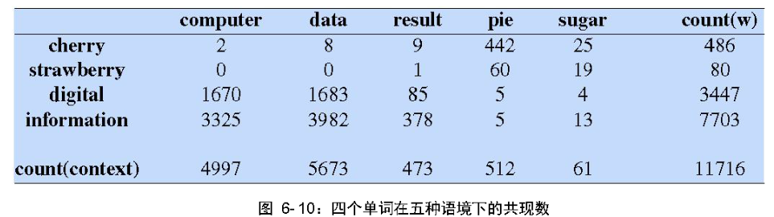
$P(w=inforamtion,c=data)=\frac{3982}{11716}=.3399$
$P(w=information)=\frac{7703}{11716}=.6575$
$P(c=data)=\frac{5673}{11716}=.4842$
$ppmi(inforamtion,data)=\log 2(.3399/(.6575*.4842))=.0944$
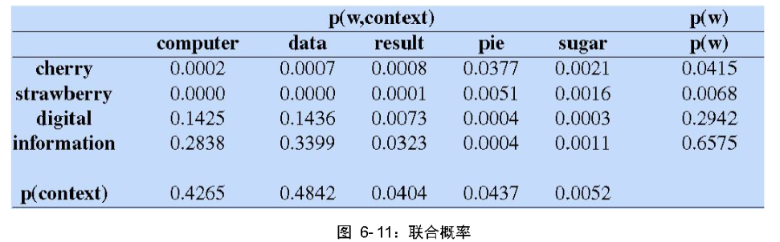
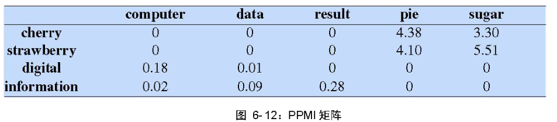
PMI存在偏重罕见事件的问题，非常罕见的词往往有很高的PMI值。减少这种对低频事件的偏差的一种方法是，使用不同的函数$P_{\alpha}(c)$来略微改为P(c)的计算，从而提高上下文单词出现的概率的$\alpha$次方：
$$
PPMI_{\alpha}(w,c)=max(log_2 \frac{P(w,c)}{P(w)P_{\alpha}(c)},0)
$$
$$
P(\alpha)(c)=\frac{count(c)^{\alpha}}{\sum_ccount(c)^{\alpha}}
$$
另一种解决方案是拉普拉斯平滑：在计算PMI之前，将一个小的常数k添加到每个计数中，已缩小（打折）所有非零值。

### 5.7 TF-IDF或PPMI矢量模型的应用

tf-idf含义模型通常用于文档功能诸如确定两个文档是否相似。我们通过获取文档中所有单词的向量并计算这些向量的**质心**来表示文档。质心是均值的多维版本。向量集合的质心是单个向量，该向量与集合中每个向量的距离的平方和最小。给定k个词向量$w_1,w_2,\cdots,w_k$，质心文档向量d为：
$$
d=\frac{w_1+w_2+\cdots +w_k}{k}
$$
PPMI模型或tf-idf模型都可以用于计算单词相似度，例如查找单词释义，跟踪单词含义的变化或自动发现不同预料库中单词的含义等任务。

### 5.8 Wordvec

之前的单词表现为稀疏长向量，其维数对于与词汇表中的单词或集合中的文档。现在，介绍一种更强大的单词表现形式：**嵌入**，短密集向量。嵌入是**短的**，维数d的范围是50-1000,而不是很大的词汇量|V|或我们看到的文件D的数量。这些d维没有一个清晰的解释。向量是密集的：向量不是稀疏的实体、大部分为零的计数或计数的函数，而是可以为负的实数值。
事实证明，稠密向量在每个NLP任务中比稀疏向量更好地工作。尽管我们不完全了解造成这种情况的所有原因，但我们有一些直觉。将单词表示为300维密集向量需要我们的分类器学习的权重比我们将单词表示为50000维向量要少的多，而且较小的参数空间可能有助于泛化和避免过拟合。密集向量在捕捉同义词方面可以做的更好。
word2vec是**静态嵌入*，动态上下文嵌入*有**BERT或ELMO**，其中每个单词的向量在不同上下文是不同的。
word2vec的直觉上，与其计算每个单词w在例如apricot附近出现的频率，不如计算一个分类器来执行二进制预测任务：“单词w是否可能在apricot附近出现？”我们实际上不关心此预测任务，取而代之的是，我们将学习到的分类器权重（weights）作为词嵌入。
skip-gram的直觉是：
- 将目标词和邻近的上下文视为肯定示例。
- 随机抽样词典中的其他单词以获得否定样本。
- 使用逻辑回归训练分类器来区分这两种情况。
- 使用学习到的权重作为嵌入。

#### 5.8.1 分类器

... lemon, a [tablespoon of apricot jam,    a] pinch ...
目标是训练一个分类器，一边在给定目标词w的元组(w,c)与候选上下文词c（例如(apricot,jam)或许(apricot aardvark)）配对的情况下，他将返回c是真实上下文单词的概率（对于jam为true,对于aardvark为false）：
$$
P(+|w,c)
$$
分类器如何计算概率P？skip-gram模型的直觉是将这种概率基于嵌入相似性：如果单词的嵌入与目标嵌入相似，则单词很可能出现在目标附近。要计算这些密集嵌入之间的相似度，我们要凭直觉，及两个向量具体**点积**：
$$
Similarity(w,c)\approx c\cdot w
$$
点积$c\cdot w$不是概率，至少$-\infty$到$\infty$之间的数字。要将点积转化为概率，我们将使用逻辑或sigmoid函数$\sigma(x)$，这是逻辑回归的基本核心：
$$
\sigma=\frac{1}{1+exp(-x)}
$$
总之，skip-gram训练了一个概率分类器，给定一个测试目标词w及其上下文窗口，skip-gram基于词上下文的嵌入的点积。要计算此概率，我们只需要为词汇表中的每个目标单词和上下文单词嵌入。
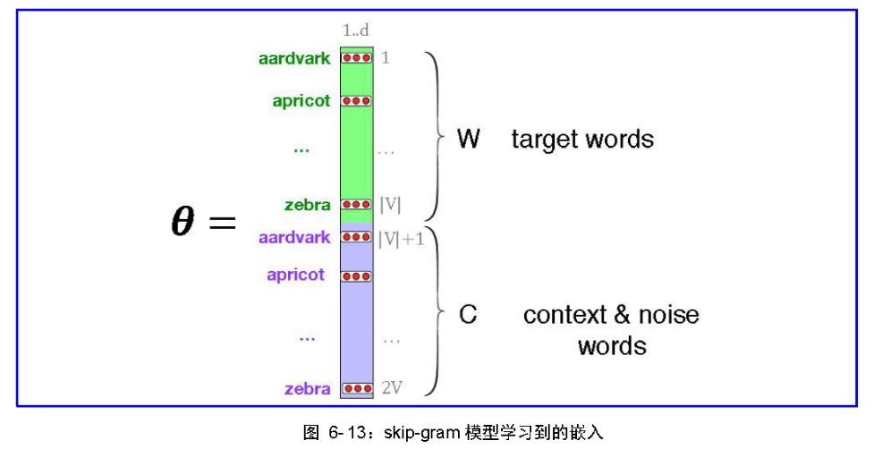

#### 5.8.2 学习skip-gram嵌入

Skip-gram通过从随机的嵌入向量开始学习嵌入，然后迭代地移动每个单词的嵌入，更像是文本中附近出现的单词的嵌入，而不像是文本中附近没有出现的单词的嵌入。
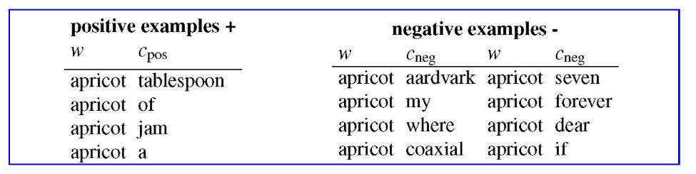
为了训练二进制分类器，我们还需要负原本。实际上，带有负采样的skip-gram(SGNS)使用的负样本比正样本更多（它们之间的比率由参数k设置）。因此，对于每个(w,c_{pos})训练的正样本，我们将创建k个负样本，每个负样本均由目标词w加上一个“噪声词”c_{neg}组成。
噪声词的选择依据其加权的unigram概率$p_{\alpha}(w)$，其中$\alpha$为权值。在实践中，通常设置$\alpha=0.75$：
$$
P_{\alpha}(w)=\frac{count(w)^{\alpha}}{\sum_{w^{'}}count(w^{'})^{\alpha}}
$$
他会给罕见的噪声单词更高的概率。
$$
\begin{matrix}
对于罕见单词：P_{\alpha}(w)>P(w) \\
P_{\alpha}(a)=\frac{.99^{.75}}{.99^{.75}+.01^{.75}}=.97 \\
P_{\alpha}(a)=\frac{.01^{.75}}{.99^{.75}+.01^{.75}}=.03
\end{matrix}
$$
给定正、负训练实例集和初始嵌入集，学习算法的目标是将这些嵌入调整到：
- 最大化正采样中的一对词(w,$c_{pos}$)的相似度；
- 最小化正采样中的一对词(w,$c_{neg}$)的相似度；
$$
L_{CE}=-\log[P(+|w,c_{pos})\prod_{i=1}{k}P(-|w,c_{negi})]=-[log \sigma(c_{pos}\cdot w)+\sum_{i=1}^k\log \sigma(-c_{negi} \cdot w)]
$$
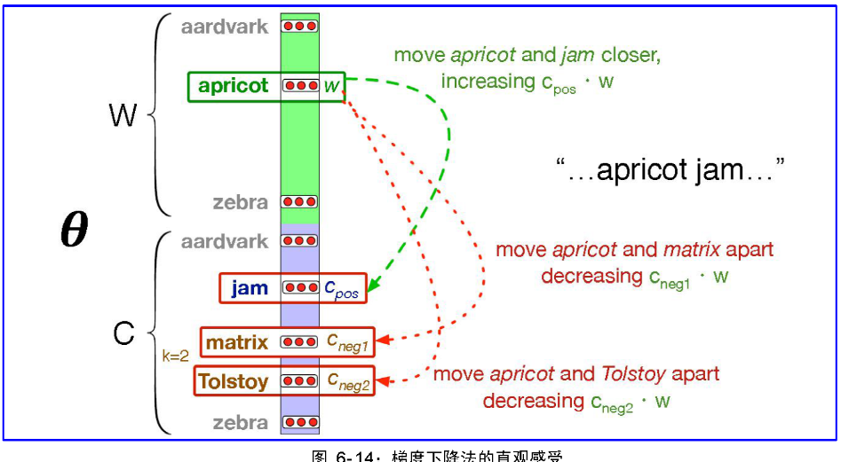

#### 6.8.3 其他类型的静态嵌入

静态嵌入有很多种：
- word2vec的扩展，即快速文本。
- GloVe,基于捕获全局预料库统计数据。

## 6. Neural Networks and Neural Language Models 

### 6.1 单元

神经网络的构建块市单个计算单元。一个单元将一组实数值作为输入，对其进行一些计算，然后产生输出。
从本质上讲，神经单元正在对其输入进行加权求和，其中的另一个项称为偏差项（bias term）。给定一组输入$x_1\cdots x_n$，一个单元具有一组相应的权重$w_1\cdots w_n$和偏差$b$，因此加权总和$z$可以表示为：
$$
z=b+\sum_iw_wx_i
$$
最终，神经单元将非线性函数$f$应用于$z$作为输出。我们将此功能的输出称为单元$a$的**激活**值。由于我们仅对单个单元建模，因此节点的激活实际上是网络的最终输出，通常将其称为$y$。因此，值$y$定义为：
$$
y=a=f(z)
$$
常用的非线性函数又三种（sigmoid、tanh、和修正的线性ReLU）：
- sigmoid函数：$y=\sigma(z)=\frac{1}{1+e^{-z}}$，输出内容为[0,1]
- tanh函数：$y=\frac{e^z-e^{-z}}{e^z+e^{-z}}$，输出内容为[-1,1]
- ReLU函数：$y=max(x,0)$

#### XOR问题

一个**感知器**具有二进制输出并且不具有非线性激活函数，输出为0或1：
$$
y=
\begin{cases}
0,if\ w\cdot x + b \leq0 \\
1,if\ w\cdot x + b \gt0 \\
\end{cases}
$$
该函数可以实现AND和OR功能，但不能计算逻辑XOR。

#### 6.2.1 解决方案：神经网络

虽然XOR函数不能由单个感知器计算，但可以由单层的分层网络计算。
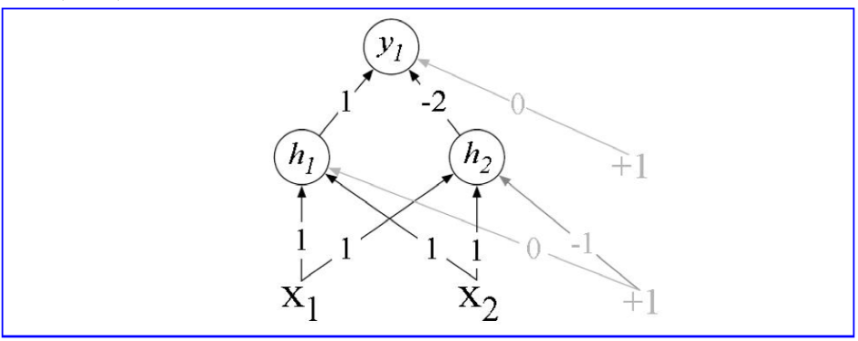

### 6.3 前馈神经网络

最简单的神经网络，即**前馈网络**。处于历史原因，多层网络，尤其是前馈神经网络，有时也称为**多层感知器**，这是一种技术上的误称，因为感知器是线性的，而现代网络具有非线性的单元。
简单前馈网络具有三种节点：输入单元、隐藏单元和输出单元。神经网络的核心是由隐藏单元组成的隐藏层。**全连接层**意味着每一层的每个单元都将前一层中所有单元的输出作为输入，并且来自两个相邻层的每对单元之间都有一个连接。
**更换偏置单元**：在描述网络时，我们经常会使用略微简化的符号表示完全相同的函数，而无需引用显式偏置节点b。
$$
h=\sigma(Wx+b)=>h=\sigma(Wx)
$$
其中b使用x进行替代。

#### 6.4 训练神经网络

1. 需要一个损失函数来对系统输出和**黄金输出**之间的距离进行建模，通常使用用于逻辑回归的损失函数，即**交叉熵损失**。
2. 寻找使损失函数最小的参数，即梯度下降算法。
3. 梯度下降需要知道损失函数的梯度，该向量包含损失函数对于每个参数的偏导数。即**误差反向传播**或**逆向微分**算法。

#### 6.4.1 损失函数

$$
L_{CE}(\hat{y},y)=-\sum_{i=1}^Cy_i\log{\hat{y_i}}
$$

#### 6.4.2 计算梯度

$$
\frac{\partial L_{CE}(w,b)}{\partial w_j}=(\hat{y}-y)x_j=(\sigma(w\cdot x+b)-y)x_j
$$

#### 6.4.3 计算图

计算图是计算数学表达式的过程表示，其中的计算被分解成独立的操作，每个操作被建模为图中的一个节点。
以计算函数$L(a,b,c)=c(a+2b)$为例：
$$
\begin{aligned}
d=2\times b \\
e=a+d \\
L=c\times e
\end{aligned}
$$

#### 6.4.4 计算图上的逆向微分

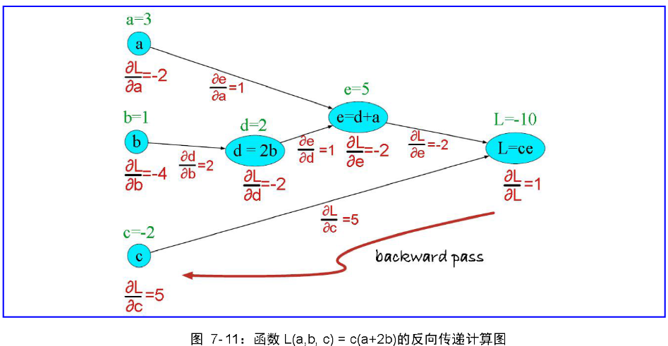

#### 6.4.5 学习的更多细节

神经网络中的优化是一个非凸优化问题，比逻辑回归更复杂。对于逻辑回归，我们可以初始化梯度下降，使所有的权值和偏差都为0。而在神经网络中，我们需要用小的随机数初始化权值。将输入值归一化使其均值和单位方差为0也很有帮助。
使用各种形式的正则化来防治过拟合。最重要的一项是**丢弃**：在训练期间从网络中随机丢弃一些单元及其连接。**超参数**的调整也很重要。

#### 6.5 神经语言模型

语言建模：根据先前的单词上下文预测即将到来的单词。前馈神经网络LM是一种标准前馈网络，它以时间t处的一些先前单词（$w_{t-1}$，$w_{t-2}$等）的表示作为输入，并输出可能的下一个单词的概率分布：
$$
P(w_t|w_1,...,w_{t-1})\approx P(w_t|w_{t-N+1},...,w_{t-1})
$$

#### 6.5.1 嵌入

在神经语言模型中，先验上下文是由前一个单词的嵌入来表示的。将先前的上下文表示为嵌入，而不是像n-gram语言模型中使用的精确词汇，这运行神经语言模型比n-gram语言模型更好地泛化到不可见的数据。

## 7. Sequence Labeling for Parts of Speech and Named Entities（词性和命名实体识别的序列标注）

### 7.1 (大部分)英语单词的分类

词类分为两大类：**封闭类**（closed class）和**开放类**（open class）
- 封闭类是那些成员关系相对固定的类，例如介词——新介词很少被创建出来。通常是**虚词**，如of、it、and或者you，这些词往往很短，经常出现，在语法中经常由结构化用法。
- 开放类主要由四种：名词（包括专有名称）、动词、形容词和副词，以及较小的感叹词开放类。

### 7.2 词类标记

**词类标记**是为文本中的每个单词分配词类的过程。输入是（符记化的）单词和标签集的序列$x_1,x_2,...,x_n$，输出是标签的序列$y_1,y_2,...,y_n$，每个输出$y_i$确切对应于一个输入$x_i$。
标记是一项**消除歧义**的任务；单词是有**歧义**的——有不止一种可能的词类——我们的目标是找到正确的标记。

7.3 命名实体和命名实体标记

命名实体是可以用专有名称引用的任何东西：一个人、一个位置、一个组织。**命名实体识别**的任务是查找构成专有名称的文本范围并标记实体的类型。最常见的四个实体标签：**PER（人员）**、**LOC（位置）**、**ORG（组织）**、**GPE（地缘政治实体）**。

词类标注不好因为每个单词获得一个标记而产生分段问题；命名实体识别的任务是查找并标记文本的片段，这在一定程度上是困难的，部分原因是分段的含糊性。我们需要确定什么是实体，什么不是实体，以及边界在哪里。
BIO标记，使用标签B来标签任何一个符记处于一个片段的开始（Begin），用标签I来标签任何一个符记处于一个片段的内部（Inside），用标签O标签任何一个符记处于一个片段的外部（Outside）。

### 7.4 HMM词类标记

HMM是一种概率序列模型：给定一个单元序列（单词、字母、语素、句子，等等），它计算可能的标签序列的概率分布，并选择最佳的标签序列。

#### 7.4.1 马尔科夫链

HMM基于增强马尔科夫链。**马尔科夫链**是一个模型，他告诉我们有关随机变量，状态序列的概率的信息，每个状态都可以从集合中取某个值。
更正式地，考虑状态$q_1,q_2,...,q_i$的序列，马尔可夫模型将马尔科夫假设体现在此序列的概率上：在预测未来时，过去并不重要，只有现在重要。
$$
Markov \ Assumption:P(q_i=a|q_1...q_{i-1})=P(q_i=a|q_{i-1})
$$

#### 7.4.2 隐式马尔可夫模型

在计算一系列可观察事件的概率时，马尔可夫链很有用。但是，在许多情况下，我们感兴趣的事件是隐藏的：我们不会直接观察它们。例如，我们通常不会再文本中观察到词类标记，相反我们需要推导出标记。
**隐马尔可夫模型**（hidden Marov model， HMM）允许我们谈论观察到的事件（例如我们再输入值看到的单词）和隐藏事件（例如词类标记），我们将它们视为概率模型中的因果关系。
一阶马尔可夫模型示例化了两个简化假设：
- 与一阶马尔可夫链一样，特定状态的概率仅取决于之前的状态。
- 输出观测值$o_i$的概率仅取决于已产生的（produced）观察值$q_i$的状态，而不取决于任何其他状态或任何其他观测值：
$$
Output\ Independence:P(o_i|q_1,...q_i,...,q_T,o_1,...,o_i,...,o_T)=P(o_i|q_1)
$$

#### 7.4.3 HMM标记器的成分

HMM有两个成分：A和B概率。
A句子包含标记**转换概率**$P(t_i|t_{i-1})$，表给定先前标记出现的概率。例如，情态动词will很可能紧跟动词的基本形式VB（例如race），因此我们希望这种概率很高。可以通过计数第一个标记后面跟谁第二个标记的概率，来计算此转移概率的最大似然估计：
$$
P(t_i|t_{i-1})=\frac{C(t_{i-1},t_i)}{C(t_{i-1})}
$$
B**发生概率**$P(w_i|t_i)$表示，在给定标签（比如MD）的条件下，它与给定单词（比如will）相关联的概率。发射概率的MLE为：
$$
P(w_i|t_i)=\frac{C(t_i,w_i)}{C(t_i)}
$$
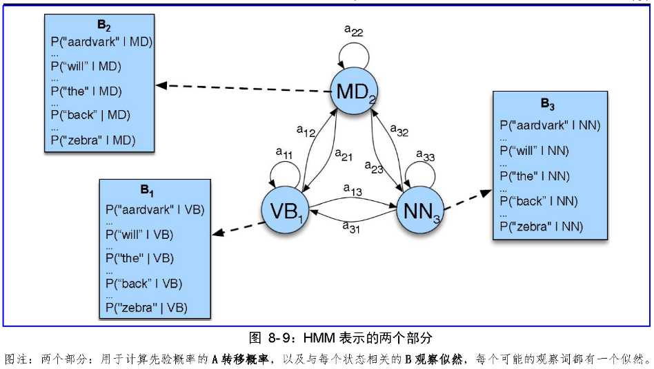

#### 7.4.4 HMM标记作为解码

**解码**：给定HMM $\lambda=(A,B)$和观测序列$O=o_1,o_2,...,o_T$作为输入，找出状态$Q=q_1q_2...q_T$最可能序列。
对于词类标记，HMM解码的目标是，在给定n个单词$w_1...w_n$的观察序列的情况下，选择最有可能的标记序列$t_1...t_n$：
$$
\hat{t_{1:n}}=argmax_{t_1...t_n}P(t_1...t_n|w_1...w_n)=argmax_{t_1...t_n}\frac{P(w_1...w_n|t_1...t_n)P(t_1...t_n)}{P(w_1...w_n)}
$$
HMM标记器作了两个进一步简化的假设：
- 单词出现的概率仅仅取决于自身的标记，并且与相邻的单词和标记无关。
- bigram假设，一个标记的概率只依赖于前一个标记，而不是整个标记序列。

#### 8.4.5 维特比算法

```python
import numpy as np

def viterbi_decode(nodes, trans):
    """
    Viterbi算法求最优路径
    其中 nodes.shape=[seq_len, num_labels],
        trans.shape=[num_labels, num_labels].
    """
    # 获得输入状态序列的长度，以及观察标签的个数
    seq_len, num_labels = len(nodes), len(trans)
    # 简单起见，先不考虑发射概率，直接用起始0时刻的分数
    scores = nodes[0].reshape((-1, 1))
    
    paths = []
    # 递推求解上一时刻t-1到当前时刻t的最优
    for t in range(1, seq_len):
        # scores 表示起始0到t-1时刻的每个标签的最优分数
        scores_repeat = np.repeat(scores, num_labels, axis=1)
        # observe当前时刻t的每个标签的观测分数
        observe = nodes[t].reshape((1, -1))
        observe_repeat = np.repeat(observe, num_labels, axis=0)
        # 从t-1时刻到t时刻最优分数的计算，这里需要考虑转移分数trans
        M = scores_repeat + trans + observe_repeat
        # 寻找到t时刻的最优路径
        scores = np.max(M, axis=0).reshape((-1, 1))
        idxs = np.argmax(M, axis=0)
        # 路径保存
        paths.append(idxs.tolist())
        
    best_path = [0] * seq_len
    best_path[-1] = np.argmax(scores)
    # 最优路径回溯
    for i in range(seq_len-2, -1, -1):
        idx = best_path[i+1]
        best_path[i] = paths[i][idx]
    
    return best_path
```

### 7.5 条件随机场（CRF）

虽然HMM是一个有用和强大的模型，但它需要大量的增强来实现较高的精度。例如，在词类标注中，就像在其他任务中一样，我们经常会遇到**未知单词**，可以通过尝试破解HMM把这些东西整合过去，但是难以干净的方式直接向模型中添加任意特征。
设P(y|x)为线性链随机场，则在随机变量X取值为x的条件下，随机变量Y取值为y的条件概率具有如下形式：
$$
P(y|x)=\frac{1}{Z(x)}exp(\sum_{i,k}\lambda_kt_k(y_{i-1},y_i,x，i)+\sum_{i,l}u_ls_l(y_i,x,i))
$$
$$
Z(x)=\sum_yexp(\sum_{i,k}\lambda_kt_k(y_{i-1},y,x,i)+\sum_{i,l} u_ls_l(y_i,x,i))
$$
$t_k,s_l$特征函数是二值函数，函数值为0或者1——满足特征条件时取值为1，否则为0：
- $t_k$是定义在边上的特征函数，称为转移特征，依赖与当前和前一个位置
- $s_l$是定义在节点上的特征函数，称为状态特征，依赖于当前位置

## 8. Deep Learning Architectures for Sequence Processing（序列处理的深度学习架构）

### 8.1 循环神经网络

**堆叠RNNs**

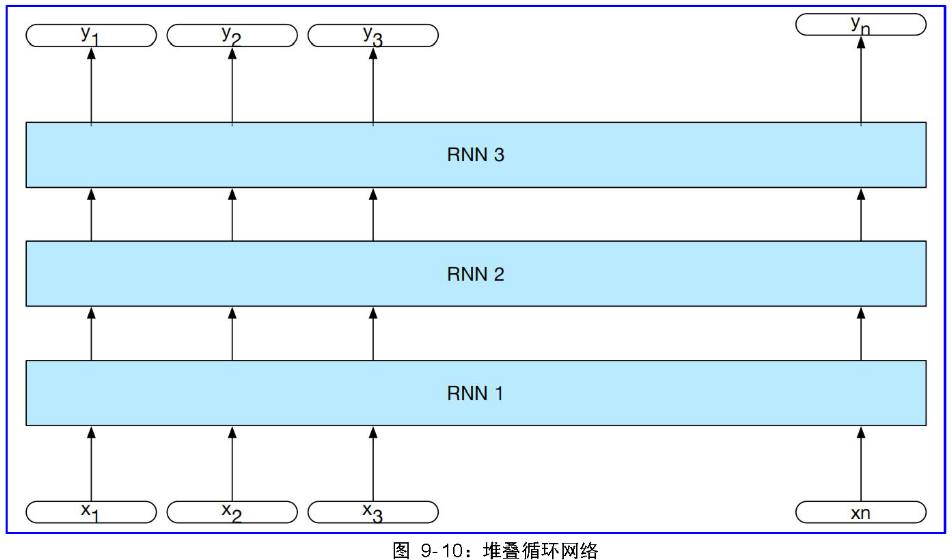

**双向RNNs**

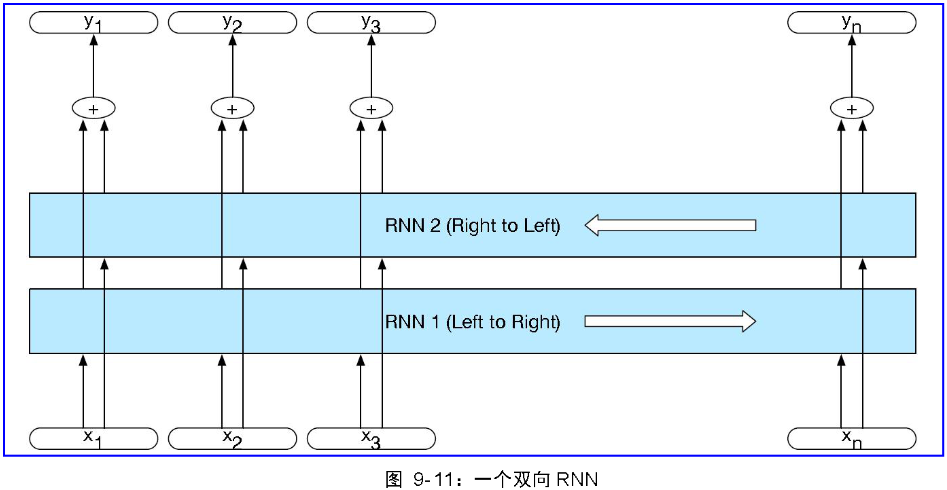

### 在RNN中管理上下文；LSTM和GRU

**长短期记忆**（LSTM）网络将上下文管理问题分为两个子问题，从上下文中删除不再需要的信息，以及添加以后决策时可能需要的信息。
LSTM通过首先在体系结构中添加一个显式的上下文层（除了通常的循环隐藏层），并通过使用专用的神经单元，这些单元利用**门**来控制信息流入和流出，这些单元组成了网络层。
LSTM的门具有相同的设计模式。每一个都由前馈层组成，其后是S型函数，然后是与该选通的层进行逐点乘法。选择S型作为激活函数是因为它倾向于将其输出推到0或1。将其与逐点乘法相结合具有类式二进制**掩码**的效果。
**遗忘门**的目的是从上下文中删除不再需要的信息。遗忘门先计算状态的隐藏层和当前输入的加权和，并通过一个sigmoid。然后将此掩码与上下文向量相乘，已从上下文中删除不再需要的信息：
$$
f_t=\sigma (U_fh_{t-1}+W_fx_t)
$$
$$
k_t=c_{t-1}\bigodot f_t
$$
$$
g_t=tanh(U_gh_{t-1}+W_gx_t)
$$
**加法门**生成掩码，已选择要添加到当前上下文的信息：
$$
i_t=\sigma (U_ih_{t-1}+W_ix_t)
$$
$$
j_t=g_t\bigodot i_t
$$
添加到修改后的上下文变量中，以获得新的上下文向量：
$$
c_t=j_t+k_t
$$
**输出门**决定当前隐藏状态需要什么信息：
$$
o_t=\sigma (U_oh_{t-1}+W_ox_t)
$$
$$
h_t=o_t\bigodot tanh(c_t)
$$
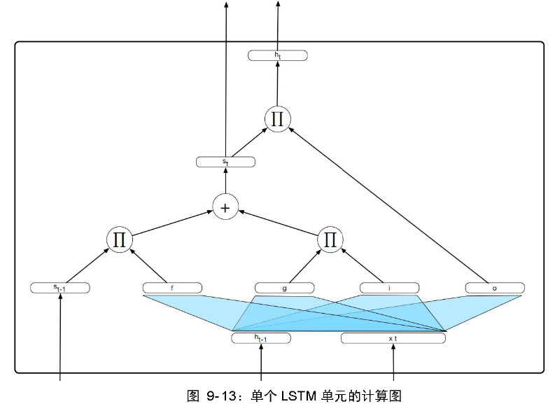

**门控循环单元**

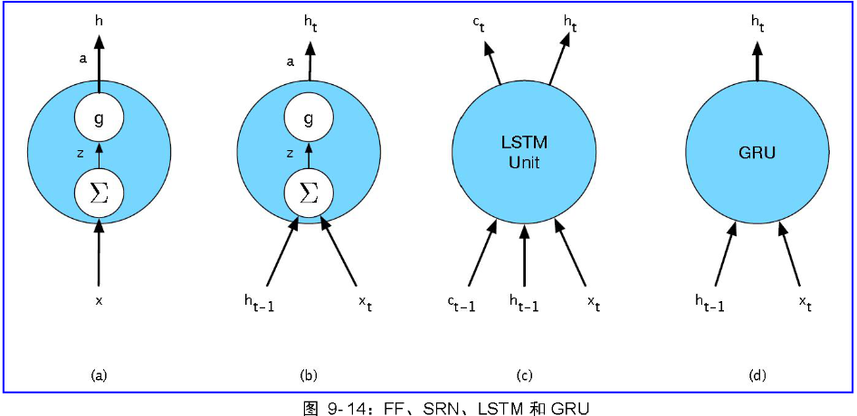

### Self-Attention网络：Transformer

尽管LSTM能够缓解由于RNN的循环而导致的远程信息丢失的问题，但潜在的问题任然存在。通过扩展的一系列循环连接向前传递信息会导致相关信息的丢失和训练上的困难。此外，循环网络的固有顺序形状抑制了并行计算资源的使用。
**Transformers**将输入向量$(x_1,...,x_n)$的序列映射到相同长度的输出向量$(y_1,...,y_n)$的序列。Transformers由网络层的堆栈组成，这些网络层由简单的线性层、前馈网络以及围绕它们的自定义连接组成。除了这些标准组件之外，Transformer的关键创新是使用**自注意力**层。自注意力层运行网络直接从任意大的上下文中提取和使用信息，而无需像RNN哪些通过中间的循环连接传递信息。
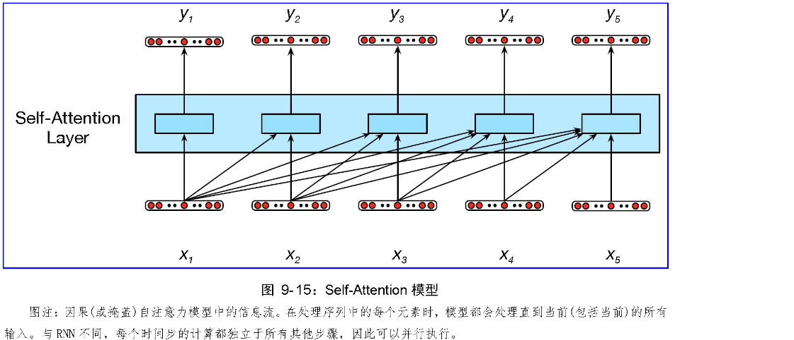

**典型的Self-Attention网络**

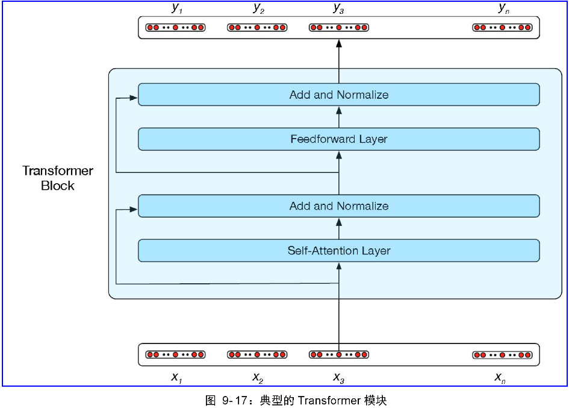

**多头自注意力**

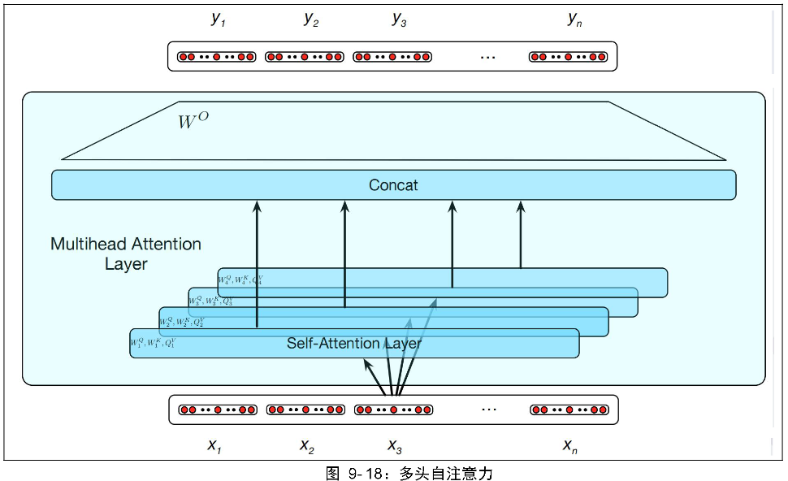

## 地址划分问题

1. 需要把地址划分为10个类别，不过根据已知的数据比较难以判断某些地址。
2. 对他人发的地址进行分析判断，发现他人的分析都有名称和地名的，可以比较方便地判断出类别。

## 总结

1. 这周继续看了语音与语言处理的几张，对于命名实体识别有了初步了解，下周继续看剩下的内容。
2. 对于地址分类应该只能根据规则进行，不过因为地址存在许多问题，分类比较困难。
