# 研究生周报（第十六周）

## 学习目标

1. 语音与语言处理——机器翻译和编码器解码器模型
2. 语音与语言处理——成分语法
3. 语音与语言处理——成分解析
4. 语音与语言处理——依存解析
5. Scala基本语法和简单使用
6. 地址项目10级分类划分

## 学习时间

> 8.21 ~ 8.27

## 学习产出

## 9. Machine Translation and Encoder-Decoder Models

机器翻译当前最常用的用法时用于**信息访问**，另一个常见用途是帮助人工翻译，此任务通常称为**机器辅助翻译**。MT的最新应用时满足即时的人际交流需求。MT的标准算法是**编码器-解码器**网络，也称为**序列到序列**网络。

### 9.1 语言差异与类型学

人类语言的某些方面似乎是通用的，适用于每一种语言，或者在统计学上市普遍存在的，适用于大多数语言。然而，语言在许多方面也存在差异，理解这种**翻译差异**的原因将有助于我们建立更好的机器翻译模型。我们经常区分两种差异：必须逐一处理的**独特**和词汇差异；我们可以用一般方式建模的**系统**差异。

#### 9.1.1 词序类型学

语言在简单陈述句中的动词、主语和宾语的基本词序上有所不同。例如。德语、法语、英语和普通话都是**SVO**（主语-动词-宾语），这意味着动词往往位于主语和宾语之间。印地语和日语是**SOV**语言，爱尔兰语和阿拉伯语是**VSO**语言。
词序差异导致系统在生成输出时需要进行结构上的重新排序。

#### 9.1.2 词汇差异

对于任何翻译，合适的词可能会根据上下文而有所不同。例如，英语源语言的单词bass在西班牙语中可以作为与lubina或乐器bajo出现。可能出现一对多或者多对多映射。还有可能出现**词汇空白**，即没有解释性脚注的情况下、任何单词或短语都不能在另一种语言中表达一个单词的含义。语言在事件的概念特性如何映射到特定单词方面存在系统差异。

#### 9.1.3 形态类型学

在**形态学**上，语言通常具有两个维度的变异特征：
- 第一个维度是每个单词的语素数量，从**孤立**语言，到**多综合**语言
- 第二个维度是语素可分段的长度

#### 9.1.4 指代密度

语言在于它们往往忽略的失误相关的类型维度中有所变化。有些语言，比如英语，要求我们在谈论话语中给定的指代物是使用显式代词。
可以省略代词的语言称为**代词省略**语言。即使在代词省略语言中，省略频率也存在明显差异。例如，日语和中文比西班牙语往往会忽略很多。跨语言的这种变化的维度称为**指代密度**的维度。

### 9.2 编码器-解码器模型

编码器-解码器网络或序列-序列网络，是能够生成上下文相关的任意长度的输出序列的模型。编码器-解码器网络以被广泛应用于包括机器翻译、摘要、问答和对话的应用。
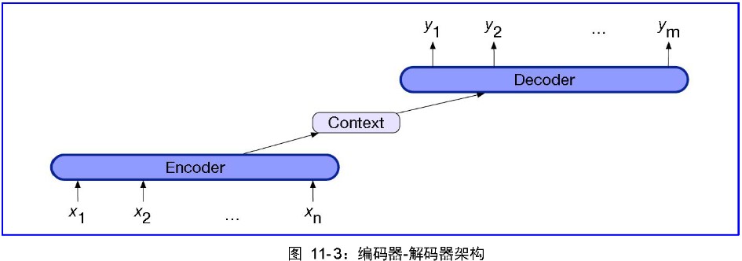
编码器网络由三部分组成：
- 解码器，它接受输入序列$x_1^n$，并生成相应的上下文表示序列$h_1^n$。LSTMs、GRUs、CNNs、Transformers都可以作为编码器。
- 上下文，他是向量c，是$h_1^n$的函数，它将输入的本质传达给解码器。
- 解码器，它接受c作为输入，生成任意长度的隐藏状态序列$h_1^m$，从中可以得到相应的输出状态序列$y_1^m$。就像编码器一样，解码器可以用任何一种序列结构来实现。

### 9.3 带RNN的编解码器

将语言模型转变为翻译模型：在**源**文本的末尾添加一个句子分隔标记，然后简单地拼接**目标**文本。调用源文本x和目标文本y，则以下方式计算概率p(y|x)：
$$
p(y|x)=p(y_1|x)p(y_2|y_1,x)p(y_3|y_1,y_2,x)...P(y_m,...y_{m-1},x)
$$
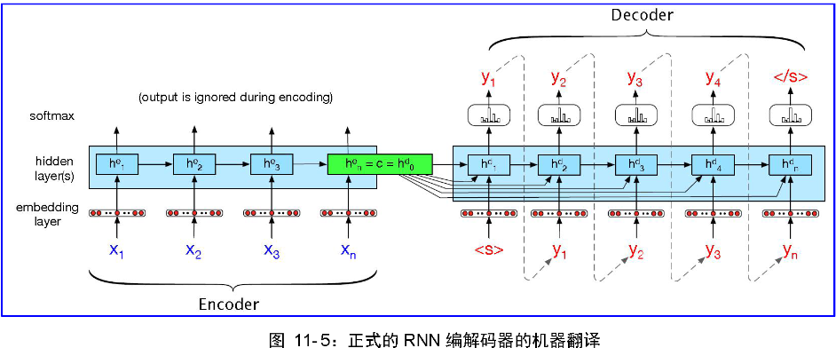
编码器的全部目的是生成输入的上下文表示。该表示体现在编码器$h_n^e$的最终隐藏状态中。然后将该表示形式，也称为**上下文**c，传递给解码器。
一个缺点：上下文向量c的影响将随着输出序列的生成而减弱。
一个解决方案是将上下文向量c作为参数添加到当前隐藏状态的计算中，使其在解码过程的每一步都可用，使用如下公式：
$$
h_t^d=g(\hat{y}_{t-1},h_{t-1}^d,c)
$$
#### 9.3.1 训练编码器-解码器模型

推理期间的解码器将其自己的估计输出$\hat{y_t}$作为下一个时间步$x_{t+1}$的输入。因此，随着编码器不断产生更多的符记，它将倾向于越来越多地偏离黄金目标语句。因此，在训练时，更常见地是在解码器中使用**教师强制**。教师强制意味着我们迫使系统使用训练中地黄金目标符记作为下一个输入$x_{t+1}$，而不是让它依赖于（可能是错误的）解码器输出$\hat{y_t}$。

### 9.4 注意力

编码器-解码器模型地简单性在于它将编码器（构建源文本地表示）与解码器（使用上下文生成目标文本）清洗地分离开来。最终的隐藏状态就像一个**瓶颈**：它必须表示源文本的所有含义，因为编码器对源文本的唯一了解就是这个上下文向量中的内容。句子开头的信息特别是长句子的信息，可能不能再上下文向量中得到同样好的表示。
注意力机制是解决瓶颈问题的一种方法，它允许解码器从编码器的所有隐藏状态中获取信息。再注意力机制中，就像再普通编码器-解码器模型中一样，上下文向量c是单个向量，它是编码器隐藏状态的函数，即$c=f(\hat{h_1^n})$。由于隐藏状态的数量随输入大小的变化而变化，因此我们无法将编码器隐藏状态的整个张量直接用作解码器的上下文。注意力的相反是通过对所有的编码器隐藏状态$h_1^n$进行加权求和来常见单个固定长度矢量c。
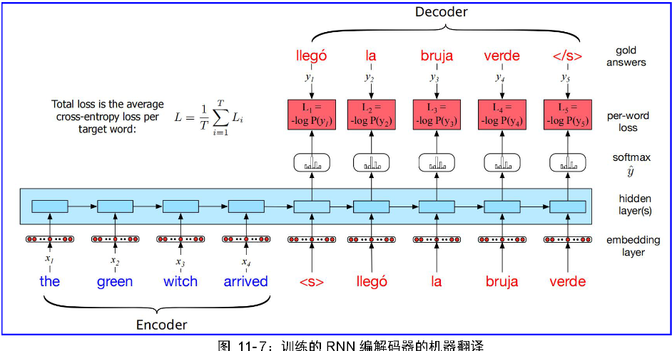
权重用于关注源文本的特定部分，该部分与当前由解码器生成的符记相关。因此，由注意力机制产生的上下文变量是动态的，对于解码中的每个符记来说都是不同的。

### 9.5 波束搜索

再解码的每个时间步，通过计算一组可能的输出的softmax来选择输出$y_t$，然后选择概率最高的符记(argmax)：
$$
\hat{y_t}=argmax_{w\in V}P(w|x,y_1...y_{t-1})
$$
再每一步中选择一个最可能产生的符记称为**贪心**解码；贪心算法是一种做出局部最优选择的算法，不管他事后是否会被证明是最好的选择。
在词类标记中，使用动态规划搜索来解决这个问题，不幸的是，动态规划不适用于输出决策之间存在长距离依存关系的生成问题。唯一能保证找到最佳解的方法是穷举搜索，这显然太慢了。在MT解码和起他序列生成问题中，通常使用一种称为**波束搜索**的方法。在波束搜索中，我们在每一步都保留k个可能的符记，而不是在每个时间步都选择最优的符记来生成。这种固定大小的记忆足迹k称为**波束宽度**
。
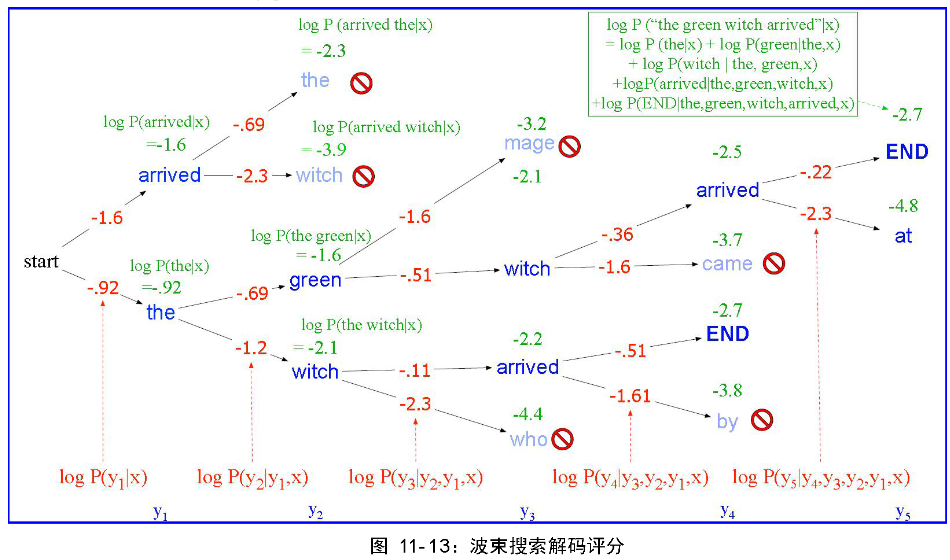

### 9.6 构建MT系统的实用细节

#### 9.6.1 符记化

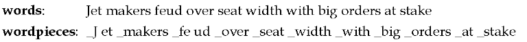

### 9.6.2 MT语料库

**句子对齐**
机器翻译的标准训练语料库是成对对齐的句子。当创建新的语料库时，例如对于资源不足的语言或新的领域，必须创建这些句子对齐。
- 一个成本函数，获取一段源句和一段目标句，返回一个分数，衡量这些句子被翻译的可能性有多大。
- 一个对齐算法，利用这些分数来找到文档之间的良好对齐。

#### 9.6.3 反向翻译

**反向翻译**是利用目标语言中的单语语料库，创建合成的平行语料库的一种方法。在反向翻译中，我们在校bitext上训练一个中间目标-源的MT系统，将但与目标数据翻译成源语言。现在我们可以将这个合成bitext添加到我们的训练数据中，并重新训练我们的源-目标MT模型。

### 9.7 机器翻译评价

- **充分性**：译文对源句的准确把握长度，有时称为忠诚
- **流利性**：翻译的目标语言的琉璃程度

#### 9.7.1 用人工评分员对机器翻译进行评价

#### 9.7.2 自动评估：BLEU

最流行的机器翻译自动度量被称为**双语评估替补**。BLEU（连同许多替代指标，例如：NIST、TER、精度和召回率、METEOR）是基于一个简单的直觉，源于Miller和Beebe-Center的开创性工作：一个好的机器翻译往往会包含在同一句子的人工翻译中出现的单词和短语。

#### 9.7.3 自动评估：基于嵌入的方法

BLEU度量是基于测量人类参考和候选机器翻译有共同之处的确切单词或n-gram。然而，这一标准过于严格，因为好的翻译可能会使用替换词或释义。一个解决方案在早期的度量诸如METEOR是允许同义词之间的参考$x$和候选$\tilde{x}$。最近的度量使用BERT或其它嵌入来实现这种直觉。

## 10. Transfer Learning with Pretrained Language Models and Contextual Embeddings（基于预训练语言模型和上下文嵌入的迁移学习）

## 11. Constituency Grammars（成分语法）

### 11.1 成分

句法成分是指一组单词可以作为单个单元或成分。发展语法的一部分是建立语言成分的清单。

### 11.2 上下文无关语法

使用英语和起他自然语言对成分结构进行建模的最广泛使用的形式结构式**上下文无关语法**。上下文无关的语法也称为**短语结构语法**，而它的形式化方法等效于**巴克斯-诺尔范式**。
上下文无关语法由一组规则或产生式，以及单元和符号的**词表**组成。每个规则会产生式可以将语言的符号进行组合和排序的方式。例如**NP**（名词短语）可以由一个专有名词或一个限定词（Det）后跟一个**名词性词**组成，一个名词性词可以以此由一个或多个名词组成。

#### 11.2.1 上下文无关语法的正式定义

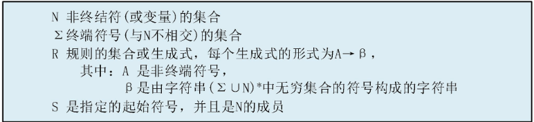
将一串单词隐射到它的解析树的过程称为**句法解析**。

### 11.3 一些英语语法规则

#### 11.3.1 句级结构

特别常见和重要的句子有**四个**：
- 陈述式（declaratives）
- 命令式（imperatives）
- 是非疑问式（yes-no questions)
- wh-疑问式(wh-questions)

#### 11.3.2 从句和句子

句子结构（即S规则）与其他语法的区别在于它们在某种意义上是**完整的**。它们就相当于一个从句的概念，而传统语法常常把从句描述为形成一个**完整的思想**。S是一个解析树的节点，S的主要动词在它下面有它所有的**论元**。

11.3.3 名词短语

英语中最常见的三种名词短语类型：代词、专有名词、NP->Det Nominal结构
**限定词**
名词短语可以以简单的词汇限定词开头；限定词的作用也可以有更复杂的表达式来填充。
**名词性词**
名词性词紧跟限定词，包含任何前、后中心名词修饰语。
**中心名词之前**
在一个**名词性词**中，许多不同种类的词类可以出现在中心名词之前，但在限定词（后限定词）之后。这些词包括**基数词**、**序数词**、**数量修饰语**和形容词。
**中心名词之后**
中心名词后面可以接后饰语。
- 介词短语
- 非限定从句
- 关系从句
**名词短语之前**
修饰和出现在NP之前的词类称为前限定词，很多都与数字或数量有关。

#### 11.3.4 动词短语

#### 11.3.4 并列关系
 
### 11.4 树库

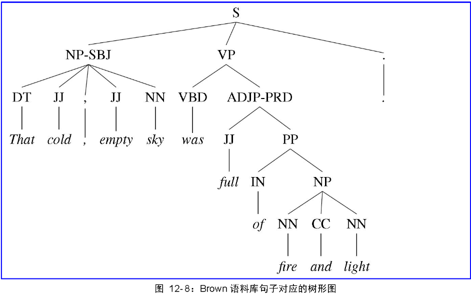

## 12. Constituency Parsing（成分解析）

12.1 歧义

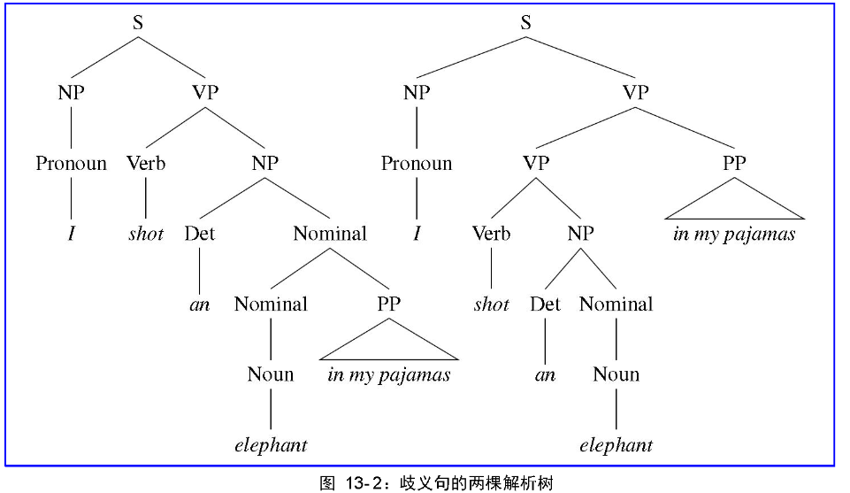

### 12.3 CKY解析：一种动态规划方法

#### 12.2.1 转换为乔姆斯基范式

- 开始生成符号$\varepsilon$。例如$a \rightarrow \varepsilon$。
- 一个非终端生成两个非终端。例如$A \rightarrow AB$。
- 生成终端的非终端。例如$S\rightarrow a$

在我们现有的语法中，规则$S\rightarrow Aux \ NP \ VP$将被$S\rightarrow X1\ VP$和$X1\rightarrow Aux\ NP$这两个规则所替代。整个转换过程可以总结为如下：
1. 将所有符合规则的复制到新语法中。
2. 将规则中的终端转换为虚拟非终端。
3. 转换单位产生式。
4. 将所有规则变为二元规则并将它们添加到新语法中。

#### 12.2.2 CYK算法

CYK算法处理的语法必须是CNF形式的，所以如果输入的是任意文法，那么需要按照前面的步骤把CFG转换未CNF形式。
CYK算法用来判断一个字符串是否属于某个CNF语法，故设输入的字符串w长度为n。
接下来需要用程序填一个动态规划的状态转移表，这里称呼为parse table。
parse table的规模为$(n+1)\times n$
我们定义PT\[n+1]\[n]表示parse table，且PT[n,:]以此存储字符串w中的每一个符号$(a_1,a_2,...,a_n)$
$$
\left(
\begin{matrix}
& & \cdots &  & \\
& \vdots  & \ddots & \\
a_1 & a_2 & \cdots & a_n
\end{matrix}
\right)
$$
我们设根据给定CNF，即G能够推导出w中第i到第j个字符串的集合为$x_{i,j}$。
为了填写这个表，我们一行一行，自下而上地处理。每一行对于一种长度地子串。最下面一行对应长度为1地子串，倒数第二行对应长度为2地子串，以此类推。最上面一行就对应长度为n地子串，即w本身。计算该表地任何一个表项的方法如下：
1. 对于最下面一行的元素，即$x_{i,i}$，是使得$A\rightarrow a_i$是G的产生式的变元$A$的集合。
2. 对于不在最下面一行的元素，我们需要找到符合以下条件的变元$A$的集合：
	1. 整数$k$满足$i\leq k \lt j$
	2. $B \in X_{i,k}$
	3. $C \in X_{k+1,j}$
	4. $A\rightarrow BC$是$G$的产生式
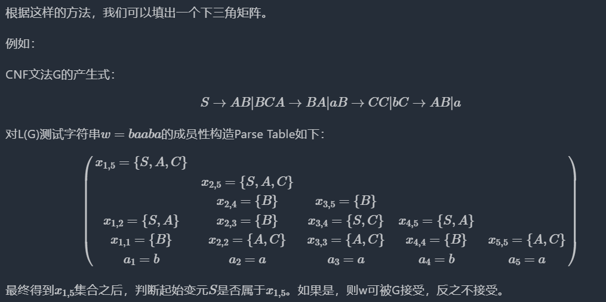

### 12.3 基于跨度的神经成分解析

CKY解析算法在枚举一个句子的所以可能解析树方面做得很好，但它有一个很大的问题：它没有告诉我们哪个解析是正确的！也就是说，他不会在可能的解析中消除歧义。为了解决消歧问题，我们将使用CKY算法的一个简单的神经扩展。

### 12.3.1 计算跨度分数

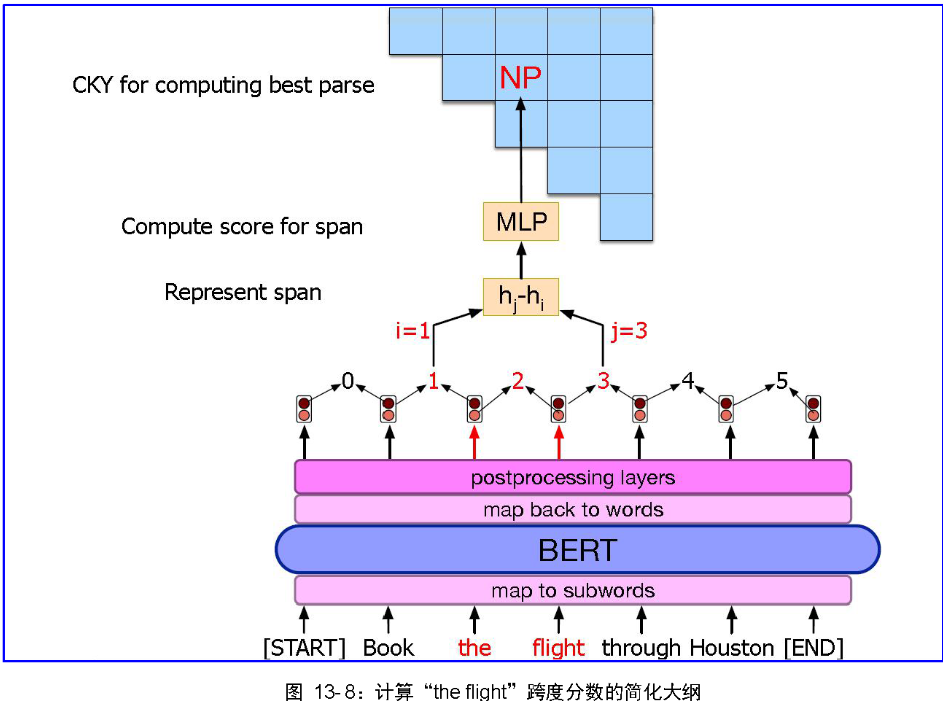

#### 12.3.2 集成跨度分数到解析中

一旦对每一个跨度都有了一个分数，解析器就可以通过对其成分跨度的分数求和来计算整个树s(T)的分树。

## 13. Dependency Parsing

**依存语法**是相当重要的当代语音和语言处理系统。在这些形式主义中，短语成分和短语结构规则并不直接起作用。相反，一个句子的句法结构仅由句子中的词（或lemmas,即次元）和包含在词之间的一组相关的二元语法关系来描述。

### 13.1 依存关系

**语法关系**的传统语言学概念为包括这些依存结构的二元关系提供了基础。这些关系的论元包括了一个**中心词**和一个**依存**。
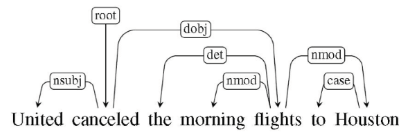

### 13.2 依存形式

**依存树**是满足以下约束的有向图：
- 有单个指定的根节点，没有传入的弧线。
- 除了根节点之外，每个节点都有一条传入的弧线。
- 在V中，从根节点到每个顶点都有一条唯一的路径。

### 13.2.1 投射性

投射性的概念强加了一个附加的约束，该约束源自输入中的单词顺序。如果句子中从中心词到从属关联词之间有一条路径，那么从中心词到从属关联词的弧线就是投射的。如果一个依存树上的所有弧线都是投射的，那么这个依存树就是投射的。

## Scala

> 因为Scala的语法与Java的比较像，以此看到比较快，后面会对之前Python写的代码进行改写

1. Scala 基本语法
2. Scala 数据类型
3. Scala 变量
4. Scala 访问修饰符
5. Scala 运算符
6. Scala IF...ELSE语句
7. Scala 循环
8. Scala 方法与函数
9. Scala 闭包
10. Scala 字符串
11. Scala 数组

## 地址分类

1. 对地址进行了简单的分类处理，对于一些难以判断的地址已经输出一份样例交给对方看
2. 周五取了6000条地址，将会根据这6000条地址的分类和对方提供的样例判断来优化分类代码

## 总结

1. 本周继续看《语音与语言识别》一书，后续的内容开始看的快了起来，后续讲的大多与语法结构相关
2. 地址项目主要负责分类与总结13级地址处理的问题反馈，下周因为另一个师兄要考试，可能需要我也去修改一下13级地址处理的代码
