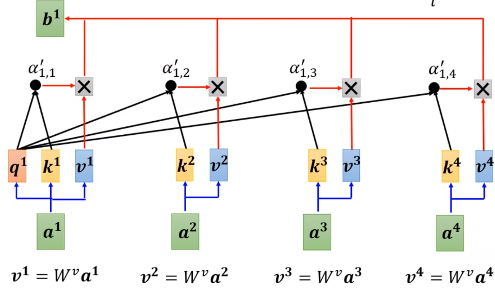
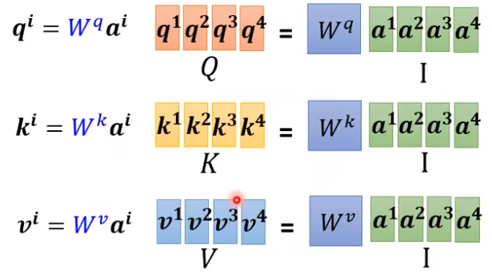
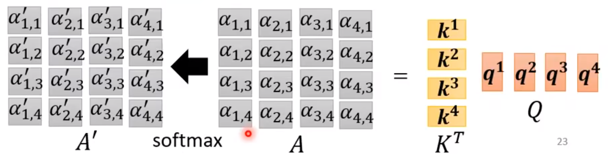
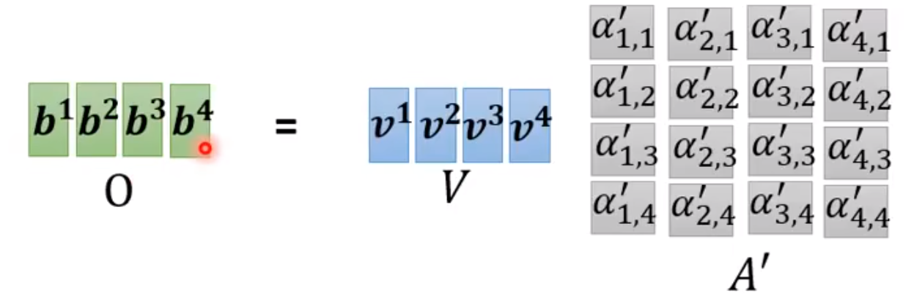
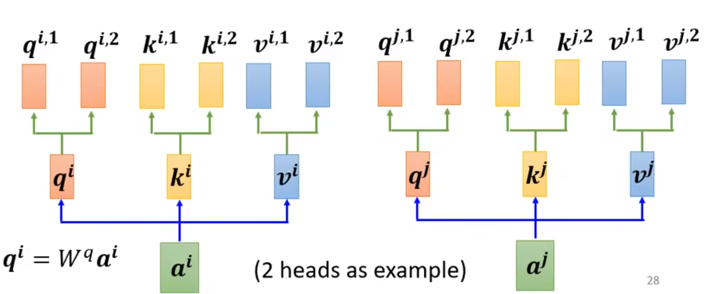
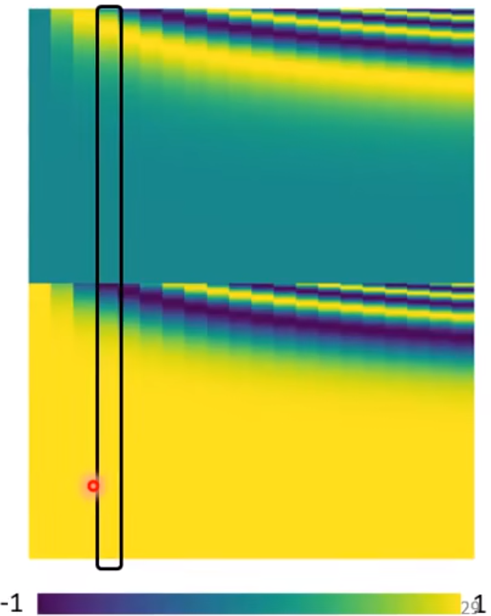
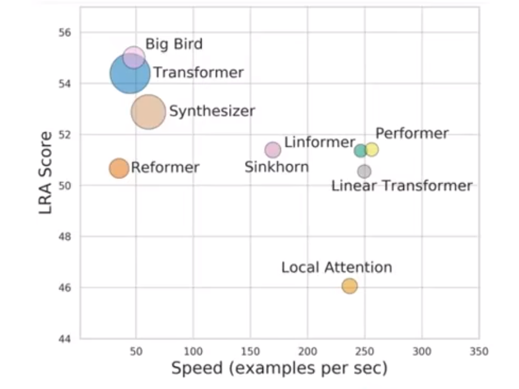
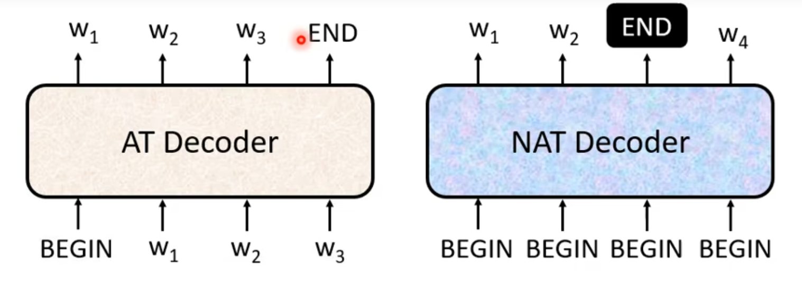

# 研究生周报（第十七周）

## 学习目标

1. 基本看完语音与语言处理一书
2. 看Transformer的结构与实现代码

## 学习时间

> 8.28 ~ 9.03

## 学习产出

### 注意力机制和Transformer

1. Vector Set as Input（输入是一堆向量）
   1. One-hot Encoding 各个词之间没有关系，并且最后的输入序列会很大
   2. Word Embedding 给每一个词汇一个向量，一类词汇可能共享一个向量
2. 输出
   1. each vector has a label：词性标注等
   2. The whole sequence has a label：一段语音的讲话者等
   3. Model decides the number of labels itself：seq2seq（翻译等）



```python
query, key, value = \
            [l(x).view(nbatches, -1, self.h, self.d_k).transpose(1, 2)
             for l, x in zip(self.linears, (query, key, value))]
```

其中$W^q、W^k、W^v$是未知参数，相当于全连接层，直接**炼丹**出来q、k、v？

$$
\begin{aligned}
q^i=W^qa^i; \
q^k=W^ka^i; \
q^v=W^va^i \
\end{aligned}
$$





其中softmax也可以用relu等替换，效果可能差一点。



**Multi-head Self-attention**

用q找不同的相关，相关性可能多种多样，因此q应该要多个，k、v也要多个。



因此会产生$b^{i,1}、b^{i,2}$等多个参数，需要进行如下处理：

$$
b^i = W^o
\left[
\begin{matrix}
    b^{i,1} \\
    b^{i,2}
\end{matrix}
\right]
$$

$W^o$应该也是超参数，需要模型自己调整。

**Positional Encoding**

前面的过程中每个向量都是平等的，可以互相换位置而对结果没有影响，语言显然不是这样的。
通过对每个向量添加$e^i$向量进行解决。

$$
e^i + a^i
$$

比如添加如下的位置向量，下面这个是人为设置（炼丹）的。



目前有各种方法产生Positional Encoding。

**Self-attention和CNN的比较**

CNN可以看作一种简化版的Self-attention。

什么样的Self-attention速度快效果又好，这是值得炼丹的……



**Masked Self-attention**

把当前处理值后面的内容忽略。

**AT vs NAT**

由于不知道要输出多少长度的结果，因此需要判断句子什么时候结束。



NAT判断结束：
   1. 用另一个预测器来判断句子的长度
   2. 把End后面的全部干掉
NAT优势：
   1. 并行化
   2. 可控的输出长度

不过通常NAT比AT坏😊

BLEU score？比较模型生成的句子和原句子的差距

**beam search**

**BatchNorm vs LayerNorm**

BatchNorm的计算流程

$$
\begin{aligned}
   &\mu_{\beta} \leftarrow \frac{1}{m}\sum_{i=1}^{m}x^i \\
   &\sigma_{\beta}^2 \leftarrow \frac{1}{m}\sum_{i=1}^{m}(x_i-\mu_{\beta})^2 \\
   &\hat{x_i} \leftarrow \frac{x_i-\mu_{beta}}{\sqrt{\sigma^2_{\beta}+\epsilon}} \\
   &y_i \leftarrow \Upsilon \hat{x_i}+\beta
\end{aligned}
$$

- $\epsilon$：添加较小的值到方差中放置除于0
- $\Upsilon$：可训练的比例参数
- $\beta$：可训练的偏差参数

"批量归一化"这个名词有点失败。归一化，意味着把tensor中的媒体个元素规范化到[0,1]区间内。而tanh、sigmoid也具有这个作用。批量归一化真正的精妙之处在于用一种极为节能的方式建模了整体与个体之间的相对关系。

BatchNorm的流程为：
1. 计算/更新均值
2. 计算/更新方差
3. 使用均值和方差将每个元素标准化

```python
import numpy as np

def Batchnorm(x, gamma, beta, bn_param):
    # x_shape:[B, C, H, W]
    running_mean = bn_param['running_mean']
    running_var = bn_param['running_var']
    results = 0.
    eps = 1e-5

    x_mean = np.mean(x, axis=(0, 2, 3), keepdims=True)
    x_var = np.var(x, axis=(0, 2, 3), keepdims=True0)
    x_normalized = (x - x_mean) / np.sqrt(x_var + eps)
    results = gamma * x_normalized + beta

    # 因为在测试时是单个图片测试，这里保留训练时的均值和方差，用在后面测试时用
    running_mean = momentum * running_mean + (1 - momentum) * x_mean
    running_var = momentum * running_var + (1 - momentum) * x_var

    bn_param['running_mean'] = running_mean
    bn_param['running_var'] = running_var

    return results, bn_param
```

小batch-size中使用BatchNorm会破坏性能。

BatchNorm的计算公式

$$
\begin{aligned}
   &\mu^{l}=\frac{1}{H}\sum_{i=1}^Ha_i^l \\
   &\sigma^l=\sqrt{\frac{1}{H}\sum_{i=1}^H(a_i^l-\mu^l)^2}
\end{aligned}
$$

```python
def Layernorm(x, gamma, beta):

    results = 0.
    eps = 1e-5

    x_mean = np.mean(x, axis=(1, 2, 3), keepdims=True)
    x_var = np.var(x, axis=(1, 2, 3), keepdims=True0)
    x_normalized = (x - x_mean) / np.sqrt(x_var + eps)
    results = gamma * x_normalized + beta
    return results
```

## 总结

1. 《语音与语音处理》一书中后面的内容大多关于句子结构与句子含义，大致上快速地看了以下。
2. Transformers的结构大致了解的差不多，现在还在看整个Transformers的代码，预计下周去跑一下看看效果。
3. 项目上的话主要是在提高地址划分的精准度。
