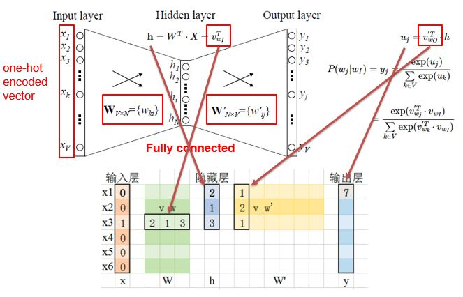
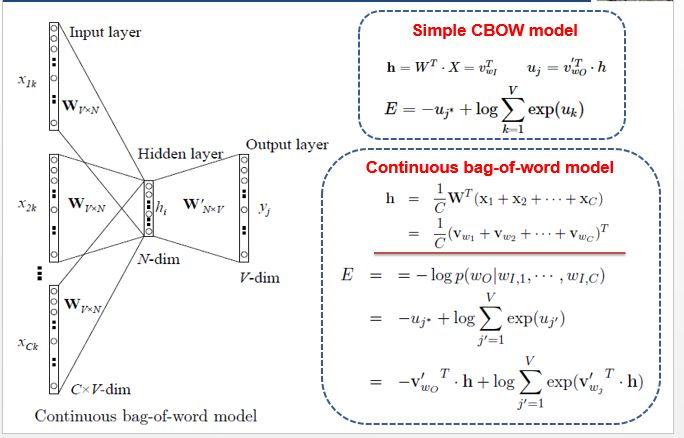
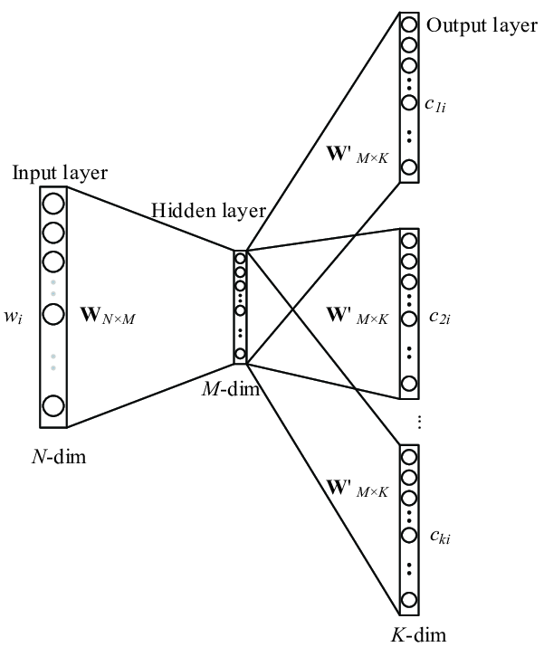
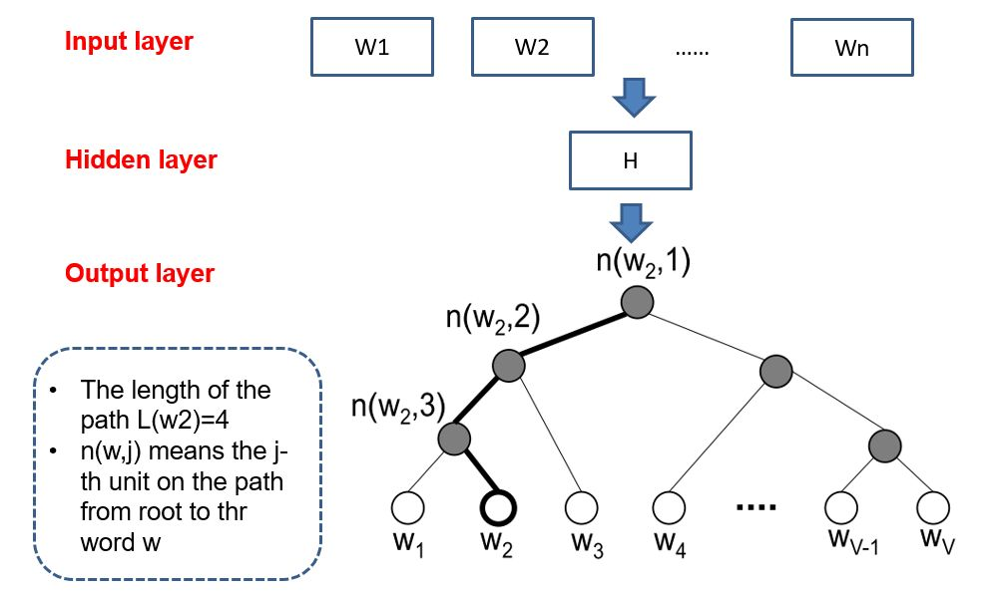

# 研究生周报（第十八周）

## 学习目标

1. Word2Vec
2. BELU
3. Transformer

## 学习时间

> 9.04 ~ 9.10

## 学习产出

### Word2Vec

#### 背景

> Word2Vec是语言模型中的一种，它是从大量文本预料中以无监督方式学习语义知识的模型。

1. 统计语言模型

统计语言模型是用来计算一个句子的概率的概率模型，它通常基于一个语料库来构建。
假设$W=(w_1,w_2,...,w_T)$表示由T个词$w_1,w_2,...,w_T$按顺序构成的一个句子，则$w_1,w_2,...,w_T$的联合概率为：
$$
p(W)=p(w_1,w_2,...,w_T)=p(w_1)p(w_2|w_1)...p(w_T|w_1,w_2,...,w_{T-1})
$$
在这种方法中，如果句子的长度为T，就需要计算T个参数。假设对应词典D的大小（即词汇量）为N，那么需要计算$TN^T$个参数

2. N-gram模型

一个词出现得概率与它前面得所有词都相关，n-gram模型在理论上是n越大，效果越好，不过当n大到一定程度，模型效果得提升幅度会变小。并且n越大，计算量也越大，在实际应用中最多是采用n=3的三元模型。
$$
p(w_k|w_1,...,w_{k-1})=\frac{p(w_1,...,w_k)}{p(w_1,...,w_{k-1})}
$$
需要进行平滑处理，比如拉普拉斯平滑等操作，不然如果一个词的概率为0会导致整个p(W)为0

3. 神经概率语言模型

经过上面步骤得到的知识一个长度为N的向量：$y_w=(y_{w,1},y_{w,2},...,y_{w,3})^T$只是一个长度为N的向量，其分量不能表示概率。需要使用Softmax归一化，自动进行了平滑处理。
神经概率语言模型中词语之间的相似性可以通过词向量来体现，不过在训练前需要提前初始化一个word embedding矩阵。

#### 词向量

自然语言处理相关任务中要将自然语言交给机器学习中的算法来处理，通常需要将语言数学化，因为机器只认数学符号。词向量就是用来将语言中的词进行数学化的一种方式，顾名思义，词向量就是把一个词表示为一个向量。

1. One-Hot Representation

调用One-Hot编码存储的方式非常简洁，一个词一个独一无二的编码，不过具有如下缺点：
- 容易受到维数灾难的困扰，尤其是词汇量特别大的时候
- 词汇鸿沟，词汇之间没有相似性
- 强稀疏性，0特别多，有用的信息特别少

2. Distributed Representation

通过训练将某种语言的每一个词映射成一个固定长度的短向量，所有这些向量构成一个词向量空间。

#### Word2Vec的网络结构

Word2Vec是轻量级的神经网络，其模型仅仅包括输入层、隐藏层和输出层，模型框架根据输入输出的不同，主要包括CBOW和Skip-gram模型。CBOW的方式是在知道词$w_t$的上下文$w_{t-2},w_{t-1},w_{t+1},w_{t+2}$的情况下预测当前词$w_t$；而Skip-gram实在知道了词$w_t$的情况下，对词$w_t$的上下文$w_{t-2},w_{t-1},w_{t+1},w_{t+2}$进行预测。

1. CBOW

- Input Layer输入的$X$是单词的One-Hot Representation。
- 输入层到隐藏层之间有一个权重矩阵$W$，选择输入$X$中的一行（即值为1）进行转置乘法。
- 隐藏层到输出层也有一个权重矩阵$W^{'}$，输出层的值就是隐藏层的向量点乘$W^{'}$。
- 最终的输出经过Softmax函数，将输出向量中的每一个元素归一化到0-1之间的概率，概率最大的，就是预测的词。

CBOW Multi-Word Context Model就是将Simple CBOW model的单个输入换成多个输入。

2. Skip-gram Model

Skip-gram Model是通过输入一个词去预测多个词的概率。输入层到隐藏层的原理和Simple CBOW一样，不同的是隐藏层到输入层，损失函数变成了$C$个损失函数的综合，权重$W^{'}$还是共享的。

$$
\begin{aligned}
    E &= -logp(w_{O,1},w_{O,2},...,w_{O,C}|w_1) \\
    &= -log{\prod_{c=1}^{C}\frac{\exp{(u_c, j_c^{*})}}{\sum_{j^{'}=1}^V\exp(u_{j^{'}})}} \\
    &= -\sum_{c=1}^Cu_{j_c^{*}}+C\cdot \log\sum_{j^{'}=1}^{V}\exp{(u_{j^{'}})}
\end{aligned}
$$

**一般神经网络语言模型在预测的时候，输出的是预测目标此的概率，因此每一次计算都需要基于全部的数据集进行计算。因此，Word2Vec提出了两种加快训练深度的方式，一种是Hierarchical softmax，另一种是Negative Sampling。**

#### 基于Hierarchical Softmax的模型

基于层次Softmax的模型主要包括输入层、隐藏层和输出层，非常的类式神经网络结构。对于Word2Vec中基于层次Softmax的CBOW模型，我们需要最终优化的目标函数是：
$$
L=\sum \log{p(w|Context(w))}
$$

1. CBOW模型网络结构

- 输入层：是指$Context(w)$中所包含的2c个词的词向量
- 隐藏层：指的是直接对2c个词向量进行累加，累加之后得到如下公式：
$$
X_w=\sum_{i=1}^{2c}v(Context(w)_i)
$$
- 输出层：是一个Huffman树，其中叶子节点共N个，对应于N个单词，非叶子节点N-1个。

1. $p^w$：从根节点出发，然后到达单词$w$对应叶子节点的路径
2. $l^w$：路径$p^w$中包含的节点的个数
3. $p_1^w,p_2^w,...,p_{l^w}^w$：路径$p^w$对应的各个节点
4. $d_2^w,d_3^w,...,d_{l^w}^w\in{0,1}$：单词$w$对应的哈夫曼编码。
5. $\theta_1^w,\theta_2^w,...,\theta_{l^w-1}^w\in \Psi^m$：路径$p^w$中非叶子节点对应的向量，$\theta_j^w$表示路径$p^w$中第$j$个非叶子节点对应的向量。

对于一个哈夫曼树而言，每次分支相当于一个二分类。既然是二分类，那么我们可以定义一个为正类，一个为负类。一般把正类认为是哈夫曼编码里面的1，而负类认为是哈夫曼编码里面的0。
$$
Label(p_i^w)=1-d_i^w，i=2,3,4...,l^w
$$
进行二分类的时候，选择Sigmoid函数，一个节点的概率为：
$$
\sigma(w_w^T\theta)=\frac{1}{1+e^{-x_w^t\theta}}
$$
被分为负类的概率为$1-\sigma (x_w^T\theta)$
譬如“足球”（1001）从根节点到叶子节点所经历的4次二分类为：
1. 第一个分类：$p(d_2^w|x_w,\theta_1^w)=1-\sigma(x^T\theta_1^w)$
2. 第二个分类：$p(d_3^w|x_w,\theta_2^w)=\sigma(x_w^T\theta_2^w)$
3. 第三个分类：$p(d_4^w|x_w,\theta_3^w)=\sigma(x_w^T\theta_3^w)$
4. 第四个分类：$p(d_4^w|x_w,\theta_4^w)=1-\sigma(x^T\theta_4^w)$
$$
p(足球|Context(足球)=\prod_{j=2}^5p(d_j^w|x_w,\theta_{j-1}^w))
$$

条件概率$p(w|Context(w))$的计算公式如下：
$$
\begin{aligned}
    & p(w|Context(w))=\prod_{j=2}^{l^w}p(d_j^w|x_w,\theta_{j-1}^w) \\
    & p(d_j^w|x_w,\theta_{j-1}^w)=
    \begin{cases}
        \sigma{x_w^T\theta_{j-1}^w},d_j^w=0 \\
        1-\sigma{x_w^T\theta_{j-1}^w},d_j^w=1
    \end{cases} \\
    & L=
    \begin{aligned}
        & \sum_{w\in C}\log{\sum_{j=2}^{l^w}[\sigma{x_w^T\theta_{j-1}^w}]^{1-d_j^w}\cdot[1-\sigma{x_w^T\theta_{j-1}^w}]^{d_j^w}} \\
        & \sum_{w\in C}\sum_{j=2}^{l^w}(1-d-j^w)\cdot\log{[\sigma{x_w^T\theta_{j-1}^w}]+d_j^w\cdot\log{[1-\sigma{x_w^T\theta_{j-1}^w}]}}
    \end{aligned}
\end{aligned}
$$

之后就可以进行$\theta_{j-1}^w,x_w,v(\tilde{w})$的梯度更新。

2. 基于Hierarchival Softmax的Skip-gram

- 输入层：只含当前样本的中心词$w$的词向量$v(w)\in \Psi^m$
- 隐藏层：一个恒等投影
- 输出层：和CBOW模型一样，输出层也是一颗Huffman树

目标函数为：
$$
P(Context(w)|w)=\prod_{w\in Context(w)}p(u|w)
$$

### BLEU score原理与解释

BLEU代表bilingual evaluation understudy，即双语评估替补。

1. 一般机器翻译输出质量的方法之一是观察输出结果的每一个词，看其是否出现在参考（也就是人工翻译结果）中，这被称为是机器翻译的精确度。
**the the the the the the**
2. 如上所述的内容会导致上述计算的精确度为1，实际上是错误的。因此改良版是把每一个单词的计分上限定为它在参考句子中出现最多的次数。
3. 推广到二元词组的**BLEU**得分，最后都要进行截取。

$$
\begin{aligned}
    &P_n = \frac{\sum_{n-gram\in\hat{y}}CounterClip(n-gram)}{\sum_{n-gram\in\hat{y}}Counter(n-gram)}
    &BLEU = BP \cdot \exp{\frac{1}{n}\sum_{i=1}^nP_n}
\end{aligned}
$$

## 总结

1. 这周比较忙，主要在修改项目的代码，没有时间去运行Transformer，估计下周应该也挺忙的
2. 把Transformer的模型完全看完了，还是得运行一下才有印象
