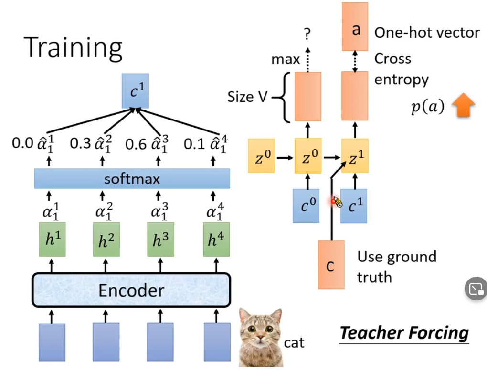

# 研究生周报（第十九周）

## 学习目标

1. Transformer
2. LAS
3. CTC
4. RNN-T
5. Language-Model

## 学习时间

> 9.11 ~ 9.17

## 学习产出

### Transformer

#### Embeddings 词嵌入

在自然语言处理中需要将词汇转换为向量形式。
1. one-hot编码形式，这种形式中每个单词都是独立的，相互之间没有任何联系，并且会占用大量的空间。
2. word2vec编码形式，这种形式中可以发现单词之间的联系，是由神经网络训练而成。

```python
class Embeddings(nn.Module):
    def __init__(self, d_model, vocab):
        super(Embeddings, self).__init__()
        self.lut = nn.Embedding(vocab, d_model)
        self.d_model = d_model

    def forward(self, x):
        return self.lut(x) * math.sqrt(self.d_model)
```

目前看不出来生成的**词向量**$\times \sqrt{d\_model}$有什么作用。

#### PositionEncoding 位置编码

由于Attention中会忽略参数位置产生的影响，同一个句子而内部单词位置不同也可能产生一样的结果，因此需要向不同位置添加冗余保证位置学习在多个信息通道上稳定灌入网络而不至于被网络抛弃。

$$
\vec{p_t}^{(i)}=f(t)^{(i)}:=
\begin{cases}
sin(w_k\cdot t), if\ i = 2k \\
cos(w_k\cdot t), if\ i = 2k + 1 \\
\end{cases}
where\ w_k = \frac{1}{10000^{2k/d}}
$$

#### Attention 注意力机制

1. 根据编码器的输入向量，使用**全连接层**生成三个向量。通常这些新向量的维度比输入词向量的维度要小（512->64），只是为了让多头attention的计算更稳定。
2. 计算attention就是计算一个分值，比如"Thinking Matchines"这句话，对"Thinking"计算attention分值，这个分决定着编码"Thinking"时对每个输入词集成多少关注度。
3. 通常query和key的点击会除以$\sqrt{d\_model}$，这样梯度会更加稳定，否则点击结果相互之间的差距过大，可能再后续的softmax产生概率为0，不利于后续计算。
4. 将softmax分值与value相乘，保留关注词的value值，削弱非相关词的value值。
5. 将所有加权向量加和，产生该位置的self-attention的输出结果。
6. 多个query、key、value即为多头注意力机制，将这些结果相加生成的结果通过全连接层的处理即可。

```python
def attention(query, key, value, mask=None, dropout=None):
    d_k = query.size(-1)
    scores = torch.matmul(query, key.transpose(-2, -1)) / math.sqrt(d_k)
    if mask is not None:
        scores = scores.masked_fill(mask == 0, -1e9)
    p_attn = F.softmax(scores, dim = -1)
    if dropout is not None:
        p_attn = dropout(p_attn)
    return torch.matmul(p_attn, value), p_attn
```

- query：对应于Key矩阵，形状是(L,N,E)。其中L是输出序列长度，N是batch size，E是词向量的维度
- key：对应于Key矩阵，形状是(S,N,E)。其中S是输入序列长度，N是batch size，E是词向量的维度
- value：对应于Value矩阵，形状是(S,N,E)。其中S是输入序列长度，N是batch size，E是词向量的维度
在实际中，K、V矩阵的序列长度是一样的，而Q矩阵的序列长度可以不一样，这种情况发生在解码器的**Encoder-Decoder Attention**层中，Q矩阵式来自解码器下层，而K、V矩阵则是来自解码器的输出。


#### 残差网络、全连接层、LayerNorm

- 通过残差网络解决“退化”现象，加深网络的深度。
- 通过LayerNorm代替BatchNorm进行正则化。
- 对MultiHeadedAttention+ResNet产生的结果后可以再次使用全连接层进行处理，因为全连接层可以处理固定维度的全部信息。

#### 标签平滑

对于分类问题，label通常采用one-hot编码的，即[0, 0, 1, 0, 0]形式，全概率1和0鼓励所属类别和其他类别之间的差距尽可能加大，然而在分类过程中不同种类的类别不一定完全没有相似的特征，不能一棍子打死。
- 例如，输出为[0.1, 0.7, 0.1, 0.1]，由于要使得Loss尽可能小，会让模型尽可能的调整为[0, 1, 0, 0]，尤其针对像交叉熵这类Loss，一旦output有些偏差，Loss值可能就往无穷大走了，就逼迫模型去接近真实的label，无法保证模型的泛化能力。
- 如果此时标签还是错误，会使得Loss很大，模型按照Loss调整将会使前面的学习功亏一篑。

$$
\begin{aligned}
& H(y,p)=\sum_{k=1}^K-y_k\log{p_k} \\
& y_k^{LS}=y_k(1-\alpha)+\alpha / K
\end{aligned}
$$

1. 更加考虑实际情况的分布，即不同样本之间其实是有相似的特征的，通常需要按照实际情况来进行分配，也有相关论文做出了让模型学习该如何分配标签的工作。
2. Label Smoothing是分类中解决noisy label的一种方法，在样本标签错误时采用这一方法，让Loss不至于像原来那般大。

#### Loss函数之KLDivLoss

**KL散度**，又叫做相对熵，用于衡量两个分布（离散分布和连续分布）之间的距离。
设$p(x)$、$q(x)$是离散随机变量$X$的两个概率分布，则$p$对$q$的KL散度是：
$$
D_{KL}(p||q)=E_{p(x)}\log{\frac{p(x)}{q(x)}}=\sum_{i=1}{N}p(x_i)\cdot(\log{p(x_i)}-\log{q(x_i)})
$$
**KLDivLoss**，对于包含N个样本的batch数据$D(x,y)$，$x$是神经网络的输出，并且就行了归一化和对数化；有是真实地标签（默认为概率），$x$与$y$同维度。
第$n$个样本的损失值$l_n$计算如下：
$$
l_n=y_n\cdot(\log_{y_n}-x_n)
$$
```python
class KLDivLoss(_Loss):
    __constants__ = ['reduction']
    def __init__(self, size_average=None, reduce=None, reduction='mean'):
        super(KLDivLoss, self).__init__(size_average, reduce, reduction)
    def forward(self, input, target):
        return F.kl_div(input, target, reduction=self.reduction)
```

### Bean Search

最终训练出来的模型，解码器每接受一个词汇，将会生成目标词汇的概率。
- 选择概率最大的词汇作为输出，即为贪婪搜索。概率最大的词汇将会参与下一轮的输入，下一轮继续选择最大概率词汇。
- 但是选择最大概率词汇并不代表最终整个词汇文本的概率组合是最高的，因此可以多选择几个概率词汇参与运算，即Bean Search。最终从Bean Search的结果从选择概率最高的组合。

 | 
---|---

### LAS

1. **Phoneme**，是发音的基本单位，模型将声音转化成为Phoneme，然后通过发音的基本单位，在确定单词的拼写。
2. **Grapheme**，是最小的字符单元，意识就是说我们将声音通过模型转换为一个个字母。
3. **Word**，模型直接将声音转化成为单词，该方法看上去挺好，但是面对词汇量大的语言不适用，比如说土耳其语，可与创造出更加复杂的词汇。
4. **Morpheme**，大致意识就是词根词缀，单位介于Grapheme和Word之间。
5. **Bytes！**，二进制。

**Listen, Attend, and Spell(LAS)**，可以看出沦为分为三个部分**Listen（encoder编码器）、Attend（注意力机制）、Spell（decoder解码器）**

#### Listen


**Listen**，这一部分我们需要做的就是专注于我们所听的，去除噪声。

我们通过Encoder编码器可以选择RNN、CNN（通常是1D-CNN）、CNN+RNN、Self-Attention。

 |  | 
---|---|---

由于声音的采集通常都是很大数据量的比如采样率为16KHz需要在一秒钟采集16000个采样点，所以通常需要对神经进行降采样，减少样本参数。

 | 
---|---

#### Attention

注意力机制，顾名思义就是要我们注意到我们该注意的，通过端到端的训练为我们总可以使得模型知道该拿哪些重要的。

 |  | 
---|---|---

#### Spell

**Spell**为解码器端，将会输出每一个词的概率，如果选择概率最大的词，那么这种方法就为贪婪搜索，通常是选择多个概率最大的词，进行下一波搜索，即为**集束搜索**。

 | 
---|---

#### Training

在训练是不将Spell输出的结果作为下一个输入，而是直接把正确的结果作为输入。

 | 
---|---

### Connectionist Temporal Classification(CTC)

 | 
--|--

1. 输入T个声学信号，输出T个符号（包括$\phi$）。
2. 输出包含$\phi$的序列，合并重复的$\phi$，去除$\phi$。

#### Training

如何制造每一个输入对应的正确的输出？

1. alignment：向预训练中添加$\phi$，这会产生许多alignmet的序列 => CTC全部拿去使用

### RNN Transducer(RNN-T)

 |  | 
---|---|---

### Neural Transducer

 | 
---|---

### Monootonic Chunkwise Attention(MoChA)

 | 
---|---

### HMM

 | 
---|---

1. Transition Probability：从一个state到另一个state的几率，及下一个vector是由哪一个state产生的
2. Emission Probability：给定一个state，这个state产生的声音序列样子怎么样。

**Tied-state**：有一些state，他们会共用一个model distribution，这件事叫做Tied-state。

### 获取所有的alignment

 |  | 
---|---|---

### Language Model

**Language model(LM)：估测token序列的几率**
- Token sequence：Y = $y_1, y_2, \cdots \cdots, y_n$
- $P(y_1, y_2, \cdots \cdots, y_n)$

$$
\begin{aligned}
    & \bold{HMM} \ \ Y^{*} = \arg{\max_{Y}{P(X|Y)P(Y)}} \\
    & \bold{LAS} \ \ Y^{*} = \arg{\max_{Y}{P(Y|X)}} = \arg{\max_{Y}{P(Y|X)P(Y)}}
\end{aligned}
$$

1. 在LAS中添加一个Language Model，效果居然会更好
   1. P(Y|X)进行训练需要搜集成对的资料，而搜集成对的资料的成本是比较高的
   2. P(Y)只需要搜集大量的文字就可以进行估测，成本比较低

### Speech Separation

1. Speech Enhancement：一个人在嘈杂的环境中讲话
2. Speaker Separation：同时又多个人在讲话

#### Evaluation

<!-- 声源分离算法用于从混合的观测声信号中分离出一个或多个期望源信号，如语音降噪、去混响、音乐分离等。评价一个声源分离算法性能的好坏，就是要衡量算法所提取的源信号和真实源信号之间的差异。目前最常用的**评价指标**是源失真比（source-to-distrotion ratio，SDR）、源干扰比（source-to-interference ratio，SIR）和源伪影比（source-to-artifcat ratio，SAR）。 -->

 | 
---|---

### 正则化技术（避免过拟合）

1. 数据增强：数据增强通过向训练数据添加转换或扰动来人工增加训练数据集。数据增强技术如水平或垂直翻转图形、剪裁、色彩变换、扩展和旋转通常应用在视觉表象和图形分类中。
2. L1和L2正则化：L1正则化向目标函数添加正则化项，以减少参数的绝对值总和；而L2正则化中，添加正则化项的目的在于减少参数平方的总和，因此它常用于特征选择设置中。
3. Dropout：Dropout指暂时丢弃一部分神经元及其连接。
4. 早停法：限制模型最小化代价函数所需的训练迭代次数。

### 损失函数

1. Classification Error（分类错误率）：$classification \ error=\frac{count \ of \ error \ items}{count \ of \ all \ items}$
2. Mean Squared Error（均方误差）：$MSE = \frac{1}{n}\sum_{i}^{n}(\hat{y_i}-y_i)^2$
   1. 使用sigmoid/softmax得到概率，配合MSE损失函数时，采用梯度下降经行学习时，会出现模型一开始训练时，学习率非常慢的情况。
3. Cross Entropy Loss Function（交叉熵损失函数）：$L=\frac{1}{N}\sum_{i}L_i=-\frac{1}{N}\sum_i\sum_{c=1}^My_{ic}\log{(p_{ic})}$
   1. 交叉熵损失函数经常用于分类问题中，特别是在神经网络做分类问题时，也经常使用交叉熵作为损失函数，由于交叉熵涉及到计算每个类别的改了，所以交叉熵几乎每次都和**sigmoid（或softmax）函数**一起出现。

### 优化算法

深度学习优化算法经历了SGD->SGDM->NAG->AdaGrad->AdaDelta->Adam->Nadam这样的发展历程。
首先定义：待优化参数：$w$，目标函数：$f(w)$，初始学习率$\alpha$，而后开始进行迭代优化，在每个epoch t：
1. 计算目标函数关于当前参数的梯度：$g_t=\bigtriangledown f(w_t)$
2. 根据历史梯度计算一阶动量和二阶动量：$m_t=\phi(g_1,g_2,\cdots,g_t);V_t=\psi(g_1,g_2,\cdots,g_t)$
3. 计算当前时刻的下降梯度：$\eta_t=\alpha\cdot m_t/\sqrt{V_t}$
4. 根据下降梯度进行更新：$w_{t+1}=w_t-\eta_t$

- **SGD**：SGD没有动量的概念，即没有步骤2
  - $m_t=g_t;V_t=I^2$
  - $\eta_t=\alpha\cdot g_t$
  - 缺点是下降速度慢，而且可能会在沟壑的两边持续震荡，停留在一个局部最优点
- **SGD with Momentum**：在梯度下降过程可以加入惯性。下坡的时候，如果发现是陡坡，那就利用惯性跑的快一些
  - $m_t=\beta_1\cdot m_{t-1}+(1-\beta_1)\cdot g_t$
- **SGD with Nesterov Acceleration**：解决一下局部最优问题，时刻t的主要下降方向是由累积动量决定的，自己的梯度方向说了也不算，与其看当前梯度方向，不如先看看如果跟着累积动量走了一步，那个时候再怎么走。
  - $g_t=\bigtriangledown f(w_t-\alpha\cdot m_{t-1}/\sqrt{V_{t-1}})$
- **AdaGrad**：此前没有用到二阶动量，二阶动量的出现，才意味着“自适应学习率”优化算法时代的到来。对于经常更新的参数，已经累积了大量关于它的知识，不希望被单个样本影响太大，希望学习速率慢一些；对于偶尔更新的参数，我们了解的信息太少，希望能从每个偶然出现的样本身上多学一些，即学习率大一些。
  - $V_t=\sum_{\tau=1}^tg_{\tau}^2$
  - $\eta_t=\alpha\cdot m_t/\sqrt{V_t}$
  - 一般为了避免分母为0，会在分母上加一个小的平滑项。二阶动量越大，学习率越小，因为$\sqrt{V_t}$是单调递增的，会使得学习率单调递减至0，可能会使得训练过程提前结束。
- **AdaDelta/RMSProp**：由于AdaGrad单调递减的学习率过于激进，因此改为只关注过去一段时间窗口的下降梯度
  - $V_t=\beta_2*V_{t-1}+(1-\beta_2)g_t^2$
- **Adam**：SGD-M在SGD的基础上增加了一阶动量，AdaGrad和AdaDelta在SGD基础上增加了二阶动量，把两者结合起来就是Adam——Adaptive+Momentum。
  - $m_t=\beta_1\cdot m_{t-1}+(1-\beta_2)\cdot g_t$
  - $V_t=\beta_2\cdot V_{t-1}+(1-\beta_2)f_t^2$
- **Nadam**：Nadam=Nesterov+Adam
  - $g_1=\bigtriangledown f(w_t-\alpha\cdot m_{t-1}/\sqrt{V_t})$

#### Adam的两个缺陷

1. 可能不收敛：二阶动量是固定时间窗口内的累积，随着时间窗口的变化，遇到的数据可能发生巨变，使得$V_t$可能时大时小，不是单调变化。
   1. $V_t=max(\beta_2*V_{t-1}+(1-\beta_2)g_t^2, V_{t-1})$
   2. 通过这样修改，保证了$||V_t||\geq||V_{t-1}||$，从而使得学习率递减
2. 可能错过全局最优解：在维度极高的空间内，引入动量可能很容易越过高峰。
   1. 前期用Adam，享受Adam快速收敛的优势
   2. 后期切换SGD，慢慢寻找最优解

## 总结

1. 本周把Transformer给完整的看完了，对于代码简单的训练了简化版本的，下周应该要一下服务器训练一个德语和英语之间的转换或者直接去看一下bert。
2. 项目继续进行，对于目前给予的2个样本准确率已经达到了90%以上，对面要求用在其它样本上查看鲁棒性，目前对面没有完全统计好，不过结果不太好，因为其它样本中出现了前两个样本中没有遇见过的情况，需要在他们的统计结果完全出来后进行处理。
