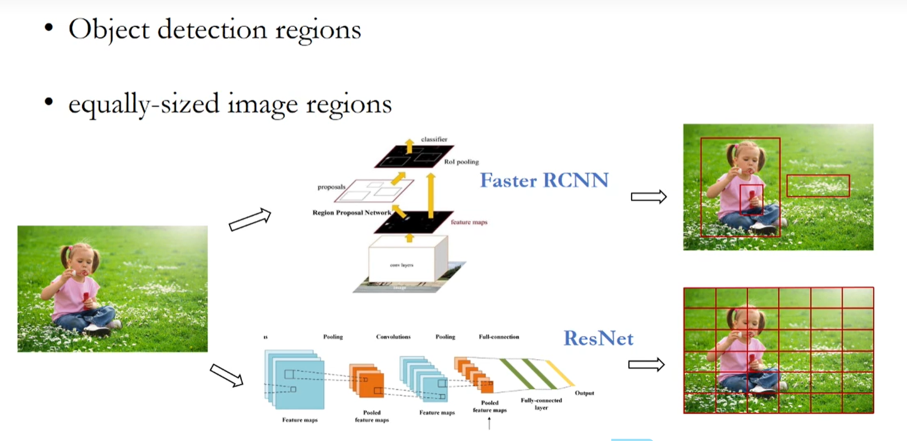

# 研究生周报（第十九周）

## 学习目标

1. BERT
2. 多模态相关知识

## 学习时间

> 9.18 ~ 9.24

## 学习产出

### BERT:Pre-training of Deep Bidirectional Transformer for language Understanding

BERT,基于transformer的双向编码表示，它是一个预训练模型，模型训练时的两个任务是预测句子中被掩盖的词以及判断输入的两个句子是不是上下句。在预训练好的BERT模型后面根据特定任务加上相应的网络，可以完成NLP的下游任务，比如文本分类、机器翻译。

#### 介绍

##### 把预训练语言模型应用到下游任务的方法有两种，分别为Feature-based和Fine-tune

1. Feature-based的方法是通过训练神经网络从而得到词语的Embedding，即该方法不使用模型本身，而是使用模型得到的参数作为词语的Embedding。比如**ELMo**这一例子。
2. Fine-tune方法会根据下游特定的任务，在原来的模型上面上进行一些修改，使得最后输出是当前任务所需要的。这种方法一般是在模型的最后一层或者在现有的网络中添加一个网络结构用于匹配下游的各种任务。比如**OpenAI GPT**这一例子，不过GPT3得益于海量的训练样本与庞大的网络参数，不需要fine-tune这一过程。
3. BERT采用的是LM+fine-tune的方法。

##### 此前ELMo和GPT都是单向的，而BERT是双向的

为什么会有ELMo等模型，这是因为Word2vec获取的是一个“死”的稠密向量，单词迁入后就是唯一的表示，不能根据其在句子中的位置和上下文关系而改变其含义，为处理**一词多义**问题增加了难度。

1. ELMo自称是双向语言模型，但实则不然，如下图所示:

 | 
---|---

实际上两个LSTM都是单向工作的，一个为**Forward**方向，另一个为**Backward**方向，然后采用**极大似然**来调整两个单向LSTM的参数，只要最大化向前和向后的对数概率即可：
$$
\sum_{k=1}^N[\log{p(t_k|t_1,\cdots,t_{k-1};\Theta_x,\mathop{\Theta_{LSTM}}\limits^{\rightarrow},\Theta_s)}+\log{p(t_k|t_{k+1},\cdots,t_{N};\Theta_x,\mathop{\Theta_{LSTM}}\limits^{\leftarrow},\Theta_s)}]
$$

ELMo所谓的双向实际上是通过**两个单向且反向的LSTM**实现的，并不是直接使用双向LSTM，那为什么不使用它呢？这是因为对于多层来说涉及到了**信息泄漏**的问题，深层双向LSTM会被泄漏上下文词语的位置信息导致模型学到了不该学习的东西，从而失去预训练的效果。

值得注意的是在ELMo中，并非采用Word2vec作为输入，而是在Embedding后采用了字符级的CNN作为替代输入；作者认为字符级CNN是一种更加**不敏感**的上下文表示，也有可能Word2vec本身就限制了多语义的表达。

2. GPT的想法非常简单，尝试用一种通用的，任务无关的模型结构解决所有NLP问题，对于不同的Task,只需要在无监督的预训练后进行监督的Fine tune即可，类似CV中的Transfer Learning。

GPT和BERT一样采用Transformer作为基本的Blcok结构，因为作者指出LSTM将预测能力限制在**短距离**，所以采用使用Attention的Transformer作为**长距离**的信息抽取器。

|
---|---

- ELMo、GPT和BERT中之一BERT真正捕捉了所有层的上下文信息，ELMo和GPT都是单向捕捉信息
- GPT和BERT是基于**微调**的方法，模型结构不用发生变化，而ELMo是基于**特征**的方法，再应用时需要改下层结构
- BERT吸收了ELMo的双向的特点，又使用了GPT的新的架构，不过GPT使用的是解码器、BERT使用的是编码器，所以BERT做机器翻译、文本摘要生成不好做

##### MLM（屏蔽语言模型）

屏蔽语言建模中，通常屏蔽给定句子中特定百分比的单词，模型期望基于该句子中的其他单词预测这些被屏蔽的单词。这种训练方案使这个模型在本质上是双向的，因为掩蔽词的表示是根据出现的词来学习的，不管是左是右，可以想象成一个填空式的问题陈述。

还有一直**因果语言模型（CLM）**，这个模型只考虑发生在它左边的单词来做同样的事情，本质上是单向的。在学习输入文档的良好表示时，MLM损失是首选；希望生成流畅文本的系统时，CLM是首选。两者都有其有点和局限性，一种成为XLNet的新模型使用置换技术来利用其两全其美。

#### BERT

|
---|---

在BERT的框架中中分为两个步骤：pre-training和fine-tuning，即预训练和微调。

1. pre-training：在预训练中模型使用不同预训练任务上的无标记数据进行训练。
2. fine-tuning：微调时最开始使用pre-training的参数，后面根据来自下游任务的标签数据进行改变。

**模型结构**

BERT的模型结构采用**多层的双向Transformer编码器**，使用$L$作为层数、$H$为隐藏大小、$A$为self-attention heads的数量，使用了两种模型尺寸：
1. $BERT_{BASE}(L=12,H=768,A=12,Total\ Parameters=110M)$
2. $BERT_{LARGE}(L=24,H=1024,A=16,Total\ Parameters=340M)$

**输入/输出 表示**

1. 输入形式：Sequence

   NLP不同下游任务的输入有不同形式，如一个句子或一个句子对（如QA任务中的<Quention,Answer>），为了使得BERT模型满足NLP多个下游任务的输入要求，BERT的输入形式是一个序列，即输入token的序列表示，可以将两个句子合并成一个序列，一起输入到BERT中。
   > 9Transformer的Encoder和Decoder均会输入一个序列，但是BERT只有Encoder部分，所以需要将两个序列并在一起输入。

2. Embedding

   BERT使用WordPiece embeddings，词表长度为3000：传统由单词构成的词表中，存在许多低频词，为这些低频词构建词表会造成浪费。WordPiece可以将这些单词切开形成子序列（类似词根、词缀），只保留词频较高的子序列。好处是可以使用相对较小的词表，对文本进行表示。
   同时每个输入序列的Embedding中，包含两个特殊的token：
   - [CLS]：代表Classification。对于非分类任务，忽略此变量。
   - [SEP]：代表Separate。用于分隔两个句子。

|
---|---

##### Pre-training BERT

BERT基于两个预训练任务：Masked LM和Next Sentence Prediction(NSP)

**Task #1：Masked LM**

使用MLM这一方法，在每一个序列中随机掩盖15%的词，模型用于预测被掩盖的词，而不是重新构建出输入序列。
但是直接使用mask会导致一个问题：pre-trainging和fine-tuning之间不匹配，因为在fine-tuning期间模型输入中没有[MASK]token。
作者提出了如下解决方案：不总是对token进行mask，而是训练数据生成器随机选择15%的token。例如在句子"My dog is hairy"中，它选择的token是"hairy"，然后，执行以下过程：

- 80%的时间：用[MASK]标记替换单词，例如，my dog is hairy -> my dog is [MASK]
- 10%的时间（加入噪音）：在vocab中随机选一个单词替换该单词，例如，my dog id hairy -> my dog is apple
- 10%的时间（拟合真实情况）：保持单词不变。

**Task #2: Next Sentence Prediction(NSP)**

在许多下游任务，比如QA和NLI中都是基于理解两个句子之间的关系，这并没有通过语言建模直接获得。为了让BERT模型学习句子层面的信息，于是设计了NSP任务，也就是选择A和B作为预训练样本时，B有50%的机会时A的下一个句子，也有50%的可能性来自语料库的句子。

 | 
---|---

> 右图中flight ##less就是WordPiece拆分的结果，表明这两和和为一个词。

**预训练的数据**

为了得到长篇幅的连续序列，作者使用的document-level的训练预料（一大段文字、文章）

##### Fine-tuning BERT

在输入端，各下游任务中，模型中句子A和句子B的输入和预训练阶段的句子输入很相似。在输出端，token表示被输入道输出层用于token-level tasks，比如序列标记或问题回答，而[CLS]表示被输入到输出层用于分类，比如情感分析。

#### 实验

把BERT fine-tuning results在11个NLP任务中运行：

|
---|---

我们只需要在BERT的基础上再加一个输出层便可以完成对特定任务的微调，这些任务包括对于句子对的分类任务：
- MNLI：给定一个前提，根据这个前提区推断假设与前提的关系。
- QQP：基于Quora，片段Quora上的两个问题句是否表示的是一样的以上。
- QNLI：用于片段文本是否包含问题的答案。
- STS-B：预测两个句子的相似性。
- MRPC：片段两个句子是否等价。
- PTE：类似于MNLO，不过只判断蕴含关系。
- SWAG：从四个句子中选择最为可能的前句下文的那个。
还有基于句子的分类任务：
- SST-2：电影评价的情感分析。
- CoLA：句子语义判断，是否是可接受的。

#### 消融实验

**1. 预训练任务和不同模型架构的影响**

|
---|---

上面的结果证明了NSP和基于Bidirectional Transformer架构的重要性

**2. 模型大小的影响**

|
---|---

一般来说，模型越大越好

**3. BERT在Feature-based中的应用**

|
---|---

BERT使用基于特征的方法效果也不错

#### 总结

在BERT提出之前，CV领域已经可以通过在一个大片的数据集上训练好一个CNN模型，用于帮助一大片的CV领域，提升性能。但是在NLP领域，一般都是根据指定任务构造特定的神经网络，然后再数据集上做训练，知道BERT的出现。

### 知识增强的视觉-语言预训练任务

<!-- ERNIE-ViL -->

1. Vision-language tasks

- 理解式任务
  - 视觉问答
  - 视觉常识推理
  - 跨模态检索
  - ……
- 生成性任务
  - 视觉生成文本的captioning任务
  - 文本生成视觉的generation任务

|
---|---
大概包含3000多个问答的答案。

|
---|---
给定一张图片，不仅要给出图片的推断还要给出原因，这是因为4个推断中选择一个可能具有随机性，所以还要选择原因，减少随机性。

|
---|---
表达式理解任务，给定区域，根据文本描述选择区域。物体模块、位置模块、关系模块。

|
---|---
跨模态检索任务，根据图片找文本，文本找图片等。常见方法如上，语言和图片分别建模最后映射到同一个空间中计算相似度。

2. V+L Joint Pre-training

|
---|---
需要解决的问题：
1. 视觉的特征怎么提取
2. 语言和视觉的特征怎么融合
3. 构建多模态预训练任务
4. 图片和文本对齐

- 视觉特征提取

|
---|---
1. 上一种提取了不同的区域代表不同的物体特征
2. 下一种将图片等分的划分，可以进行微调

- 图片和文字特征融合

 | 
---|---
1. 单层的结构，将图片和文本在预处理之后映射到同一个空间中
2. 图片特征和文本特征通过Co-TRM在表征自身语义的时候相互参考对方的语义

- 预训练任务

 | 
---|---
1. Language Modal(Multi-model Masked Language Modelling)
2. Vision Modal
3. Cross-Model

- 图像文本匹配

选择不关的文本替换掉原来图片下的文本。

#### ERNIE-ViL Framework

<!-- ### 什么是多模态

多模态指的是多总模态的信息，包括：文本、图像、视频、音频等。多模态研究的就是这些不同类型的数据的融合的问题。

例如给定一张图片，可以完成以下任务：
1. VQA（Visual Question Answering）视觉问答
   1. 输入：一张图片、一个自然语音描述的entire
   2. 输出：答案
2. Image Caption图像字幕
   1. 输入：一张图片
   2. 输出：图片的自然语音描述
3. Referring Expression Comprehension 指代表达
   1. 输入：一张图片、一个自然语言描述的1句子
   2. 输出：判断句子描述的内容
4. Visual Dislogue 视觉对话
   1. 输入：一张图片
   2. 输出：两个角色进行多少交互、对话
5. VCR（Visual Commonsense Reasoning）视觉常识推理
   1. 输入：一个问题、4个备选答案、4个理由
   2. 输出：正确答案和理由
6. NLVR（Natural Language for Visual Reasoning）自然视觉推理
   1. 输入：2张图片、一个分布
   2. 输出：true或false
7. Visual Entailment 视觉蕴含
   1. 输入：图像、文本
   2. 输出：3种label的概率。
8. Image-Text Retrieval 图文检索
   1. 以图搜文：输入图片，输出文本
   2. 以文搜图：输入文本，输出图片
   3. 以图搜图，输入图片，输出图片

### 多模态融合的方式

通过NLP的预训练模型，可以得到文本的嵌入表示；再结合图像和视觉领域的预训练模型，可以得到图像的嵌入表示；最后将两者结合：
1. 点乘或者直接追加

2. 使用Transformer架构

### Transformers做多模态

Transformer是多模态里重要一环，但不是所有任务的唯一方案或最佳方案。
多模态任务目前主要有Align和Fuse两大派系，也有论文成为light fusion和heavy fusion。
前者的fusion方式比较简单，如向量内积，代表是CLIP和ALIGN，他们是一种双塔结构，重点在于多模态额对齐，以便于图文匹配、检测下游任务。
Transformer，代表有VLP、OSCAR、UNITER、VINVL等，他们可看作是一种单塔结构，重点在于利用attention机制融合多模态信息，可以做更多的任务，可实现VAQ、caption等需要学习融合和理解的下游任务。 -->

## 总结

1. 本周本来最开始直接寻找多模态的以下综述看看，不过发现需要先去了解一些预训练模型的相关知识，就去看了BERT，下周准备多看几篇视觉和自然语言结合的多模态论文。
2. 项目继续进展，本周分别对三个市的抽取数据进行弥补，发现了一些之前规则上的缺陷，并且进行了弥补，不过更多的是新出现的错误以及未确定的规则导致的，需要进行修改。