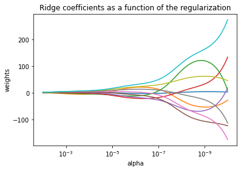
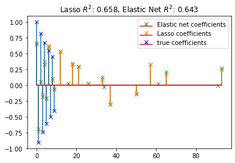

# Sklearn学习手册

## 监督学习

### 广义线性模型

本章主要讲述一些用于回归的方法，其中目标值y是输入向量x的线性组合。
数学概念表示为：如果$\hat{y}$是预测值，那么有：
$$\hat{y}(w,x)=w_0+w_1x_1+...+w_px_p$$
在整个模块中，我们定义向量$w=(w_1,\cdots,w_p)$作为coef_，定义$w_0$作为intercept_

1. 普通最小二乘法

LinearRegression拟合一个带有系数$w=(w_1,\cdots,w_p)$的线性模型，使得数据集观测数据和预测数据（估计值）之间的残差平方和最小。其数学表达式为：
$$\min_w||Xw-y||_2^2$$


```python
>>> from sklearn import linear_model
>>> reg = linear_model.LinearRegression()
>>> reg.fit ([[0, 0], [1, 1], [2, 2]], [0, 1, 2])
LinearRegression(copy_X=True, fit_intercept=True, n_jobs=1, normalize=False)
>>> reg.coef_
array([ 0.5,  0.5])
```

2. 岭回归

Ridge回归通过对系数的大小施加惩罚来解决普通最小二乘法的一些问题。岭系数最小化的是带惩罚项的残差平方和：
$$\min_w||Xw-y||_2^2+\alpha ||w||_2^2$$
其中，$\alpha\geq 0$是控制系数收缩量的复杂性参数：$\alpha$的值越大，收缩量越大，模型对共线性的鲁棒性也更强


```python
>>> from sklearn import linear_model
>>> reg = linear_model.Ridge (alpha = .5)
>>> reg.fit ([[0, 0], [0, 0], [1, 1]], [0, .1, 1])
Ridge(alpha=0.5, copy_X=True, fit_intercept=True, max_iter=None,
 normalize=False, random_state=None, solver='auto', tol=0.001)
>>> reg.coef_
array([ 0.34545455,  0.34545455])
>>> reg.intercept_
0.13636...

```

RidgeCV通过内置的关于alpha参数的交叉验证来实现岭回归。该对象与GridSearchCV的使用方法相同，只是它默认为Generalized Cross-Validation（广义交叉验证GCV），这是一种有效的验证方法

```python
>>> from sklearn import linear_model
>>> reg = linear_model.RidgeCV(alphas=[0.1, 1.0, 10.0])
>>> reg.fit([[0, 0], [0, 0], [1, 1]], [0, .1, 1])       
RidgeCV(alphas=[0.1, 1.0, 10.0], cv=None, fit_intercept=True, scoring=None,
 normalize=False)
>>> reg.alpha_                                      
0.1
```

3. Lasso

Lasso是拟合稀疏系数的线性模型。它在一些情况下是有用的，因为它倾向与使用具有较少参数值的情况，有效地减少给定方案所依赖变量的数量。因此，Lasso及其变体是压缩感知领域的基础。在一定条件下它可以恢复一组非零权重的精确集。
其最小化的目标函数是：
$$\min_w\frac{1}{2n_{samples}}||Xw-y||_2^2+\alpha||w||_1$$


```python
>>> from sklearn import linear_model
>>> reg = linear_model.Lasso(alpha = 0.1)
>>> reg.fit([[0, 0], [1, 1]], [0, 1])
Lasso(alpha=0.1, copy_X=True, fit_intercept=True, max_iter=1000,
 normalize=False, positive=False, precompute=False, random_state=None,
 selection='cyclic', tol=0.0001, warm_start=False)
>>> reg.predict([[1, 1]])
array([ 0.8])
```

4. 多任务Lasso

MultiTaskLasso 是一个估计多元回归稀疏系数的线性模型： y 是一个形状为(n_samples, n_tasks) 的二维数组，其约束条件和其他回归问题（也称为任务）是一样的，都是所选的特征值。

5. 弹性网络

弹性网络是一种使用L1，L2范数作为先验正则项训练的线性回归模型。这种组合允许拟合到一个只有少量参数是非零稀疏的模型，就像Lasso一样，但是它仍然保持了一些类似于Ridge的正则性质。我们可利用l1_ratio参数控制L1和L2的凸组合。
弹性网络在很多特征互相联系的情况下是非常有用的。Lasso很可能只随机考虑这些特征中的一个，而弹性网络更倾向于选择两个。
最小化的目标函数是：
$$\min_w\frac{1}{2n_{samples}}||Xw-y||_2^2+\alpha p||w||_1+\frac{\alpha(1-p)}{2}||w||_2^2$$

6. 多任务弹性网络

MultiTaskElasticNet是一个对多回归问题估算稀疏参数的弹性网络: Y是一个二维数组，形状是 (n_samples,n_tasks)。其限制条件是和其他回归问题一样，是选择的特征，也称为tasks。

7. 最小角回归

最小角回归（LARS）是对高维数据的回归算法，由Bradley Efron, Trevor Hastie, Iain Johnstone和Robert Tibshirani开发完成。LARS和逐步回归很像。在每一步，它都寻找与响应最有关联的预测。当有很多预测有相同的关联时，它并不会继续利用相同的预测，而是在这些预测中找出应该等角的方向。

8. LARS Lasso

LassoLars是一个使用LARS算法的lasso模型，不同于基于坐标下降法的实现，它可以得到一个精确解，也就是一个关于自身参数标准化后的一个分段线性解。

```python
>>> from sklearn import linear_model
>>> reg = linear_model.LassoLars(alpha=.1)
>>> reg.fit([[0, 0], [1, 1]], [0, 1])  
LassoLars(alpha=0.1, copy_X=True, eps=..., fit_intercept=True,
     fit_path=True, max_iter=500, normalize=True, positive=False,
     precompute='auto', verbose=False)
>>> reg.coef_    
array([0.717157..., 0.        ])
```

9. 正交匹配追踪法（OMP）

OrthogonalMatchingPursuit (正交匹配追踪法)和 orthogonal_mp使用了OMP算法近似拟合了一个带限制的线性模型，该限制影响于模型的非0系数(例：L0 范数)。

10. 贝叶斯回归

贝叶斯回归可以用于在预估阶段的参数正则化: 正则化参数的选择不是通过人为的选择，而是通过手动调节数据值来实现。

    1.  贝叶斯岭回归

    ```python
    >>> from sklearn import linear_model
    >>> X = [[0., 0.], [1., 1.], [2., 2.], [3., 3.]]
    >>> Y = [0., 1., 2., 3.]
    >>> reg = linear_model.BayesianRidge()
    >>> reg.fit(X, Y)
    BayesianRidge(alpha_1=1e-06, alpha_2=1e-06, compute_score=False, copy_X=True,
    fit_intercept=True, lambda_1=1e-06, lambda_2=1e-06, n_iter=300,
    normalize=False, tol=0.001, verbose=False)
    ```

    2. 主动相关决策理论 - ARD

11. logistic 回归

12. 随机梯度下降，SGD

13. Perceptron（感知器）

14. Passive Aggressive Algorithms（被动攻击算法）

15. 稳健回归（Robustness regression）: 处理离群点（outliers）和模型错误

16. 多项式回归：用基函数展开线性模型

### 线性和二次判别分析
