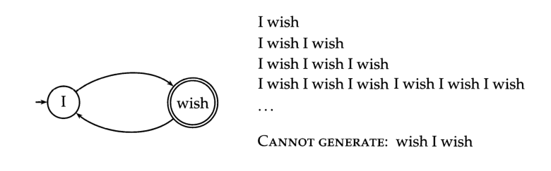
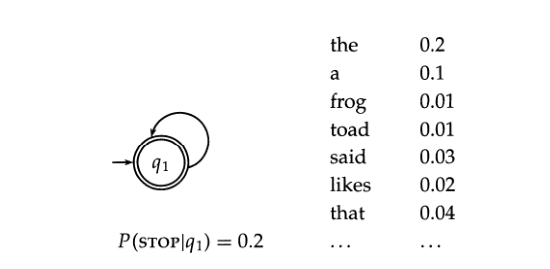

# 信息检索导论

> 第一章主要介绍倒排索引：并说明如何通过这种索引实现简单的布尔查询。

## 第一章：布尔检索

信息检索（Information Retrieval，简称IR）的含义可以非常广。学术意义上的信息检索定义为：
    信息检索时=是从大规模非结构化数据（通常时文本）的集合（通常保持在计算机上）中找出满足用户信息需求的资料（通常时文档）的过程。

1. 正向索引
   1. 结构：
   “文档1”的ID->单词1：出现次数，出现位置列表；单词2：出现次数，出现文章列表；......。
   “文档2”的ID->此文档出现的关键词列表。
   2. 因为互联网上收录在搜索引擎中的文档的数目是个天文数字，这样的索引结构根本无法满足实时返回排名结果的要求。
2. 倒排索引
   1. 结构：
   “关键词1”：“文档1”的ID,“文档2”的ID,......。
   “关键词2”：带有此关键词的文档ID列表。
   2. 基本概念
      1. 文档（Document）：以文本形式存在的储存对象。
      2. 文档集合（Document Collection）：由若干文档构成的集合。
      3. 文档编号（Document ID）：将文档集合内每个文档赋予一个唯一的内部编号。
      4. 单词列表（Word ID）：与文档编号类似，用唯一的编号来表征某个单词。
      5. 单词列表（PostingList）：倒排列表记载了出现在某个单词的所有文档列表及单词在该文档中出现的位置信息，每条记录称为一个倒排项（Posting）。
3. 单词——文档矩阵
   单词——文档矩阵是表达两者之间所具有的一种包含关系，每列代表一个文档，每行代表一个单词。
4. 布尔查询的处理
5. 构建倒排序的几个主要步骤
   1. 收集待索引的文档；
   2. 对这些文档中的文本进行词条化；
   3. 对第二步产生的词条进行语言预处理，得到词项；
   4. 根据词项对所有文档建立索引

> 第二章介绍索引之前的文档预处理过程，并讨论在不同的功能和速度要求下对倒排索引进行改进的方法。

## 第二章：词项词典及倒排记录表

1. 文档分析及编码转换
   1. 字符序列的生成：作为索引构建过程的输入，数字文档一般由文件中或者Web服务器上的一系列字节组成。因此，文档处理的第一步往往是将这些字节序列转换成线性的字符序列。
   2. 文档单位的选择：确定索引的文档单位（ document unit）。
2. 词项集合的确定
   1. 词条化：定义好文档单位之后，词条化是将给定的字符序列拆分成一系列子序列的过程，其中每个子序列称为一个词条（token）。在这个过程中，可能会去掉一些特殊字符，如标点符号等。主要任务时确定哪些才是真正的词条。
   2. 去除停用词：某些情况下，一些常见词在文档和用户需求进行匹配时价值并不大，需要彻底从词汇表中去除。
   大停用词表->小停用词表->不用停用词表
   3. 词项归一化：将文档和查询转换成一个个的词条之后，最简单的情况就是查询中的词条正好和文档中的词条相一致。
      1. 词条归一化（token normalization）就是将看起来不完全一致的多个词条归纳成一个等价类，以便在它们之间进行匹配的过程。最常规的做法是隐式地建立等价类，每类可以用其中的某个元素来命名。
      2. 另一种建立等价类的方法时维护多个非归一化词条之间的关联关系。
   4. 词干还原和词形归并
      1. 词干还原：很粗略的去除单词两端词汇的启发式过程。
      2. 词形归并：通常利用词汇表和词形分析来去除屈折词缀。
3. 基于跳表的倒排记录快速合并算法
   1. 放置调表指针位置的一个简单的启发式策略时，在每个$\sqrt{P}$出均匀放置跳表指针，这个策略在实际中效果不错，但是任然有提高的余地，因为它并没有考虑查询词项的任何分布细节。
4. 含有位置信息的倒排记录表及短语查询
   1. 二元词索引：
   stanford university palo alto => "standford university" AND "university palo" AND "palo alto"
   2. 位置信息索引
   3. 混合索引机制

> 第三章主要介绍词典搜索的数据结构，并给出查询存在拼写错误或者与被搜索的文档中的词汇不能精确匹配时的处理方法。

### 第三章：词典及容错式检索

前两章陈述布尔查询和邻近查询，本章讲述对查询中存在拼写错误或存在不同拼写形式具有鲁棒性的拼写校验技术。

1. 词典搜索的数据结构
   1. 哈希表方式
   2. 搜索树方式
2. 通配符查询
   1. 使用场景
      1. 用户对查询的拼写不太确定
      2. 用户知道某个查询可能有不同的拼写版本，并且要把包含这些版本的文档都找出来
      3. 用户查找某个查询词项的所有变形，这些变形可能够还做了词干还原，但是用户并不知道搜索引擎是否进行了词干还原
      4. 用户不确定一个外来词或者短语的正确拼写方式
   2. 一般的通配符查询
      1. 轮排索引
      2. 支持通配符查询的k-gram索引
   3. 拼写校正
      1. 词项独立（isolated-term）的校正
         1. 编辑距离
            ```c
            EDITDISTANCE(s1, s2)
            int m[|s1|, |s2|] = 0
            for i <- 1 to |s1|
            do m[i, 0] = i
            for j <- 1 to |s2|
            do m[0, j] = j
            for i <- 1 to |s1|
            do for j <- 1 to |s2|
               do m[i, j] = min{m[i-1, j-1] + if(s1[i] = s2[j]) then 0 else 1fi,
                              m[i-1, j] + 1,
                              m[i, j-1] + 1}
            return m[|s1|, |s2|]
            ```
         2. k-gram
      2. 上下文敏感（context-sensitive）的校正
   4. 基于发音的校正技术

> 第四章主要介绍基于文本集合构建倒排索引的几个算法，并着重介绍具有高扩展性的分布式算法，这类算法适用于大规模文档集的索引构建。

### 第四章：索引构建

1. 基于块的排序索引方法
   1. 将文档集分割成几个大小相等的部分
   2. 将每个部分的词项ID-文档ID对排序
   3. 将中间产生的临时排序结果存放在磁盘中
   4. 将所提中间文件合并成最终的索引
2. 内存式单遍扫描索引构建方法
3. 分布式索引构建方法
4. 动态索引构建方法
   1. 周期性索引
   2. 保持两个索引：大的主索引，小的用于存储新文档信息的辅助索引

> 第五章介绍词典和倒排索引的压缩技术。这些技术对于实现大型搜索引擎的亚秒级查询响应十分关键。

### 第五章：索引压缩

1. 索引压缩的优点：
   1. 增加高速缓存技术的利用率
   2. 压缩能够加快数据从磁盘到内存的传输速度
2. Heaps定律
   一个对词项数目M进行更好估计的方法时采用Heaps定律，它将词项的数目估计成文档集大小的一个函数：
   $$M=kT^b$$
   其中，T时文档集合的词条个数。参数k和b的典型取值为：$30\leq k \leq 100, b\approx 0.5$
3. Zipf定律：对词项的分布建模
   估计词项在文档中分布的模型时Zipf定律，它的主要内容如下：如果$t_1$时文档集中的出现最多的词项，$t_2$时文档集中方的出现第二多的词项，一次类推，那么排名第i多的词项的文档集评论$cf_i$与1/i成正比，即
   $$cf_i\propto \frac{1}{i}$$
4. 词典压缩
   1. 将词典看成单一字符串的压缩方法
   2. 按块存储
5. 倒排记录表的压缩
   1. 可变字节码
   2. $\gamma$编码

> 词项权重计算和评分算法的主要内容：给定查询，我们可以利用这两章介绍的技术，按照文档评分的结果次序输出结果列表

### 第六章：文档评分、词项权重计算及向量空间模型

1. 参数化索引及域索引
   大多数文档都具有额外的结构信息
   域（zone）和字段很相似，只是它的内容可以是任意的自由文本。字段通常的取值可能性相对较小，而域可以由任意的、数目无限制的文本构成。比如，通常可以把文档的标题和摘要看作域。
   1. 域加权得分
   给定一个布尔查询q和一篇文档d，域加权评分方法给每个（q，d）对计算出一个[0,1]之间的得分，该得分由每个域上的得分线性组合而成，而每个域上的得分取布尔值：要么时0，要么时1。
   2. 权重学习
   倾向于从人工标注好的训练数据中学习得到这些权重，这种方法属于信息检索中一类被称为机器学习相关性评分及排序方法的范畴。
   3. 最优权重g的计算
2. 词项频率及权重计算
   1. 逆文档频率
   原始的词项频率面临这样一个严重问题，即在和查询进行相关度计算时，所有的词项都被认为时同等重要的。实际上，某些词项对于相关度计算来说几乎没有或很少有区分能力。
   一种方法时给文档集频率较高的词项赋予较低的权重。
   一种更常用到的因子时文档频率$df_t$，它表示的时出现t的所有文档的数目。
   2. tf-idf权重计算
   对于每篇文档中的每个词项，可以将其tf和idf组合在一起形成最终的权重。
3. 向量空间模型

### 第七章：一个完整搜索系统中的评分计算

1. 快速评分及排序
   1. 非精确返回前K篇文档的方法
   2. 索引去除技术
   3. 胜者表
   4. 静态得分和排序
   5. 影响度排序
   6. 簇剪枝方法
2. 信息
   1. 层次型索引
   2. 查询词项的邻近性
   3. 查询分析及文档评分函数的设计
   4. 搜索系统的组成

> 根据检索系统返回结果的相关性对不同系统进行评价

### 第八章：信息检索的评价

### 第九章：相关反馈及查询的扩展

1. 相关反馈及伪相关反馈
   RF（relevance feedback,相关反馈）的主要思想是，在信息检索的过程中通过用户交互来提高最终的检索效果。
   1. Rocchio相关反馈算法
   在一个真实的信息检索场景中，假定我们有一个用户查询，并知道部分相关文档和不相关文档的学习，则可以通过如下公式得到修改后的查询向量$\vec{q_m}$：
   $$\vec{q_m}=\alpha \vec{q_0} + \beta \frac{1}{|D_r|}\sum_{\vec{d_j}\in D_r}\vec{d_j} - \gamma \frac{1}{|D_{nr}|}\sum_{\vec{d_j}\in D_{nr}}\vec{d_j}
   $$
   其中，$\vec{q_m}$是元素的查询变量，$D_r$和$D_{nr}$是已知的相关和不相关文档的集合。$\alpha$、$\beta$及$\gamma$是上述三者的权重。
   相关反馈可以同时提高召回率和正确率。
   2. 基于概率的相关反馈方法
   如果用户告诉系统一些相关和不相关文档，那么此时我们就可以通过建立分类器而不是修改查询变量的权重进行相关反馈。
   3. 相关反馈的作用时间
   相关反馈的成功依赖于某些假设。第一，用户必须要有足够的知识来建立一个不错的初始查询，该查询至少要在某种程度上接近需求文档；第二，相关反馈方法要求相关文档之间非常相似。
   4. 相关反馈策略的评价
   交互式相关反馈能够给检索性能带来实质性的提高。从经验上说，一轮相关反馈常常很有用，两轮反馈有时也会勉强有用。
      * $q_0$的正确率-召回率曲线和$q_m$的正确率-召回率曲线比较
      * 剩余文档集对反馈后的结果进行评价
      * 给出两个文档集，一个用于初始查询和相关性判定，另一个用于比较和评价
   5. 伪相关反馈
   将相关反馈的人工操作部分自动化。
   6. 间接相关反馈
   在反馈过程中，利用简介的资源而不是显式的反馈结果作为反馈的基础。
2. 查询重构的全局方法
   1. 简单辅助用户进行查询扩展
   2. 采用人工词典的方法
   3. 自动构建词典的方法

### 第十章：XML检索

### 第十一章：概率检索模型

1. 概率排序原理
   1. 1/0风险的情况
   对查询q和文档集的一篇文档d，假定变量$R_{d,q}$代表d和查询q是否相关，当文档d和查询q相关是$R_{d,q}$的取值为1，不相关时$R_{d,q}$的取值为0。
   利用概率模型来估计每篇文档和需求的相关概率P(R=1|d,q)，然后对结果进行次序，这是PRP（概率排序）。
   2. 基于检索代价的概率排序原理
   假定检索中存在检索代价，在此基础上给出一个检索模型。令$C_1$表示一篇相关文档未返回所发生的代价，而$C_0$表示返回一篇不相关文档发生的代价。PRP认为，对于一篇特定的文档d以及所有其它未返回的文档$d^{'}$都满足
   $$C_0\cdot P(R=1|d)-C_1\cdot P(R=0|d)\leq C_0\cdot P(R=1|d^{'})-C_1\cdot P(R=0|d^{'})$$
   那么d就应该是下一篇被返回的文档
2. 二值独立模型

### 第十二章：基于语言建模的信息检索模型

1. 语言模型
   1. 有穷自动机和语言模型
   
   一类最简单的语言模型与一个概率有穷自动机等价，该自动机仅仅包含一个节点，它也只洋浦一个生成不同词项的概率分布，即$\sum_{t\in V}P(t)=1$
   
   2. 语言模型的种类
      1. 最简单的语言模型形式是：去掉所有条件概率中的条件来独立地估计每个词项的频率，这被称为一元语言模型。
      2. 复杂的语言模型，比如二元语言模型，即计算条件概率时只考虑前一个词项的出现情况。
      3. 基于文法的语言模型，如概率上下文无关文法等。
   3. 词的多项式分布
      1. 在一元模型中词的先后顺序无关紧要，因此，这类模型也往往被称为词袋模型。
2. 查询似然模型
   1. IR中的查询似然模型
   语言建模是IR中一种非常通用的形式化方法，它在实现时有多个变形，最早最基本的模型是查询似然模型。在这个模型中，我们对文档集中的每篇稳定d构建其对应的语言模型$M_d$。我们的目标是将文档按照其于查询相关的似然$P(d|q)$排序。
   基于语言模型的检索中，可以将查询的生成看成一个随机过程。具体的方法是：
      * 对每篇文档推导出其$LM$
      * 估计查询在每个文档$d_i$的$LM$下的生成概率$P(q|M_{d_i})$
   2. 查询生成概率的估计

### 文本分类及贝叶斯方法
   固定查询可能导致用户丢失很多新的使用了其他术语的相关文档。为了达到较高的召回率，固定查询本身也要随时间不断改进从而逐渐越来越复杂。不失一般性，并且为了获得固定查询所属问题的空间范围，下面我们引入分类这个一般性的概念。
   1. 文本分类问题
      利用某种学习算法将给定文档分到一个固定的类别集合
   2. 朴素贝叶斯文本分类
      文档$d$属于类别$c$的概率的计算方法如下：
      $$P(c|d)\propto P(c)\prod_{1GkGn_d}P(t_k|c)$$
      其中，$P(t_k|c)$是$t_k$出现在类$c$文档中的条件概率，也可以把$P(t_k|c)$视为正确类为$c$时$t_k$的贡献程度。$P(c)$是文档出现出现在类$c$中的先验概率。
      在文本分类中，我们的目标是找出文档最可能属于的类别，对于$NB$分类来说，最可能的类是具有$MAP$（最大后验概率）估计值的结果$c_{map}$
      $$c_{map}=\arg \max_{c\in C} \hat{P}(c|d)=\arg \max_{c\in C} \hat{P}(c)\prod_{1GkGn_d}\hat{P}(t_k|c)$$
   3. 贝努利模型
      建立$NB$分类器有两种不同的方法，基于多项式的方法和生成式的方法。
   4. 特征选择
      特征选择是从训练集合出现的词项中选出一部分子集的过程。
         * 通过减少有效的词汇空间来提高分类器训练和应用的效率
         * 特征选择能够去除噪声特征，从而提高分类的精度