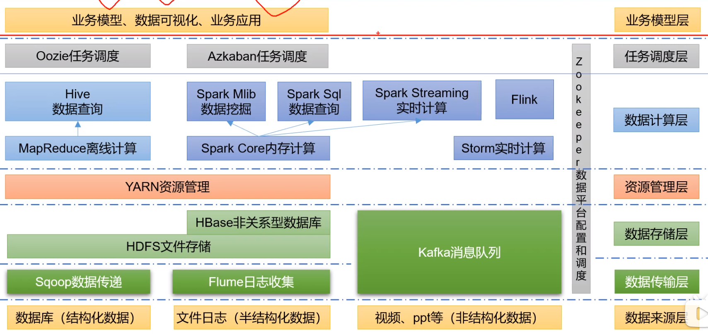

# Hadoop

## 概念

1. 大数据(big data)，或称巨量资料，指的是所涉及的资料量规模巨大到无法透过主流软件工具，在合理时间内达到撷取、管理、处理、并整理成为帮助企业经营决策更积极目的的资讯。
2. 特点（4V）
   1. 大量（Volume）
   2. 高速（Velocity）
   3. 多样（Variety）
   4. 低价值密度（Value）
3. Hadoop是一个分布式系统基础框架
   1. 海量数据的储存
   2. 海量数据的计算
4. 优势
   1. 高可靠性：存在多个副本
   2. 高扩展性：动态扩展节点
   3. 高效性：并行工作
   4. 高容错性：失败的任务重新分配

## HDFS架构

1. NameNode（nn）：储存文件的元数据，如文件名，文件目录结构，文学属性，以及每个文件的快列表和所在的DataNode
2. DataNode（dn）：在本地文件系统储存文件块数据，以及数据的校验和
3. Secondary NameNode(2nn)：美隔一段时间对NameNode的元数据进行备份

## YARN架构

1. ResourceManager（RM）：整个集群资源的老大
2. NodeManager（NM）：单个节点服务器资源老大
3. ApplicationMaster（AM）：单个人物运行的老大
4. Container：容器，相当于一台独立的服务器，里面封装了任务运行需要的资源

## 大数据技术生态体系

## 集群部署

1. NameNode,Secondary NameNode,ResourceManager分贝放在三台服务器上
2. 配置文件说明
   1. 默认配置文件
      1. core-default.xml
      2. hdfs-default.xml
      3. mapred-default.xml
      4. yarn-default.xml
   2. 自定义配置文件
      1. core-site.xml
         1. 指定NameNode的地址
         2. 指定hadoop数据的储存目录
         3. 配置HDFS网页登录使用的静态用户
      2. hdfs-site.xml
         1. NameNode的web端访问地址
         2. Secondary-NameNode的web端访问地址
      3. yarn-site.xml
         1. 指定MR走shuffle的地址
         2. 指定ResourceManager的地址
         3. 环境变量的继承
      4. mapred-site.xml
         1. 指定MapReduce运行在yarn上（默认是本地运行）
3. 配置work
4. 启动集群
   1. 如果集群是第一次启动，需要格式化NameNode节点
      1. hdfs namenode -format
   2. 启动HDFS
      1. sbin/start-hdfs.sh
   3. 启动YARN
      1. sbin/start-yarn.sh
5. hdfs上传文件
   1. hadoop fs -put 文件
