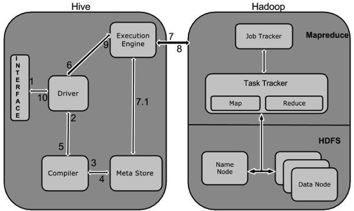

# Hive学习笔记

## Hive基础

1. Hive是什么？
   1. Hive是一个数据仓库基础工具在Hadoop中用来处理结构化数据。
2. Hive特点
   1. 它储存架构在一个数据库中并发=处理数据到HDFS。
   2. 它是专为OLAP设计。
   3. 它提供SQL类型语言查询叫HiveQL或HQL.
   4. 它是熟知，快速，可扩展的
3. Hive架构
   1. 
   2. 单元描述
      1. 用户接口/界面：Hive是一个数据仓库基础工具软件，可以创建用户和HDFS之间互动。用户界面，Hive支持是Hive的Web UI,Hive命令行，Hive HD洞察。
      2. 元储存：Hive选择各自的数据库服务器，用以储存表，数据库，列模式或元数据表，它们的数据类型和HDFS映射。
      3. HiveQL处理引擎：HiveQL类似与SQL的查询上Metastore模式信息。
      4. 执行引擎：HiveQL处理引擎和MapReduce的结合部分是由Hive执行引擎。执行引擎处理查询并产生结果和MapReduce的结果一样。
4. Hive工作原理
   1. 
   2. 交互方式
      1. Ececute Query：Hive接口，如命令行或Web UI发生查询驱动程序来执行。
      2. Get Plan：在驱动程序帮助下查询编译器，分析查询检查语法和查询计划或查询的要求。
      3. Get Metadata：编译器发送元数据请求到Metastore（任何数据库）。
      4. Send Metadata：Metastore发送元数据，以编译器的响应。
      5. Send Plan：编译器检查要求，并重新发送计划给驱动程序。到此为止，查询解析和编译完成。
      6. Execute Plan：驱动程序发送的执行计划到执行引擎。
      7. Execute Job：在内部，执行作业的过程是一个MapReduce工作。执行引擎发送作业给JobTracker，在名称节点并把它分配作业到TaskTracker，这是在数据节点。在这里，查询执行MapReduce工作。
      8. Metadta Ops：与此同时，在执行时，执行引擎可以通过Metastore执行元数据操作。
      9. Fetch Result：执行引擎接收来自数据节点的结果。
      10. Send Results：执行引擎发送这些结果值给驱动程序。
      11. Send Results：驱动程序将结果发送给Hive接口。

## Hive数据类型

1. 列类型
   1. 整形
      1. TINYINT（后缀Y）
      2. SMALLINT（后缀S）
      3. INT
      4. BIGINT（后缀L）
   2. 字符串类型
      1. VARCHAR（1 to 65355）
      2. CHAR（255）
      3. 时间戳{{YYYY-MM-DD HH:MM:SS.fffffffff}}
      4. 日期{{YYYY-MM-DD}}
      5. 小数点：DECIMAL（precision,scale）
      6. 联合类型：UNIONTYPE<>
2. 文字
   1. 浮点类型
   2. 十进制类型
3. Null值
   1. 缺少通过特殊值-NULL表示
4. 复杂类型
   1. 数值：{Syntax：ARRAY<data_type>}
   2. 映射：{Syntax：MAP<primitive_type, data_type>}
   3. 结构体：{Syntax：STRUCT<col_name:data_type[COMMENT col_comment], ...>}

## 创建数据库

CREATE DATABASE|SCHEMA [IF NOT EXISTS] \<database_name\>

## 删除数据库

DROP DATABASE (DATABASE|SCHEMA) [IF NOT EXISTS] database_name [RESTRICT|CASCADE]

## 创建表

```sql
CREATE [TEMPORARY] [EXTERNAL] TABLE [IF NOT EXISTS] [db_name.] table_name

[(col_name data_type [COMMENT col_comment], ...)]
[COMMENT table_comment]
[ROW FORMAT row_format]
[STORED AS file_format]

// 下面的数据为一个注释，字段终止符、行终止符、储存文件格式
COMMENT ‘Employee details’
FIELDS TERMINATED BY ‘\t’
LINES TERMINATED BY ‘\n’
STORED IN TEXT FILE
```

## 修改表

```sql
ALTER TABLE name RENAME TO new_name
ALTER TABLE name ADD COLUMNS (col_spec[, col_spec ...])
ALTER TABLE name DROP [COLUMN] column_name
ALTER TABLE name CHANGE column_name new_name new_type
ALTER TABLE name REPLACE COLUMNS (col_spec[, col_spec ...])

ALTER TABLE eemployee RENAME TO emp
```

## 删除表

DROP TABLE [IF EXISTS] table_name

## 分区（存放在单独的文件中）

```sql
// 添加分区
ALTER TABLE table_name ADD [IF NOT EXISTS] PARTITION partition_spec
[LOCATION 'location1'] partition_spec [LOCATION 'location2'] ...;

partition_spec:
: (p_column = p_col_value, p_column = p_col_value, ...)

// 重命名分区
ALTER TABLE table_name PARTITION partition_spec RENAME TO PARTITION partition_spec;

// 删除分区
ALTER TABLE table_name DROP [IF EXISTS] PARTITION partition_spec, PARTITION partition_spec,...;
```

## 导入数据

```sql
// 导入HDFS数据
load data inpath '/user.txt' into table table_name;
// 导入本地数据
load data local '/user.txt' into table table_name;
```

## 清空表

```sql
truncate table table_name;
```

## 插入数据

```sql
// 插入一条数据
insert into table table_name values(xx,yy,zz);

// 利用查询语句插入数据
insert overwrite [into] table table_name [partition(partcols=val1, partcol2=val2 ...)] select_statement1 from from_statement

// 多重插入
from from_statement insert overwrite table table_name1 [partition(partcols=val1, partcol2=val2 ...)] select_statement1 insert overwrite table table_name2 [partition(partcols=val1, partcol2=val2 ...)] select_statement2

// 分区插入 分区插入有两种，一种是静态分区，另一种是动态分区。如果混合使用静态分区和动态分区，则静态分区必须出现在动态分区之前

// 静态分区
// 1. 创建静态分区表
// 2. 从查询结果中导入数据
// 3. 查看插入结果动态分区

// 静态分区需要创建非常多的分区，用户需要写非常多的SQL，因此提供了动态分区功能
// 1. 创建分区表
// 2. 参数设置
//// set hive.exec.dynamic.partition.mode=nonstrict
//// set hive.exec.mac.dynamic.partitions.pernode=100
//// set hive.exec.max.dynamic.partitions=1000
//// set hive.exec.mac.created.files=100000
//// set dfs.datanode.max.xcievers=4096
//// set hive.error.on.empty.partition=false
```
