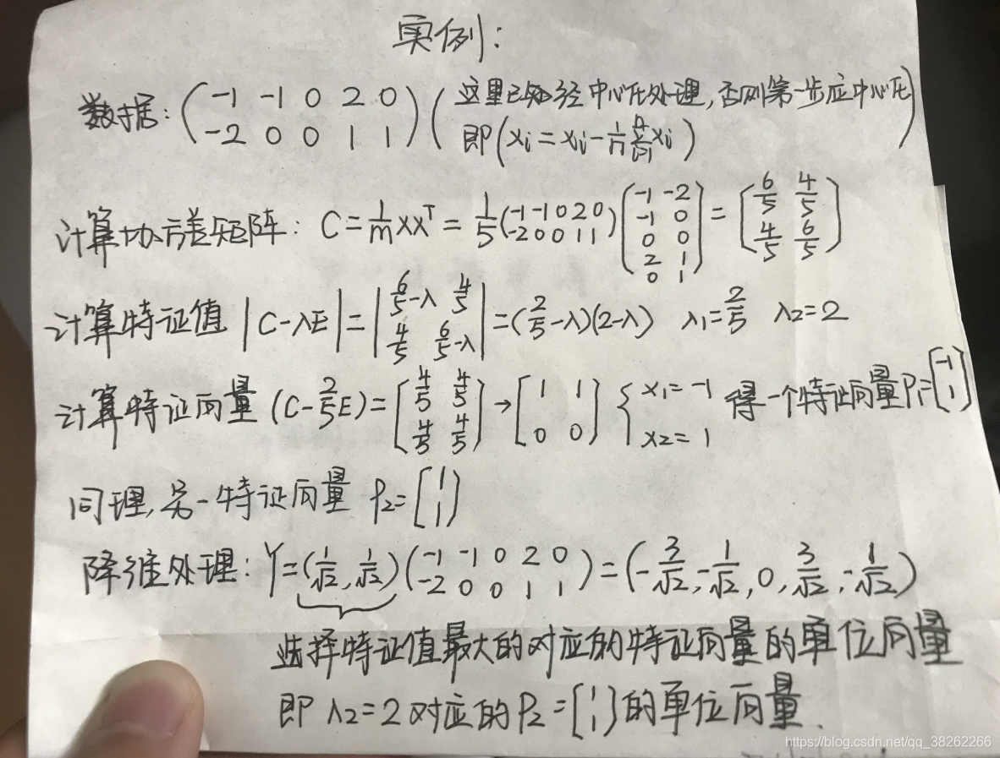

# 线性代数

1. 标量、向量、矩阵、张量
   1. 标量：表示单独的一个数，斜体小写字母表示：$\mathit{x}$
   2. 向量：表示一列数，粗体小写字母表示：$\pmb{x}$
   3. 矩阵：表示一个二维数组，粗体大写字母表示：$\pmb{A}$
   4. 张量：超过二维的数组，使用$A$表示
2. 矩阵转置
   1. 矩阵转置（Transpose)相当于沿着对角线翻转：$A_{i,j}^T=A_{i,j}$
3. 矩阵加法
   1. 矩阵形状一样：$\pmb{C}=\pmb{A}+\pmb{B},C_{i,j}+A_{i,j}+B_{i,j}$
   2. numpy广播机制：矩阵和向量相加
4. 矩阵乘法
   1. $\pmb{A}$的形状为$m\times n$，$\pmb{B}$的形状为$n\times p$，得到$\pmb{C}$的形状为$m\times p$
   2. 具体定义：$C_{i,j}=\sum_kA_{i,k}B_{k,j}$
   3. 矩阵乘法不是对应元素相乘，而是$\pmb{A}\odot \pmb{B}$
5. 单位矩阵
   1. 单位矩阵对焦元素为1，其它元素为0，使用$\pmb{I_n}$表示
   2. np.identity(n)用于生成单位矩阵
6. 矩阵的逆（Inversion）
   1. $\pmb{A^{-1}}\pmb{A}=\pmb{I_n}$
   2. np.linalg.inv(A)求A的逆矩阵
7. 范数
   1. 向量$L^p$范数定义为$||\pmb{x}||_p=(\sum_i|x_i|^p)^{\frac{1}{p}}$
   2. F范数用于衡量一个矩阵$||\pmb{A}||_F=\sqrt{\sum_{i,j}A_{i,j}^2}$
   3. np.linalg.norm(a, ord="fro")
8. 特征值分解
   1. 矩阵$\pmb{A}$有n组线性无关的单位特征向量$\{\pmb{v^{(1)},\dots,\pmb{v^{(n)}}}\}$以及对应的特征值$\lambda_1,\dots,\lambda_n$
   2. $\pmb{A}$的特征值分解为：$\pmb{A}==\pmb{V}diag(\lambda)\pmb{V}^{-1}$
9. 奇异值分解
   1. $\pmb{A=U\sum V^T}$
   2. 如果$\pmb{A}$是$m\times n$的，那么$\pmb{U}$是$m\times m$的，为左奇异向量，而$\pmb{V}$是$n\times n$，为右奇异向量
   3. 左奇异向量是$\pmb{A^TA}$的特征向量，右奇异向量是$\pmb{AA^T}$的特征向量
   4. np.linalg.svd()
10. 主成分分析
    1. 对所有样本进行中心化：$x_i\leftarrow x_i-\frac{1}{n}\sum_{i=1}^{n}x_i$
    2. 计算样本的斜方差矩阵$\pmb{XX^T}$
    3. 对协方差矩阵$\pmb{XX^T}$
    4. 取最大的m个特征值所对应的单位特征向量
    
