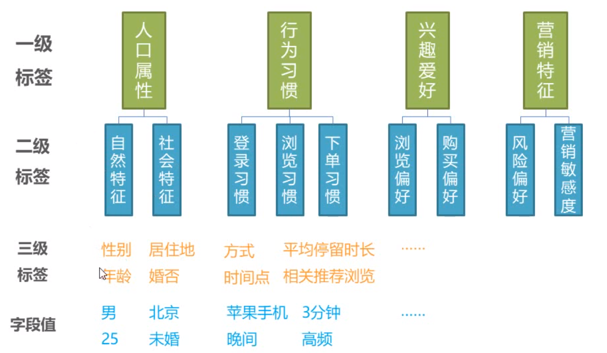
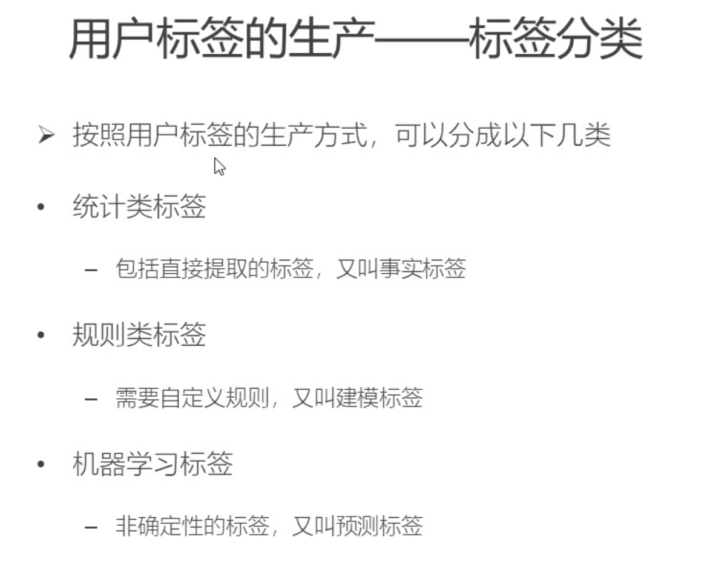
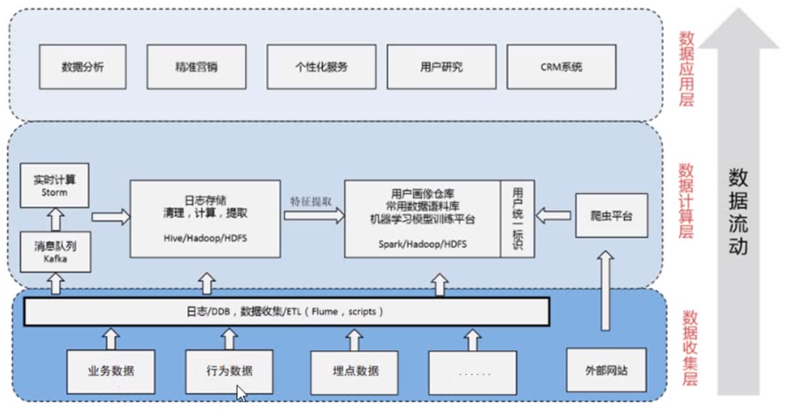
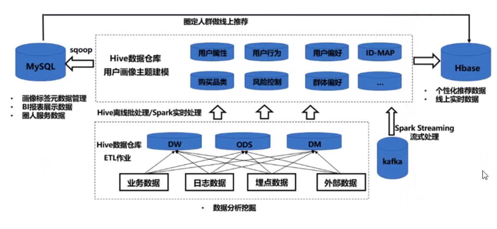
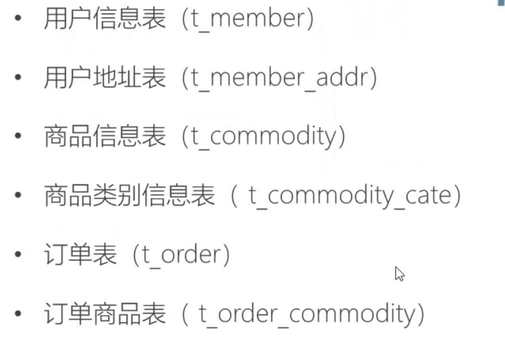
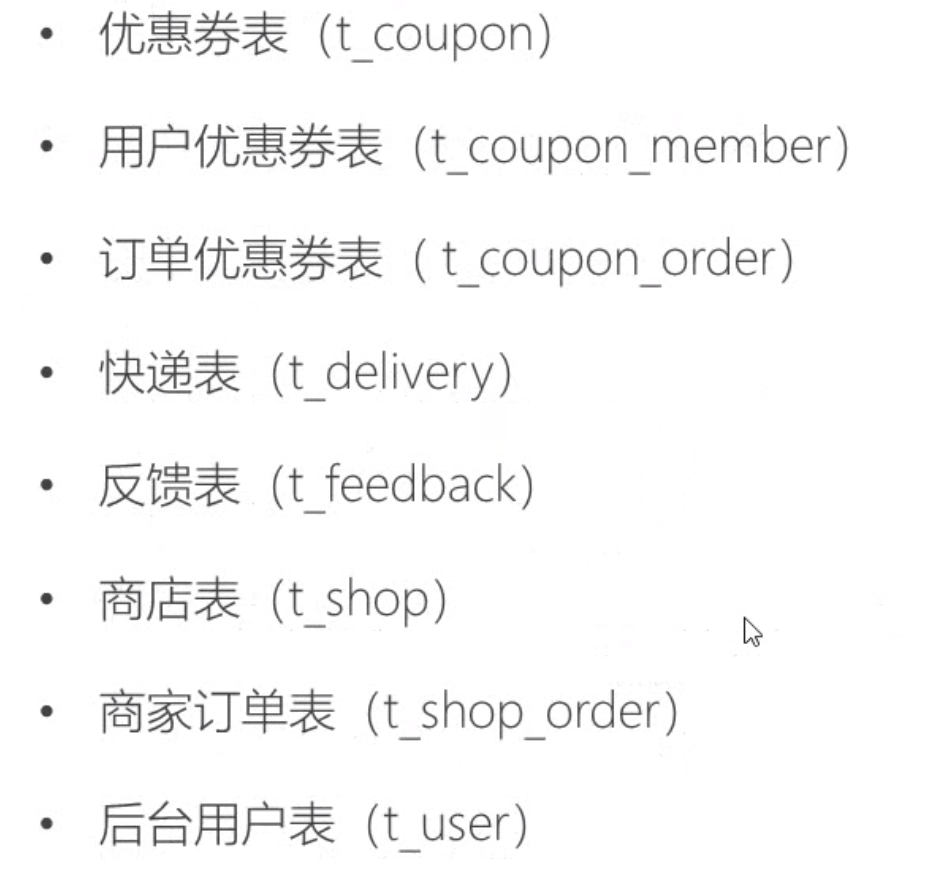
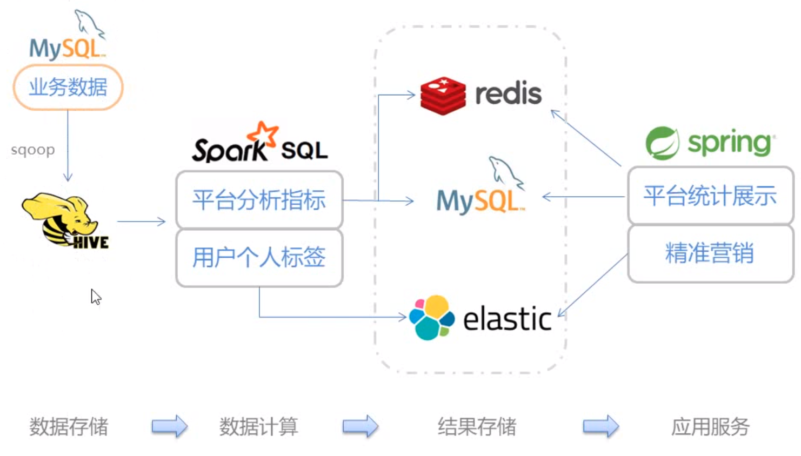
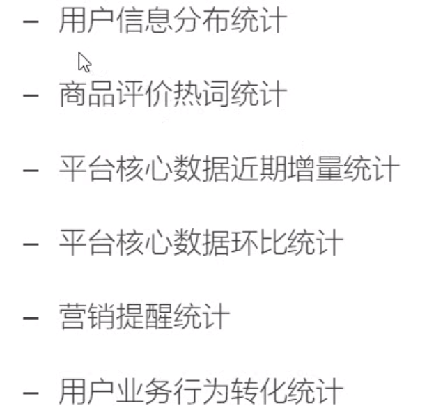
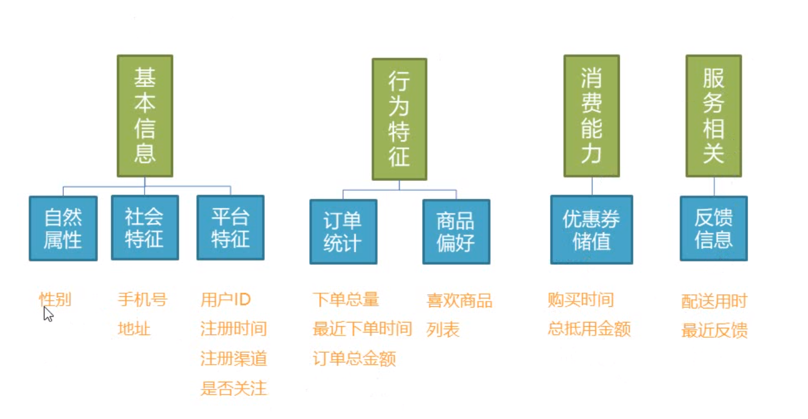

# 用户画像

## 概念

1. 信息 -> 文本 -> 标签
2. 用户画像(Uer Profile)
   1. 用户信息标签化
   2. 收集用户的社会属性、消费习惯、偏好特征等各个维度的信息刻画用户并推断出用户潜在的信息
3. 用户画像用处
   1. 业务决策
      1. 定位用户人群
      2. 统计指标展示
   2. 精准营销
      1. 信息定点推送
   3. 个性化服务
      1. 个性化推荐，个性化搜索
   4. 用户研究
      1. 挖掘用户特征，从数据中得到知识
4. 内容-标签建模
   1. 根据已有的数据，生产标签
   2. 按照不同维度划分标签
      1. 将标签按照内容横向划开
      2. 基本社会属性、行为习惯、购买能力、兴趣爱好
   3. 设置分级标签模型
      1. 将标签按照层级纵向分开
      2. 
      3. 
      4. 统计类标签是用户画像的基础，是最常见的标签类型
      5. 规则类标签由人指定
      6. 机器学习类标签具有不确定性
5. 基本架构
   1. 
6. 常规架构
   1. 
7. 用户画像项目流程
   1. 用户建模-确定提取的用户信息维度
   2. 数据收集
   3. 数据清洗-通常直接在Hive中进行，包括统计类标签的生成
   4. 模型训练-对于无法直接得到的标签，建立模型进行训练
   5. 属性预测-预测用户的位置信息
   6. 数据合并
   7. 数据分发

## 电商平台的用户画像项目

1. 数据源分析
   1. 
   2. 
2. 数据内容分析
   1. 运营相关信息
   2. 服务相关信息
   3. 订单相关信息
   4. 用户信息
   5. 商品信息
3. 项目架构
   1. 
4. 平台用户统计分析指标
   1. 
5. 用户画像建模
   1. 
