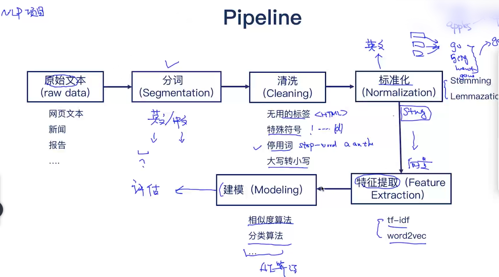
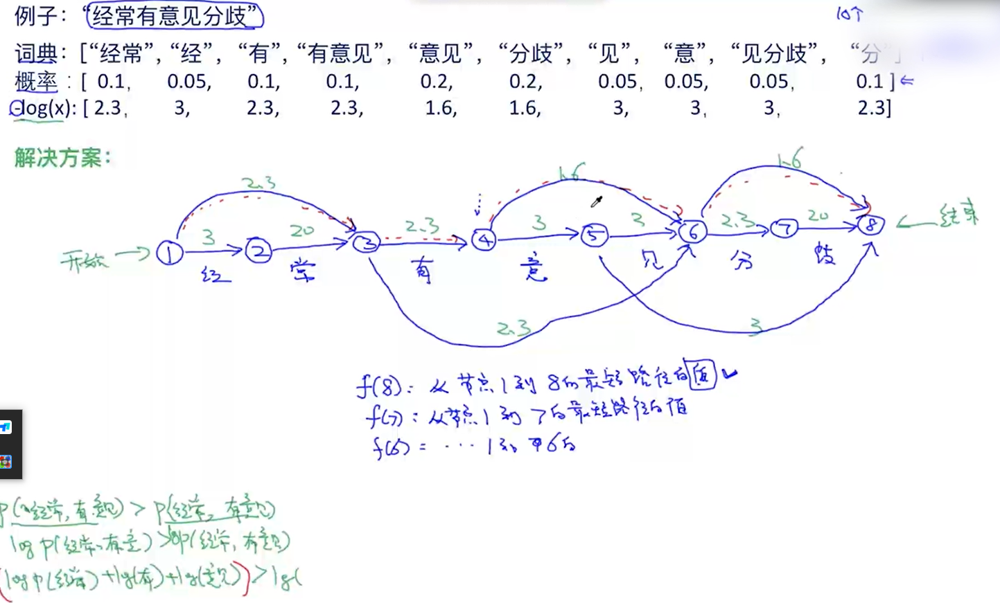

# NLP

NLP = NLU + NLG
- NLU：语音/文本 -> 意思
- NLG：意思 -> 语音/文本

## 自然语言处理技术四个维度

1. Phonetics（声音）
2. Morphology（单词）：分词、词性、命名实体识别
3. Syntax（句子结构）：句法分析、依存分析 
4. Semantic（语义）

## 文本处理的流程



### 最大匹配算法

```txt
例子：[我们经常有意见分歧]
词典：[“我们”，“经常”，“有”，“有意见”，“意见”，“分歧”]
```

- 前向最大匹配
- 后向最大匹配
- 双向最大匹配

> 使用最大匹配算法得到的结果可能不准确、需要得到多个结果再使用其它工具选择最好的结果。

### 分词-维特比算法

